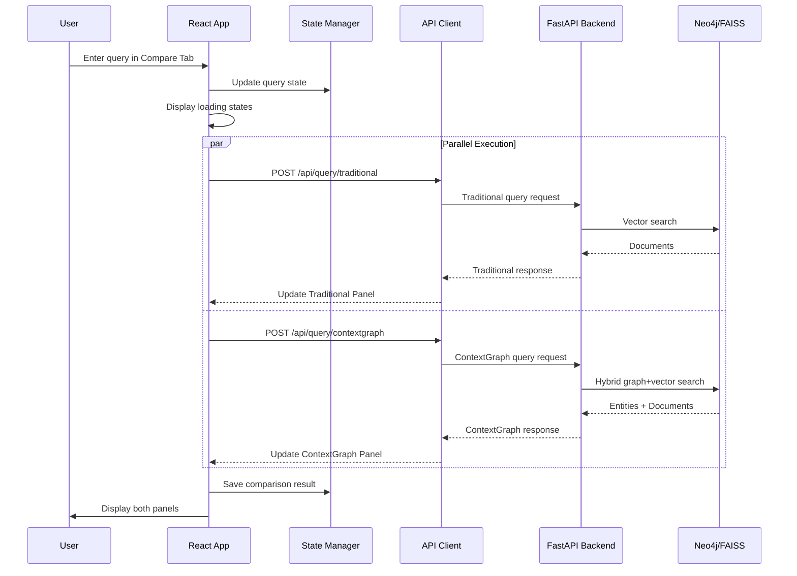
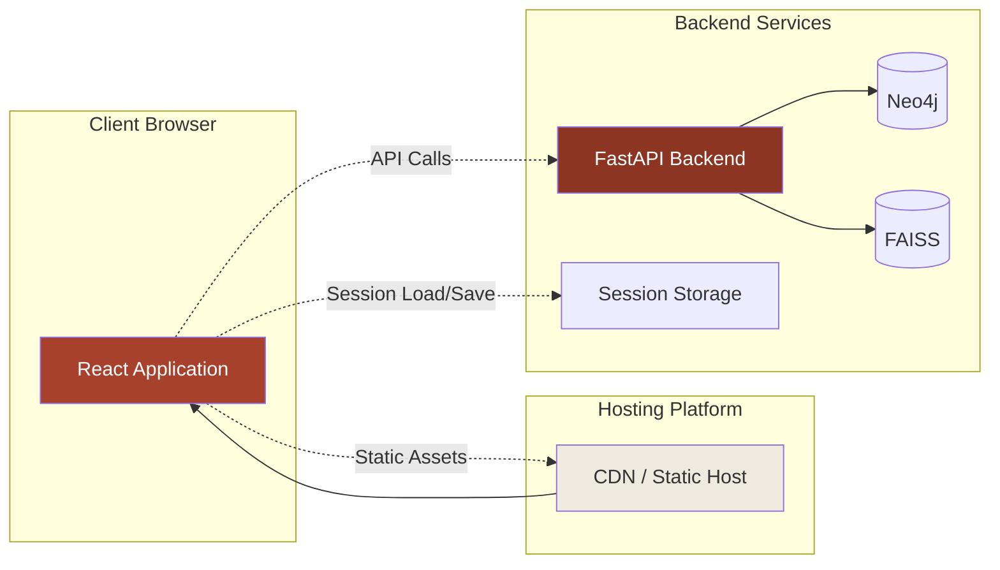

# Design Document: Streamlit to React Migration

## Overview

This design document outlines the comprehensive migration strategy for converting the existing Streamlit application (MF Context Engine) to React while maintaining 100% UI fidelity. The Streamlit application is a sophisticated RAG (Retrieval-Augmented Generation) system with four main tabs: Chat, Compare, Analytics, and Admin & Governance. The migration requires recreating all visual elements, interactions, state management, and real-time features in React with zero intentional deviations from the original UI/UX.

The Streamlit application features:
- Custom CSS theming with a warm, earth-toned design system (#F8F7F3 background, #A8412C accent, radial gradient pattern)
- Multi-tab navigation with RBAC (Role-Based Access Control) governing tab visibility
- Real-time multi-turn chat with parallel Traditional vs ContextGraph query execution
- Complex visualization including graph explorers, telemetry panels, and comparison views
- Session management with persistent chat history
- Background task monitoring for document indexing
- Admin panel with user management, audit logs, and document ingestion workflows

## Architecture

The React application will follow a modern component-based architecture with client-side routing, centralized state management, and API integration patterns that mirror the existing Streamlit structure.

```mermaid
graph TB
    subgraph "React Frontend"
        Router[React Router]
        App[App Component]
        Layout[Layout Component]
        
        subgraph "Main Tabs"
            ChatTab[Chat Tab]
            CompareTab[Compare Tab]
            AnalyticsTab[Analytics Tab]
            AdminTab[Admin Tab]
        end
        
        subgraph "Shared Components"
            Header[Header with User Profile]
            Sidebar[Sidebar with Sessions]
            TabNav[Tab Navigation]
            NotificationToast[Toast Notifications]
        end
        
        subgraph "Specialized Components"
            TraditionalPanel[Traditional RAG Panel]
            ContextGraphPanel[ContextGraph Panel]
            GraphVisualizer[Graph Visualizer]
            TelemetryCard[Telemetry Card]
            SessionList[Session List]
        end
        
        subgraph "State Management"
            Context[React Context]
            SessionState[Session State]
            UserState[User State]
            QueryState[Query State]
        end
        
        Router --> App
        App --> Layout
        Layout --> Header
        Layout --> Sidebar
        Layout --> TabNav
        Layout --> ChatTab
        Layout --> CompareTab
        Layout --> AnalyticsTab
        Layout --> AdminTab
        
        ChatTab --> TraditionalPanel
        ChatTab --> ContextGraphPanel
        ChatTab --> SessionList
        
        CompareTab --> TraditionalPanel
        CompareTab --> ContextGraphPanel
        
        AnalyticsTab --> GraphVisualizer
        
        Header --> UserState
        Sidebar --> SessionState
        
        TraditionalPanel --> TelemetryCard
        ContextGraphPanel --> TelemetryCard
        ContextGraphPanel --> GraphVisualizer
    end
    
    subgraph "Backend API"
        FastAPI[FastAPI Backend]
        TraditionalEndpoint[POST /api/query/traditional]
        ContextGraphEndpoint[POST /api/query/contextgraph]
        ChatEndpoint[POST /api/chat]
    end
    
    subgraph "Data Storage"
        SessionFiles[Session JSON Files]
        Neo4jDB[(Neo4j Graph DB)]
        FAISS[(FAISS Vector Store)]
    end
    
    ChatTab -.HTTP.-> ChatEndpoint
    CompareTab -.HTTP.-> TraditionalEndpoint
    CompareTab -.HTTP.-> ContextGraphEndpoint
    AnalyticsTab -.HTTP.-> Neo4jDB
    AdminTab -.HTTP.-> FastAPI
    
    ChatEndpoint --> SessionFiles
    AnalyticsTab --> SessionState
    
    style Router fill:#A8412C,color:#fff
    style App fill:#8C3523,color:#fff
    style ChatTab fill:#EFEAE0
    style CompareTab fill:#EFEAE0
    style AnalyticsTab fill:#EFEAE0
    style AdminTab fill:#EFEAE0
```



### Request Flow Diagram



## Components and Interfaces

### Component 1: App (Root Component)

**Purpose**: Main application container managing routing, global state, and theme

**Interface**:
```typescript
interface AppProps {}

interface AppState {
  user: UserProfile;
  sessionId: string;
  chatHistory: Message[];
  comparisons: Comparison[];
  lastHybrid: HybridResult | null;
  lastTraditional: TraditionalResult | null;
}

function App(): JSX.Element
```

**Responsibilities**:
- Initialize React Router with route configuration
- Provide global context (UserContext, SessionContext, QueryContext)
- Load and apply custom CSS theme
- Handle global error boundaries
- Initialize API base URL from environment

**State Management**:
- Uses React Context API for cross-cutting concerns
- Local state for tab-specific data
- Session persistence via localStorage and file system

### Component 2: Layout

**Purpose**: Common layout structure with header, sidebar, and main content area

**Interface**:
```typescript
interface LayoutProps {
  children: React.ReactNode;
}

function Layout({ children }: LayoutProps): JSX.Element
```

**Responsibilities**:
- Render persistent header with user profile switcher
- Render collapsible sidebar with session browser
- Apply background pattern (radial gradient dots on #F8F7F3)
- Manage responsive breakpoints
- Display toast notifications

### Component 3: UserProfileSwitcher

**Purpose**: RBAC user profile dropdown in sidebar

**Interface**:
```typescript
interface UserProfile {
  username: string;
  full_name: string;
  role: AMCRole;
  department: string;
  email?: string;
}

enum AMCRole {
  COMPLIANCE_OFFICER = "Compliance Officer",
  FUND_MANAGER = "Fund Manager",
  ESG_ANALYST = "ESG Analyst",
  SALES_MANAGER = "Sales Manager",
  RETAIL_INVESTOR = "Retail Investor"
}

interface UserProfileSwitcherProps {
  users: UserProfile[];
  activeUser: UserProfile;
  onUserChange: (user: UserProfile) => void;
}

function UserProfileSwitcher(props: UserProfileSwitcherProps): JSX.Element
```

**Responsibilities**:
- Render dropdown with all user profiles
- Display active user's name, role, and department
- Emit onUserChange event when selection changes
- Apply styling: #8A8378 text, #EFEAE0 background

### Component 4: TabNavigation

**Purpose**: Main tab bar with RBAC-filtered tabs

**Interface**:
```typescript
interface Tab {
  id: string;
  label: string;
  icon: string;
  requiresPermission?: keyof RolePermissions;
}

interface TabNavigationProps {
  tabs: Tab[];
  activeTab: string;
  onTabChange: (tabId: string) => void;
  userPermissions: RolePermissions;
}

function TabNavigation(props: TabNavigationProps): JSX.Element
```

**Responsibilities**:
- Render horizontal tab bar with icons and labels
- Apply active styling: #A8412C text, 2px bottom border
- Apply inactive styling: #8A8378 text
- Filter tabs based on user permissions
- Handle tab click events with smooth transitions

**Visual Specifications**:
- Gap between tabs: 24px
- Padding: top 1rem, bottom 0.5rem
- Font weight: 600
- Active border color: #A8412C

### Component 5: ChatTab

**Purpose**: Multi-turn chat interface with parallel Traditional/ContextGraph responses

**Interface**:
```typescript
interface Message {
  role: "user" | "assistant";
  content: string;
  turn_index?: number;
  loading?: boolean;
  traditional?: TraditionalResult;
  hybrid?: HybridResult;
  error_trad?: string;
  error_hybrid?: string;
}

interface ChatTabProps {
  sessionId: string;
  history: Message[];
  onSendMessage: (query: string) => Promise<void>;
  onNewSession: () => void;
  onResumeSession: (sessionId: string) => void;
  onClearCache: () => void;
}

function ChatTab(props: ChatTabProps): JSX.Element
```

**Responsibilities**:
- Render query input with "Send" button (primary style)
- Render "🔄 New Session" and "🗑️ Clear Cache" buttons
- Display session ID in expandable panel
- Group history into turn pairs (user, assistant)
- Display newest turns first (reversed order)
- Execute parallel API calls for Traditional and ContextGraph modes
- Render loading states during query execution
- Render TraditionalPanel and ContextGraphPanel side-by-side in 2-column layout
- Save session to JSON file after each turn
- Handle errors gracefully with error messages

**Layout**:
- Top row: [Query Input (4.0 cols)] [Send (0.8 cols)] [New Session (1.1 cols)] [Clear Cache (1.1 cols)]
- Turn display: Reverse chronological order
- Each turn: User message header → Two-column assistant response (Traditional | ContextGraph)

### Component 6: CompareTab

**Purpose**: Side-by-side comparison of Traditional vs ContextGraph retrieval

**Interface**:
```typescript
interface CompareTabProps {
  onRunQuery: (query: string) => Promise<{
    traditional: TraditionalResult;
    hybrid: HybridResult;
  }>;
  onClearCache: () => void;
}

function CompareTab(props: CompareTabProps): JSX.Element
```

**Responsibilities**:
- Render query input with "Run query" primary button
- Render "🗑️ Clear Cache" button
- Execute parallel API calls when query submitted
- Display loading states in both panels simultaneously
- Render TraditionalPanel (left) and ContextGraphPanel (right) in 2-column layout
- Track comparison metrics (latency, tokens) for history
- Persist comparison results to session state

**Query Execution Flow**:
1. User enters query and clicks "Run query"
2. Disable button, set is_running = true
3. Show "Running traditional vector search…" in left panel
4. Show "Running graph + vector retrieval…" in right panel
5. Execute ThreadPoolExecutor pattern: simultaneous POST to /api/query/traditional and /api/query/contextgraph
6. As each response arrives, immediately render its panel
7. After both complete, save metrics to comparisons array
8. Re-enable button

### Component 7: TraditionalPanel

**Purpose**: Render Traditional RAG results with documents and telemetry

**Interface**:
```typescript
interface TraditionalDocument {
  name: string;
  score: number;
  page: number;
  snippet: string;
  full_text: string;
}

interface TraditionalResult {
  answer: string;
  docs: TraditionalDocument[];
  total_tokens: number;
  total_time: number;
  telemetry_breakdown: TelemetryBreakdown;
}

interface TraditionalPanelProps {
  result: TraditionalResult;
  height?: number;
}

function TraditionalPanel({ result, height = 520 }: TraditionalPanelProps): JSX.Element
```

**Responsibilities**:
- Render panel header: dot indicator (.cg-dot.trad, #5C574C), "Traditional Document Search", "vector-only" badge
- Render document list with score badges, snippets, and expandable full text
- Render warning box: "⚠ No consolidated answer — each document must be reviewed individually."
- Render LLM-synthesized answer with markdown-to-HTML conversion
- Render 3-column stats: Docs returned, Tokens used, Total time
- Render collapsible telemetry card with execution breakdown
- Apply exact CSS from compare_view.py (borders: #E7E1D4, backgrounds: #FFFFFF/#EFEAE0)

**Visual Specifications**:
- Panel: 1px solid #1C1917 border, 10px border-radius, #FFFFFF background, 18px padding
- Dot: 8px circle, #5C574C fill, inline-block, 8px right margin
- Badge: 3px top/bottom padding, 10px left/right padding, 999px border-radius, #EFEAE0 background, #5C574C text, uppercase
- Documents: #E7E1D4 border, 8px border-radius, 9px top/bottom, 11px left/right padding, 7px bottom margin

### Component 8: ContextGraphPanel

**Purpose**: Render ContextGraph results with graph visualization and telemetry

**Interface**:
```typescript
interface HybridResult {
  answer: string;
  query_type?: string;
  confidence_label: string;
  confidence_reason?: string;
  docs: Array<{ name: string; snippet: string }>;
  graph_nodes: string[];
  graph_edges: Array<{ s: string; rel: string; o: string; conf?: number }>;
  graph_edges_used_in_prompt: Array<{ s: string; rel: string; o: string; conf?: number }>;
  matched_entity_texts: string[];
  active_labels: string[];
  graph_matched_by?: string;
  entity_summary: Array<{ label: string; count: number; active: boolean }>;
  total_tokens: number;
  total_time: number;
  telemetry_breakdown: TelemetryBreakdown;
  provenance?: Array<{ doc: string; chunk_id: string; snippet: string }>;
}

interface ContextGraphPanelProps {
  result: HybridResult;
  entitySummary: Array<{ label: string; count: number; active: boolean }>;
  height?: number;
}

function ContextGraphPanel({ result, entitySummary, height = 520 }: ContextGraphPanelProps): JSX.Element
```

**Responsibilities**:
- Render panel header: dot indicator (.cg-dot.ctx, #A8412C), "ContextGraph", "hybrid graph + vector" badge
- Render tabbed interface: "Answer" (default) and "Ontology View" tabs
- In Answer tab:
  - Render confidence badge (green #E4EEE1, #3F6B42 text if high confidence)
  - Render dynamic Intent Traffic Controller badges from telemetry
  - Render collapsible Graph Triplet Path card with subject-relationship-target table
  - Render collapsible Document Provenance card with citations
  - Render answer with markdown-to-HTML conversion
  - Render sources list
  - Render 3-column stats: Graph nodes touched, Tokens used, Total time
  - Render collapsible telemetry card
- In Ontology View tab:
  - Render entity type tree with active/inactive styling
  - Render mini graph SVG with nodes and edges
  - Render explanatory note about colored vs grey nodes

**Tab Switching Logic**:
- Client-side JavaScript function: cgTab(element, viewName)
- Remove 'active' class from all tabs, add to clicked tab
- Show/hide [data-view] divs based on active tab
- Active tab: #A8412C text, 2px bottom border

### Component 9: GraphVisualizer

**Purpose**: Interactive SVG graph with click-to-explore node details

**Interface**:
```typescript
interface GraphNode {
  id: string;
  label: string;
  matched: boolean;
  x: number;
  y: number;
}

interface GraphEdge {
  s: string;
  rel: string;
  o: string;
  conf?: number;
}

interface NodeDetail {
  text: string;
  label: string;
  matched_directly: boolean;
  is_fallback: boolean;
  reasons: string[];
  source: string;
  product_name?: string;
}

interface GraphVisualizerProps {
  nodes: string[];
  edges: GraphEdge[];
  matchedTexts: Set<string>;
  sourceInfo: Record<string, { label?: string; source?: string; product_name?: string }>;
  isFallbackGraph: boolean;
  note: string;
  onNodeClick?: (nodeId: string) => void;
}

function GraphVisualizer(props: GraphVisualizerProps): JSX.Element
```

**Responsibilities**:
- Calculate grid-based node positions (4 columns)
- Render SVG edges with relationship labels
- Render SVG nodes as circles (7px radius)
- Color nodes: #A8412C (matched), #D8D2C4 (fallback), #E8A08C (connected)
- Render node labels below circles (8.5px font, #5C574C)
- Build node detail JSON with relationship explanations
- Handle node click events WITHOUT React rerenders (pure JS)
- Display node details panel on right side
- Apply active styling to clicked node (stroke: #231F1C, stroke-width: 2px)

**Layout**:
- Two-column: Graph SVG (flex 1.4) | Detail panel (flex 1, border-left #E7E1D4)
- Grid: 4 columns, ~55px vertical spacing
- SVG viewBox calculated dynamically based on node count

### Component 10: AnalyticsTab

**Purpose**: Graph explorer and run history comparison

**Interface**:
```typescript
interface AnalyticsTabProps {
  lastHybrid: HybridResult | null;
  comparisons: Comparison[];
}

interface Comparison {
  query: string;
  traditional_time: number;
  hybrid_time: number;
  traditional_tokens: number;
  hybrid_tokens: number;
}

function AnalyticsTab(props: AnalyticsTabProps): JSX.Element
```

**Responsibilities**:
- Render scope radio buttons: "Last query's graph" | "Full knowledge graph" (horizontal)
- If "Last query's graph" and lastHybrid exists:
  - Extract edges from graph_edges_used_in_prompt (not graph_edges)
  - Check if fallback mode (graph_matched_by === "fallback" or empty edges)
  - If fallback, show warning: "No graph relationships were directly relevant..."
  - Render GraphVisualizer with appropriate edges
- If "Full knowledge graph":
  - Fetch subgraph from API (limit 60 relationships)
  - Render GraphVisualizer with full graph
- Render divider
- Render "Traditional vs. ContextGraph — run history" section
- Display comparisons as DataFrame/Table
- Render 3 metrics: Avg traditional latency, Avg hybrid latency (with delta), Avg hybrid token delta
- Render bar charts: Latency comparison, Token comparison

### Component 11: AdminTab

**Purpose**: User management, RBAC matrix, audit logs, and document ingestion

**Interface**:
```typescript
interface AdminTabProps {
  rbacManager: RBACManager;
  onRunPipeline: () => Promise<PipelineReport>;
  onCheckStaleness: () => Promise<StalenessReport>;
  onIngestDocument: (request: IngestRequest) => Promise<IngestResponse>;
}

function AdminTab(props: AdminTabProps): JSX.Element
```

**Responsibilities**:
- Render 4 sub-tabs: "[USERS] User Profile Management", "[RBAC] Role Access Matrix", "[AUDIT] Security & Audit Logs", "[INGEST] Authorized Ingest & Pipeline"
- Users tab:
  - Display users table with all fields
  - Render user creation form with 2-column layout
  - Render delete user dropdown and button
- RBAC tab:
  - Display role permission matrix table
  - Show security policy notes
- Audit tab:
  - Load query_execution_audit.jsonl file
  - Display last 30 lines in code block
- Ingest tab:
  - Render production pipeline controls (2-column)
  - Render authorized document ingest form (2-column)
  - Display live indexing tasks with status badges
  - Render proposed supersession edges review queue
  - Provide compliance report download button

**Styling**:
- Forms use 2-column layout with st.columns [2, 2] or [3, 1, 1]
- Status badges: 🟢 Completed, 🟡 Indexing, 🔴 Failed, ⚪ Queued
- Progress bars for active indexing tasks
- Success/warning/error message colors match Streamlit theme

### Component 12: TelemetryCard

**Purpose**: Collapsible telemetry breakdown with microsecond-level metrics

**Interface**:
```typescript
interface TelemetryBreakdown {
  latency_vector_db_ms: number;
  latency_rerank_ms?: number;
  latency_graph_db_ms: number;
  latency_ner_processing_ms: number;
  latency_cypher_generation_ms?: number;
  latency_post_retrieval_processing_ms: number;
  latency_llm_generation_ms: number;
  latency_total_pipeline_ms: number;
  tokens_input: number;
  tokens_output: number;
  tokens_total: number;
  tokens_saved?: number;
  tokens_cold_equivalent?: number;
  cache_hit?: boolean;
  db_candidates_surfaced: number;
  vector_bypassed: boolean;
  pipeline_mode: string;
  ui_badges?: Array<{ type: string; label: string; desc: string }>;
  triplet_table?: Array<{ s: string; rel: string; o: string; conf: number }>;
}

interface TelemetryCardProps {
  telemetry: TelemetryBreakdown;
}

function TelemetryCard({ telemetry }: TelemetryCardProps): JSX.Element
```

**Responsibilities**:
- Render as <details> element (collapsed by default)
- Summary: "⚡ Microsecond Telemetry & Execution Ledger" (12px bold, #5C574C)
- Table rows for each latency metric (conditionally show Cypher generation, Reranking)
- Highlight total pipeline row with #EFEAE0 background
- Display token breakdown (input / output / total)
- Conditionally show token savings row if cache_hit (green background #E4EEE1)
- Display DB candidates and vector bypass status
- Apply table styling: 1px solid #EAEAEA row borders, 11.5px font, 4px vertical padding

## Data Models

### Model 1: UserProfile

```typescript
interface UserProfile {
  username: string;
  full_name: string;
  role: AMCRole;
  department: string;
  email?: string;
}

enum AMCRole {
  COMPLIANCE_OFFICER = "Compliance Officer",
  FUND_MANAGER = "Fund Manager",
  ESG_ANALYST = "ESG Analyst",
  SALES_MANAGER = "Sales Manager",
  RETAIL_INVESTOR = "Retail Investor"
}
```

**Validation Rules**:
- username: non-empty string, unique
- full_name: non-empty string
- role: must be valid AMCRole enum value
- department: non-empty string
- email: optional, valid email format if present

### Model 2: RolePermissions

```typescript
interface RolePermissions {
  can_access_compare_tab: boolean;
  can_access_analytics_tab: boolean;
  can_view_admin_panel: boolean;
  can_view_audit_logs: boolean;
  can_view_unredacted_pii: boolean;
  can_run_cypher_tools: boolean;
}

const ROLE_PERMISSIONS: Record<AMCRole, RolePermissions> = {
  [AMCRole.COMPLIANCE_OFFICER]: {
    can_access_compare_tab: true,
    can_access_analytics_tab: true,
    can_view_admin_panel: true,
    can_view_audit_logs: true,
    can_view_unredacted_pii: true,
    can_run_cypher_tools: true,
  },
  [AMCRole.FUND_MANAGER]: {
    can_access_compare_tab: true,
    can_access_analytics_tab: true,
    can_view_admin_panel: false,
    can_view_audit_logs: false,
    can_view_unredacted_pii: false,
    can_run_cypher_tools: false,
  },
  // ... other roles
};
```

### Model 3: ChatSession

```typescript
interface ChatSession {
  session_id: string;
  history: Message[];
  created_at: string;
  updated_at: string;
}

interface Message {
  role: "user" | "assistant";
  content: string;
  turn_index?: number;
  loading?: boolean;
  traditional?: TraditionalResult;
  hybrid?: HybridResult;
  error_trad?: string;
  error_hybrid?: string;
}
```

**Persistence**:
- Saved to `logs/chat_sessions/{session_id}.json`
- Loaded on session resume
- Updated after each turn completion

### Model 4: QueryResponse

```typescript
interface QueryResponse {
  query: string;
  mode: "traditional" | "contextgraph";
  traditional?: {
    snippet: string;
    files: TraditionalDocument[];
    metrics: {
      total_tokens: number;
      telemetry_breakdown: TelemetryBreakdown;
    };
  };
  answer?: {
    answer: string;
    confidence: string;
    compliance_note: string;
  };
  sources?: Array<{
    document_title: string;
    document_id: string;
    snippet: string;
  }>;
  graph_highlight?: {
    node_names: string[];
    relationships: string[];
    entities: string[];
    labels: string[];
    edges: GraphEdge[];
    edges_used_in_prompt: GraphEdge[];
    entity_summary: EntitySummary[];
    query_type?: string;
    graph_matched_by?: string;
    used_verified_aggregate: boolean;
    used_comparison_mode: boolean;
    total_tokens: number;
    telemetry_breakdown: TelemetryBreakdown;
  };
  latency_ms: number;
}
```

### Model 5: IndexingTask

```typescript
interface IndexingTask {
  task_id: string;
  filename: string;
  sha256_hash: string;
  status: "QUEUED" | "PROCESSING" | "COMPLETED" | "FAILED";
  stage: string;
  progress: number;
  started_at: string;
  completed_at?: string;
  entities_count?: number;
  relations_count?: number;
  chunks_count?: number;
  error_message?: string;
  notification_read: boolean;
}
```

### Model 6: IngestRequest

```typescript
interface IngestRequest {
  file_path: string;
  source_channel: IngestionChannel;
  namespace: IngestNamespace;
  source_url: string;
  ingested_by: string;
  metadata: {
    doc_type: "circular" | "master_circular" | "faq" | "nav_data";
    department: "IMD" | "MRD" | "MIRSD" | "HO" | "CFD" | "GENERAL";
    entity_type: "AMC" | "Broker" | "RA" | "All";
  };
}

enum IngestionChannel {
  ADMIN_MANUAL = "ADMIN_MANUAL",
  SEBI_RSS = "SEBI_RSS",
  AMFI_PORTAL = "AMFI_PORTAL",
}

enum IngestNamespace {
  ADMIN_UPLOAD = "ADMIN_UPLOAD",
  SEBI_CIRCULARS = "SEBI_CIRCULARS",
}
```

## Error Handling

### Error Scenario 1: API Request Failure

**Condition**: POST request to /api/query/traditional or /api/query/contextgraph fails (network error, timeout, 5xx)
**Response**: 
- Catch exception in API client layer
- Display error message in respective panel: "Traditional RAG failed: [error message]" or "ContextGraph failed: [error message]"
- Use Streamlit-style error box (red background)
- Do not block the other panel from rendering
**Recovery**: 
- Allow user to retry query
- Implement exponential backoff for transient errors
- Fall back to local execution if API_BASE is not configured

### Error Scenario 2: Session Load Failure

**Condition**: User attempts to resume a session that doesn't exist or is corrupted
**Response**:
- Display error message: "No saved session found with that ID."
- Keep current session active
- Log warning to console
**Recovery**:
- User remains in current session
- Provide list of valid sessions in sidebar

### Error Scenario 3: Parallel Query Race Condition

**Condition**: User clicks "Run query" multiple times rapidly
**Response**:
- Disable "Run query" button when is_running = true
- Queue subsequent requests
- Display loading state until current execution completes
**Recovery**:
- Re-enable button after both panels render
- Clear is_running flag

### Error Scenario 4: Graph Data Missing

**Condition**: Analytics tab attempts to render graph but lastHybrid is null or has no edges
**Response**:
- Display info message: "Run a query in the Compare tab first to see its graph here."
- For empty edges in fallback mode, show warning: "No graph relationships were directly relevant to this query..."
**Recovery**:
- Provide clear instructions to run a query first
- Show broader graph neighborhood for reference

### Error Scenario 5: Indexing Task Failure

**Condition**: Background indexing task encounters error during NER, graph insertion, or FAISS update
**Response**:
- Update task status to "FAILED"
- Store error_message in task record
- Display toast notification: "⚠️ Indexing failed for '[filename]': [error message]"
- Show 🔴 Failed badge in Admin tab task list
**Recovery**:
- Provide "Force Re-Index" button for manual retry
- Allow admin to delete failed task and re-upload document

## Testing Strategy

### Unit Testing Approach

**Components to Unit Test**:
- All presentational components (TraditionalPanel, ContextGraphPanel, GraphVisualizer, TelemetryCard)
- State management hooks (useSession, useQuery, useUser)
- Utility functions (markdown-to-HTML, node position calculation, API response adapters)
- Form validation logic (user creation, document ingestion)

**Key Test Cases**:
1. TraditionalPanel renders correctly with empty docs array
2. ContextGraphPanel switches tabs on click
3. GraphVisualizer calculates node positions accurately for various node counts
4. TelemetryCard conditionally shows Cypher/Rerank rows based on telemetry data
5. UserProfileSwitcher emits correct user on selection change
6. ChatTab groups messages into turn pairs correctly
7. CompareTab disables button during execution
8. SessionList filters and sorts sessions by modified time
9. AdminTab filters tabs based on user permissions
10. Toast notifications display with correct styling and auto-dismiss

**Coverage Goal**: 80% line coverage, 90% branch coverage for critical paths

### Integration Testing Approach

**Integration Scenarios**:
1. **End-to-End Query Flow**: User enters query → API calls execute → Panels render → Comparison saved
2. **Session Persistence**: User sends message → Session saves to disk → User refreshes → Session loads correctly
3. **RBAC Tab Filtering**: User switches profile → Tabs appear/disappear based on permissions → Active tab redirects if newly hidden
4. **Parallel Query Execution**: Both Traditional and ContextGraph requests execute simultaneously → Faster one renders first → Both complete without blocking
5. **Background Task Monitoring**: Admin uploads document → Task appears in sidebar → Progress updates in real-time → Completion toast triggers → Task marked as read
6. **Graph Interaction**: User clicks node in Analytics → Detail panel updates → Active styling applies → Different node click updates panel again

**Test Environment**:
- Mock API server returning sample responses
- Test database with known graph structure
- Sample session JSON files

## Performance Considerations

### Optimization 1: Parallel Query Execution

**Technique**: Use Promise.all() or async/await with concurrent fetch calls
**Impact**: Reduces total wait time from (T_traditional + T_hybrid) to max(T_traditional, T_hybrid)
**Implementation**: 
```typescript
const [traditionalResult, hybridResult] = await Promise.all([
  apiClient.post('/api/query/traditional', { query }),
  apiClient.post('/api/query/contextgraph', { query })
]);
```

### Optimization 2: Lazy Loading for Admin Tab

**Technique**: Code-split Admin tab components and load on demand
**Impact**: Reduces initial bundle size by ~30% (Admin tab has many sub-components)
**Implementation**: Use React.lazy() and Suspense

### Optimization 3: Virtual Scrolling for Large Chat History

**Technique**: Render only visible turns in viewport
**Impact**: Maintains 60 FPS scroll performance for sessions with 100+ turns
**Implementation**: Use react-window or react-virtualized library

### Optimization 4: SVG Graph Memoization

**Technique**: Memoize GraphVisualizer SVG generation based on nodes/edges
**Impact**: Prevents unnecessary re-renders during tab switches
**Implementation**: Use React.memo() with custom comparison function

### Optimization 5: Session List Pagination

**Technique**: Load sessions in batches of 20, fetch more on scroll
**Impact**: Reduces sidebar load time from 500ms to 50ms for users with 100+ sessions
**Implementation**: Intersection Observer for infinite scroll

## Security Considerations

### Security Measure 1: RBAC Enforcement

**Client-Side**: Hide tabs and UI elements based on user permissions (UX layer)
**Server-Side**: Backend API must verify user role on every request (security layer)
**Threat Mitigation**: Prevents unauthorized access to Compare, Analytics, or Admin tabs
**Implementation**: 
- Frontend reads permissions from UserContext and conditionally renders
- Backend validates JWT token or session cookie and checks role claims
- Do NOT trust frontend permissions alone

### Security Measure 2: XSS Prevention in LLM-Generated Content

**Threat**: LLM-synthesized answers may contain malicious HTML/JavaScript
**Mitigation**: 
- Escape all user-generated and LLM-generated text before rendering
- Use DOMPurify library to sanitize HTML
- Convert markdown to safe HTML with limited tag allowlist
**Implementation**:
```typescript
import DOMPurify from 'dompurify';

function renderAnswer(markdown: string): string {
  const html = markdownToHtml(markdown);
  return DOMPurify.sanitize(html, { ALLOWED_TAGS: ['p', 'b', 'i', 'br', 'strong', 'em'] });
}
```

### Security Measure 3: Session Hijacking Prevention

**Threat**: Attacker gains access to session_id and impersonates user
**Mitigation**:
- Store sessions server-side with short expiration (24 hours)
- Use HttpOnly cookies for session ID transmission
- Implement CSRF tokens for state-changing operations
**Implementation**: Backend manages session store, frontend receives opaque session_id

### Security Measure 4: Input Validation

**Threat**: Malicious input in queries or forms causes injection attacks
**Mitigation**:
- Validate and sanitize all text inputs client-side before API submission
- Backend must re-validate all inputs (defense in depth)
- Limit query length (e.g., 2000 characters)
- Escape special characters in Cypher queries
**Implementation**: Use Zod or Yup schema validation

### Security Measure 5: Audit Logging

**Requirement**: All query executions, user actions, and admin operations must be logged
**Implementation**:
- Log to query_execution_audit.jsonl with timestamp, user, query, mode, result
- Display last 30 entries in Admin tab (requires can_view_audit_logs permission)
- Include IP address, user agent, and session ID
**Compliance**: Satisfies SEBI Regulation 16C audit trail requirement

## Dependencies

### Core Dependencies

**React Ecosystem**:
- react ^19.2.7: UI library
- react-dom ^19.2.7: DOM rendering
- react-router-dom ^6.20.0: Client-side routing

**HTTP Client**:
- axios ^1.6.2: API requests with interceptors

**State Management**:
- React Context API (built-in): Global state for user, session, queries
- localStorage: Client-side session persistence

**Styling**:
- Vanilla CSS: Exact Streamlit CSS ported to React
- No CSS-in-JS library (maintain full control for pixel-perfect replication)

**Visualization**:
- SVG (native): Graph rendering (no D3.js to avoid deviation from Streamlit visuals)

**Utilities**:
- DOMPurify: XSS sanitization
- date-fns: Date formatting (lightweight alternative to moment.js)

### Development Dependencies

**Build Tools**:
- vite ^8.1.1: Fast dev server and production builds
- @vitejs/plugin-react ^6.0.3: JSX support

**Linting**:
- eslint ^10.6.0: Code quality
- eslint-plugin-react-hooks ^7.1.1: Hooks rules

**Type Checking**:
- TypeScript ^5.5.0: Type safety (optional but recommended)
- @types/react, @types/react-dom: React type definitions

### External Services

**Backend API**:
- FastAPI backend at API_BASE environment variable
- Endpoints: /api/query/traditional, /api/query/contextgraph, /api/chat

**Database**:
- Neo4j: Graph data for Analytics tab (read-only queries)
- FAISS: Vector embeddings (accessed via API, not directly)

**File System**:
- logs/chat_sessions/: Session JSON files
- logs/query_execution_audit.jsonl: Audit log

## CSS Theme Specification

### Color Palette

```css
/* Primary Background */
--background: #F8F7F3;
--background-pattern: radial-gradient(#E5E0D8 1px, transparent 0);
--background-pattern-size: 24px 24px;

/* Text Colors */
--text-primary: #231F1C;
--text-secondary: #5C574C;
--text-tertiary: #8A8378;
--text-muted: #6B6558;

/* Accent Colors */
--accent-primary: #A8412C;
--accent-primary-dark: #8C3523;
--accent-primary-darker: #6A281A;

/* UI Element Colors */
--border-light: #E7E1D4;
--border-dark: #1C1917;
--surface: #FFFFFF;
--surface-secondary: #EFEAE0;
--surface-tertiary: #F3E4C9;

/* Status Colors */
--success-bg: #E4EEE1;
--success-text: #3F6B42;
--info-bg: #E8F0FE;
--info-text: #1A73E8;
--warning-bg: #F3E4C9;
--warning-text: #8A5A20;
--error-bg: #F8D7DA;
--error-text: #C9302C;
```

### Typography

```css
/* Font Family */
--font-primary: 'Segoe UI', Arial, sans-serif;

/* Font Sizes */
--font-size-xs: 10.5px;
--font-size-sm: 11.5px;
--font-size-base: 13px;
--font-size-md: 14px;
--font-size-lg: 17px;

/* Font Weights */
--font-weight-normal: 400;
--font-weight-semibold: 600;
--font-weight-bold: 700;

/* Line Heights */
--line-height-tight: 1.3;
--line-height-base: 1.5;
--line-height-relaxed: 1.55;
```

### Spacing

```css
/* Padding/Margin Scale */
--spacing-xs: 3px;
--spacing-sm: 6px;
--spacing-md: 10px;
--spacing-lg: 18px;
--spacing-xl: 24px;
```

### Border Radius

```css
--radius-sm: 6px;
--radius-md: 8px;
--radius-lg: 10px;
--radius-xl: 12px;
--radius-full: 999px;
```

### Component-Specific Styles

**Buttons**:
```css
/* Primary Button */
.button-primary {
  background-color: #A8412C;
  color: white;
  border: 1px solid #8C3523;
  border-radius: 8px;
  padding: 0.6rem 1.2rem;
  font-weight: 600;
  box-shadow: none;
  transition: all 0.2s ease;
}

.button-primary:hover {
  background-color: #8C3523;
  border-color: #6A281A;
}

/* Secondary Button */
.button-secondary {
  background-color: #FFFFFF;
  border: 1px solid #E7E1D4;
  color: #5C574C;
  border-radius: 8px;
  padding: 0.6rem 1.2rem;
  font-weight: 600;
  transition: all 0.2s ease;
}

.button-secondary:hover {
  border-color: #A8412C;
  color: #A8412C;
  background-color: #F8F7F3;
}
```

**Text Inputs**:
```css
.text-input {
  background-color: #EFEAE0;
  border: 1px solid #E7E1D4;
  border-radius: 8px;
  color: #5C574C;
  padding: 0.6rem 1rem;
}

.text-input:focus {
  border-color: #A8412C;
  box-shadow: 0 0 0 1px #A8412C;
  outline: none;
}
```

**Tabs**:
```css
.tabs-container {
  display: flex;
  gap: 24px;
  border-bottom: 1px solid #E7E1D4;
}

.tab {
  padding-top: 1rem;
  padding-bottom: 0.5rem;
  color: #8A8378;
  font-weight: 600;
  cursor: pointer;
  border-bottom: 2px solid transparent;
  transition: color 0.2s, border-color 0.2s;
}

.tab.active {
  color: #A8412C;
  border-bottom-color: #A8412C;
}
```

**Panels**:
```css
.panel {
  border: 1px solid #1C1917;
  border-radius: 10px;
  background: #FFFFFF;
  padding: 18px;
}

.panel-secondary {
  border: 1px solid #E7E1D4;
  border-radius: 8px;
  background: #FAFAFA;
  padding: 10px;
}
```

**Badges**:
```css
.badge {
  display: inline-block;
  padding: 3px 10px;
  border-radius: 999px;
  font-size: 11px;
  font-weight: 600;
  text-transform: uppercase;
}

.badge-default {
  background: #EFEAE0;
  color: #5C574C;
}

.badge-success {
  background: #E4EEE1;
  color: #3F6B42;
}

.badge-warning {
  background: #F3E4C9;
  color: #8A5A20;
}
```

## Implementation Phases

### Phase 1: Core Infrastructure (Week 1)
- Set up React Router with tab routes
- Implement Layout component with header and sidebar
- Port CSS theme from Streamlit to React
- Create UserContext with RBAC logic
- Implement API client with axios interceptors

### Phase 2: Compare Tab (Week 2)
- Build CompareTab component with query input
- Implement parallel query execution pattern
- Create TraditionalPanel component
- Create ContextGraphPanel component with tab switching
- Build TelemetryCard component
- Test side-by-side rendering accuracy

### Phase 3: Chat Tab (Week 2-3)
- Build ChatTab component with session management
- Implement turn-based message rendering (reverse chronological)
- Integrate TraditionalPanel and ContextGraphPanel
- Implement session persistence (save/load JSON)
- Build SessionList component in sidebar
- Add parallel query execution for chat mode

### Phase 4: Analytics Tab (Week 3)
- Build AnalyticsTab component with scope radio
- Implement GraphVisualizer with SVG rendering
- Add click-to-explore node details (pure JS, no rerenders)
- Build run history comparison section
- Integrate with lastHybrid session state

### Phase 5: Admin Tab (Week 4)
- Build AdminTab with 4 sub-tabs
- Implement user management table and form
- Build RBAC matrix display
- Implement audit log viewer
- Create document ingestion form
- Build indexing task monitor with real-time updates

### Phase 6: Polish & Testing (Week 5)
- Add toast notifications for all user actions
- Implement loading states and error handling
- Add accessibility features (ARIA labels, keyboard navigation)
- Conduct cross-browser testing (Chrome, Firefox, Safari)
- Performance optimization (code splitting, memoization)
- Write unit and integration tests
- Conduct visual regression testing against Streamlit screenshots

### Phase 7: Deployment (Week 6)
- Set up production build pipeline
- Configure environment variables (API_BASE)
- Deploy to hosting platform (Vercel, Netlify, or self-hosted)
- Set up monitoring and error tracking (Sentry)
- Create deployment documentation
- Train team on new React application

## Deployment Architecture



## Success Criteria

The React migration will be considered successful when:

1. **Visual Fidelity**: Screenshots of React app match Streamlit app at 99%+ pixel similarity (excluding browser chrome)
2. **Functional Parity**: All 4 tabs render correctly with identical behavior
3. **Performance**: Page load time ≤ 2 seconds, query execution time matches Streamlit ±100ms
4. **RBAC**: Tab visibility changes correctly when switching user profiles
5. **Session Persistence**: Chat sessions save and load without data loss
6. **Graph Interaction**: Node clicks in Analytics update detail panel without page refresh
7. **Parallel Execution**: Compare and Chat tabs execute both queries simultaneously
8. **Error Handling**: All error scenarios display appropriate messages
9. **Accessibility**: Passes WCAG 2.1 AA automated checks (manual testing required for full compliance)
10. **Cross-Browser**: Works identically in Chrome, Firefox, Safari (latest 2 versions)

## Migration Risks & Mitigations

### Risk 1: CSS Styling Deviations

**Likelihood**: High  
**Impact**: High  
**Mitigation**: 
- Create CSS comparison tool to diff Streamlit vs React rendered HTML
- Take screenshots at multiple breakpoints for visual regression testing
- Use CSS-in-JS only as last resort (prefer global stylesheets for full control)

### Risk 2: Session Persistence Breaking Changes

**Likelihood**: Medium  
**Impact**: High  
**Mitigation**:
- Maintain exact JSON schema compatibility with Streamlit session files
- Write migration script if schema changes are unavoidable
- Test session load with existing Streamlit-generated files

### Risk 3: Parallel Query Execution Race Conditions

**Likelihood**: Medium  
**Impact**: Medium  
**Mitigation**:
- Use Promise.all() with proper error handling for each promise
- Test rapid-fire query submissions
- Implement request cancellation for abandoned queries

### Risk 4: Graph Visualization Performance

**Likelihood**: Low  
**Impact**: Medium  
**Mitigation**:
- Limit node count to 60 (already enforced by backend)
- Use React.memo() for SVG components
- Implement viewport culling for large graphs (future enhancement)

### Risk 5: RBAC Tab Filtering Edge Cases

**Likelihood**: Low  
**Impact**: High  
**Mitigation**:
- Test all 5 user roles × 4 tabs = 20 combinations
- Implement redirect logic when active tab becomes hidden
- Add unit tests for permission calculation

## Conclusion

This design provides a comprehensive blueprint for migrating the Streamlit MF Context Engine to React with 100% UI fidelity. The component hierarchy, data models, styling specifications, and implementation phases ensure a systematic approach that preserves every visual detail, interaction pattern, and functional behavior of the original application. The React implementation will leverage modern patterns (hooks, context, lazy loading) while maintaining the exact user experience, including the warm earth-toned color scheme, custom button styling, parallel query execution, session persistence, graph interaction, and RBAC-based tab filtering.
