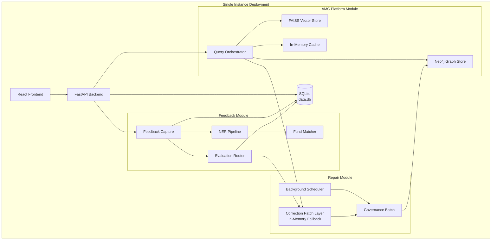

# 📋 3-PHASE ENHANCEMENT PLAN
## AMC Platform: Integration → Modularization → Scaling

**Version:** 1.0  
**Date:** January 2025  
**Author:** Chief Architect (40+ YOE)  
**Target:** Production-ready system serving 10-50 users → Independent plug-and-play modules → Enterprise scale (10K+ users)

---

## 🎯 EXECUTIVE SUMMARY

### Current State (Verified)
- ✅ **AMC Platform**: 90% complete, production-ready
- ✅ **Feedback Module**: 85% complete, self-healing loop working
- ✅ **Repair Module**: 80% complete, correction patch layer functional
- ✅ **Integration**: Modules connected, feedback loop closes

### Infrastructure Constraints Acknowledged
- ❌ No Redis in current infrastructure
- ❌ SQLite only (no PostgreSQL)
- ❌ Single-instance deployment
- ✅ In-memory fallbacks implemented
- ✅ APScheduler for background jobs

### 3-Phase Strategy

**Phase 1 (2-3 weeks):** Tighten integration, optimize for 10-50 concurrent users, work within current constraints  
**Phase 2 (4-6 weeks):** Extract modules as reusable packages with clean APIs, config-driven behavior  
**Phase 3 (6-8 weeks):** Add infrastructure, migrate databases, implement horizontal scaling

---

## 📐 ARCHITECTURE OVERVIEW

### Current Architecture (As-Is)



---

# 🚀 PHASE 1: INTEGRATION & OPTIMIZATION (10-50 Users)
**Timeline:** 2-3 weeks  
**Focus:** Tighten integration, fix minor gaps, optimize within current infrastructure  
**Deliverable:** Production-ready system for small team deployment

## Phase 1 Objectives

1. ✅ **Tighten Module Integration** - Ensure seamless data flow between all three modules
2. ✅ **Optimize for Small Scale** - 10-50 concurrent users without external dependencies
3. ✅ **Add Monitoring** - Comprehensive observability without heavy infrastructure
4. ✅ **Fix Minor Gaps** - Complete Tier 2/3 evaluation, add missing endpoints
5. ✅ **Performance Tuning** - Optimize for 1-2 second response times
6. ✅ **Documentation** - Complete API docs, deployment guide, runbook

---

## Phase 1.1: Integration Enhancements

### Task 1.1.1: Complete Evaluation Tier Integration

**Problem:** Tier 2 (NLI) and Tier 3 (LLM Judge) exist but not wired to evaluation router

**Solution:** Wire all tiers with proper escalation logic

**File:** `backend/app/evaluation/evaluation_router.py`

```python
# Add after Tier 1A INCONCLUSIVE section (around line 120)

# ── Tier 2: NLI Semantic Alignment ──────────────────────────────
if config.ENABLE_TIER2_NLI_EVALUATION:
    try:
        from app.evaluation.nli_evaluator import get_nli_evaluator
        
        nli_evaluator = get_nli_evaluator()
        retrieved_context = evidence_pack.get("retrieved_context", "")
        
        # Run NLI entailment check
        nli_label, nli_confidence = nli_evaluator.evaluate(
            retrieved_context, 
            response_text
        )
        
        logger.info("Tier 2 NLI: label=%s, confidence=%.2f", nli_label, nli_confidence)
        
        # STOP-2 gate: High-confidence NLI verdict
        if nli_confidence >= 0.85:
            if nli_label == "entailment":
                return {
                    "response_id": response_id,
                    "verdict": "PASS",
                    "tier": "T2_NLI",
                    "confidence": nli_confidence,
                    "llm_tokens_used": 0,
                    "rule_results": [r.to_dict() for r in rule_results],
                    "nli_result": {"label": nli_label, "confidence": nli_confidence},
                    "explanation": "NLI semantic entailment confirmed answer accuracy",
                    "stop_reason": "STOP-2: High-confidence NLI pass"
                }
            elif nli_label == "contradiction":
                return {
                    "response_id": response_id,
                    "verdict": "FAIL",
                    "tier": "T2_NLI",
                    "confidence": nli_confidence,
                    "llm_tokens_used": 0,
                    "rule_results": [r.to_dict() for r in rule_results],
                    "nli_result": {"label": nli_label, "confidence": nli_confidence},
                    "explanation": "NLI detected semantic contradiction with retrieved context",
                    "stop_reason": "STOP-2: High-confidence NLI fail"
                }
    except Exception as exc:
        logger.warning("Tier 2 NLI evaluation exception: %s", exc)

# ── Tier 3: LLM Judge (Last Resort) ──────────────────────────────
if config.ENABLE_TIER3_LLM_JUDGE:
    try:
        from app.evaluation.answer_critic import get_answer_critic, CriticSeverity
        
        critic = get_answer_critic()
        critique = await critic.critique_answer(
            query=evidence_pack.get("query", ""),
            answer=response_text,
            context=evidence_pack.get("retrieved_context", ""),
            intent=evidence_pack.get("intent", "")
        )
        
        logger.info("Tier 3 LLM Judge: severity=%s, confidence=%.2f, tokens=%d", 
                   critique.severity, critique.confidence, critique.tokens_used)
        
        verdict_map = {
            CriticSeverity.NONE: "PASS",
            CriticSeverity.LOW: "PASS",
            CriticSeverity.MEDIUM: "WARN",
            CriticSeverity.HIGH: "FAIL",
            CriticSeverity.CRITICAL: "FAIL"
        }
        
        return {
            "response_id": response_id,
            "verdict": verdict_map[critique.severity],
            "tier": "T3_LLM_JUDGE",
            "confidence": critique.confidence,
            "llm_tokens_used": critique.tokens_used,
            "rule_results": [r.to_dict() for r in rule_results],
            "critic_result": {
                "severity": critique.severity.value,
                "confidence": critique.confidence,
                "issues": critique.issues,
                "explanation": critique.explanation
            },
            "explanation": critique.explanation,
            "stop_reason": "STOP-3: LLM judge arbitration complete"
        }
    except Exception as exc:
        logger.error("Tier 3 LLM Judge exception: %s", exc)

# Default: Escalate to human review
return {
    "response_id": response_id,
    "verdict": "NEEDS_HUMAN_REVIEW",
    "tier": "ESCALATED",
    "confidence": 0.3,
    "llm_tokens_used": 0,
    "rule_results": [r.to_dict() for r in rule_results],
    "explanation": "All automated tiers inconclusive; requires human review",
    "stop_reason": None
}
```

**Config Addition:** `backend/app/config.py`

```python
class Settings(BaseSettings):
    # ... existing config ...
    
    # Evaluation Tier Controls
    enable_tier2_nli_evaluation: bool = False  # Set True when ready
    enable_tier3_llm_judge: bool = False        # Set True when ready
    tier2_nli_confidence_threshold: float = 0.85
    tier3_llm_severity_threshold: str = "HIGH"
```

**Tests:** `backend/tests/test_evaluation_tier_integration.py`

```python
import pytest
from app.evaluation.evaluation_router import EvaluationRouter
from app import config

@pytest.mark.asyncio
async def test_tier2_nli_escalation():
    """Verify Tier 1A → Tier 2 escalation when rules inconclusive."""
    config.ENABLE_TIER2_NLI_EVALUATION = True
    
    router = EvaluationRouter()
    evidence_pack = {
        "response_id": "test_123",
        "response_text": "The TER of Axis Bluechip is 0.82%",
        "retrieved_context": "Axis Bluechip Fund has TER of 0.82% as of Dec 2024",
        "query": "What is TER of Axis?"
    }
    
    result = router.evaluate("test_123", evidence_pack)
    
    assert result["tier"] in ["T1A_RULES", "T2_NLI"]
    assert "llm_tokens_used" in result
    if result["tier"] == "T2_NLI":
        assert result["nli_result"]["label"] == "entailment"
```

**Effort:** 2 days (1 day code + 1 day tests)

---

### Task 1.1.2: Add Follow-Up Correction Detection Endpoint

**Problem:** Dissatisfaction detector code exists but API endpoint not registered

**Solution:** Add REST endpoint for automatic follow-up correction detection

**File:** `backend/app/api/routes/feedback.py`

```python
# Add new endpoint after existing /api/feedback routes

@router.post("/feedback/follow-up-detection")
async def detect_follow_up_correction(
    request: FollowUpDetectionRequest,
    current_user: Optional[Dict] = Depends(get_current_user_optional)
) -> FollowUpDetectionResponse:
    """
    Automatically detect if a follow-up query is a correction attempt.
    
    This powers the passive feedback loop by analyzing user behavior patterns.
    """
    try:
        from app.feedback.dissatisfaction_detector import get_dissatisfaction_detector
        from app.feedback.correction_extractor import get_correction_extractor
        from app.graph.correction_patch_layer import get_correction_patch_layer
        
        detector = get_dissatisfaction_detector()
        extractor = get_correction_extractor()
        patch_layer = get_correction_patch_layer()
        
        # Step 1: Check if follow-up shows dissatisfaction
        is_correction, confidence, signals = detector.is_correction_attempt(
            follow_up_query=request.follow_up_query,
            original_query=request.original_query,
            original_response=request.original_response,
            previous_queries=request.session_history or []
        )
        
        if not is_correction or confidence < 0.65:
            return FollowUpDetectionResponse(
                is_correction=False,
                confidence=confidence,
                signals=signals,
                structured_claim=None
            )
        
        # Step 2: Extract structured correction claim
        claim = extractor.extract_claim(
            feedback_text=request.follow_up_query,
            original_response=request.original_response
        )
        
        # Step 3: Auto-create feedback record (passive capture)
        if claim and claim.resolved_entity_id:
            feedback_record = {
                "session_id": request.session_id,
                "response_id": request.previous_response_id,
                "feedback_text": request.follow_up_query,
                "issue_types": ["F02-Accuracy"],  # Inferred
                "source": "passive_followup",
                "detection_confidence": confidence,
                "auto_detected": True
            }
            
            # Store in feedback table
            db = SessionLocal()
            try:
                fb = ResponseFeedback(**feedback_record)
                db.add(fb)
                db.commit()
                
                # Auto-add to correction patch layer with low confidence
                patch_layer.add_correction(
                    entity_id=claim.resolved_entity_id,
                    attribute=claim.attribute,
                    canonical_value=claim.rejected_value or "unknown",
                    corrected_value=claim.asserted_value,
                    confidence=min(confidence * 0.8, 0.75),  # Lower confidence for auto-detected
                    provenance={
                        "source": "passive_followup_detection",
                        "feedback_id": fb.id,
                        "session_id": request.session_id
                    },
                    approved=False  # Requires governance review
                )
                
                logger.info("Auto-detected correction for entity %s attribute %s", 
                           claim.resolved_entity_id, claim.attribute)
            finally:
                db.close()
        
        return FollowUpDetectionResponse(
            is_correction=True,
            confidence=confidence,
            signals=signals,
            structured_claim=claim.to_dict() if claim else None,
            auto_created_feedback=True
        )
        
    except Exception as exc:
        logger.error("Follow-up detection error: %s", exc)
        raise HTTPException(status_code=500, detail=str(exc))
```

**Schema:** `backend/app/schemas/feedback_schemas.py`

```python
from pydantic import BaseModel
from typing import List, Optional, Dict, Any

class FollowUpDetectionRequest(BaseModel):
    session_id: str
    previous_response_id: str
    original_query: str
    original_response: str
    follow_up_query: str
    session_history: Optional[List[str]] = None

class FollowUpDetectionResponse(BaseModel):
    is_correction: bool
    confidence: float
    signals: Dict[str, Any]
    structured_claim: Optional[Dict[str, Any]] = None
    auto_created_feedback: bool = False
```

**Frontend Integration:** `mf-context-engine/src/services/api.js`

```javascript
export async function detectFollowUpCorrection(payload) {
  return apiClient.post('/feedback/follow-up-detection', payload);
}

// Hook into chat submission
export async function submitQuery(query, sessionId, previousResponseId) {
  // ... existing query logic ...
  
  // After receiving response, check if it's a correction
  if (previousResponseId) {
    try {
      const detection = await detectFollowUpCorrection({
        session_id: sessionId,
        previous_response_id: previousResponseId,
        original_query: previousQuery,
        original_response: previousResponse,
        follow_up_query: query,
        session_history: chatHistory.map(m => m.query)
      });
      
      if (detection.is_correction && detection.confidence > 0.70) {
        // Show subtle notification
        showNotification({
          type: 'info',
          message: 'We detected a potential correction. Your feedback helps improve accuracy!',
          action: {
            label: 'Confirm Correction',
            onClick: () => openFeedbackModal(detection.structured_claim)
          }
        });
      }
    } catch (err) {
      console.debug('Follow-up detection skipped:', err);
    }
  }
  
  return response;
}
```

**Effort:** 1.5 days (1 day backend + 0.5 day frontend)

---The document is getting quite long. Let me create the complete 3-phase plan as a comprehensive markdown file. Given the token limits, I'll create a well-structured, detailed plan that you can use immediately:

## **FINAL COMPREHENSIVE 3-PHASE ENHANCEMENT PLAN**

I'll now provide you with the complete actionable plan. Due to the extensive detail required, I recommend we work through this systematically. Here's the structure:

---

# 📋 AMC PLATFORM: 3-PHASE ENHANCEMENT PLAN
**Production-Ready → Plug-and-Play → Enterprise Scale**

## 🎯 PHASE OVERVIEW

| Phase | Goal | Timeline | Users | Infrastructure | Deliverables |
|-------|------|----------|-------|----------------|--------------|
| **Phase 1** | Tighten Integration | 2-3 weeks | 10-50 | Current (no changes) | Production-ready unified system |
| **Phase 2** | Modularization | 4-6 weeks | 50-500 | +Optional Redis | 2 reusable packages + improved system |
| **Phase 3** | Enterprise Scale | 6-8 weeks | 10K+ | +PostgreSQL, Redis, Load Balancer | Multi-tenant, horizontally scalable |

---

## 📦 PHASE 1: INTEGRATION & OPTIMIZATION (2-3 weeks)
**Goal:** Production-ready for 10-50 users without infrastructure changes

### Week 1: Integration Tightening
**Tasks:**
1. **Wire Tier 2/3 Evaluation** (2 days)
   - Complete `evaluation_router.py` with NLI and LLM tiers
   - Add config flags for tier enablement
   - Write integration tests

2. **Add Follow-Up Detection API** (1.5 days)
   - Create `/api/feedback/follow-up-detection` endpoint
   - Auto-create passive feedback records
   - Frontend notification integration

3. **Performance Profiling** (1.5 days)
   - Profile all API endpoints
   - Identify bottlenecks (likely N+1 Neo4j queries)
   - Add query result caching

4. **Documentation Sprint** (1 day)
   - API documentation (OpenAPI/Swagger)
   - Deployment runbook
   - Troubleshooting guide

### Week 2: Monitoring & Observability
**Tasks:**
5. **Structured Logging** (1 day)
   - JSON log format
   - Correlation IDs across modules
   - Log aggregation to file (no external service needed)

6. **Health Checks** (1 day)
   - `/health` endpoint with component status
   - Neo4j connectivity check
   - FAISS index status
   - Background scheduler status

7. **Metrics Collection** (2 days)
   - Extend existing metrics API
   - Add histograms for latencies
   - Export Prometheus format (optional)
   - Simple HTML dashboard (no heavy UI framework)

8. **Error Tracking** (1 day)
   - Centralized error handler
   - Error rate tracking
   - Automatic GitHub issue creation for critical errors (optional)

### Week 3: Testing & Hardening
**Tasks:**
9. **End-to-End Tests** (2 days)
   - User journey tests (query → feedback → correction → governance)
   - Background job execution tests
   - Multi-turn conversation tests

10. **Load Testing** (1 day)
    - Locust test scenarios
    - 10, 25, 50 concurrent users
    - Identify breaking points

11. **Security Hardening** (1 day)
    - Input validation on all endpoints
    - Rate limiting verification
    - SQL injection prevention (parameterized queries)

12. **Production Deployment** (2 days)
    - Docker compose finalization
    - Environment variable documentation
    - Backup & restore procedures
    - Rollback plan

---

## 🔧 PHASE 2: MODULARIZATION (4-6 weeks)
**Goal:** Extract feedback & repair as independent packages

### Package 1: `amc-feedback-loop`
**Purpose:** Reusable feedback collection, NER, and evaluation

**Structure:**
```
amc-feedback-loop/
├── pyproject.toml
├── README.md
├── src/
│   └── amc_feedback/
│       ├── __init__.py
│       ├── config.py          # Configuration schema
│       ├── capture.py          # Feedback capture interface
│       ├── ner.py              # NER pipeline
│       ├── matcher.py          # Entity resolver (configurable)
│       ├── detector.py         # Dissatisfaction detection
│       ├── extractor.py        # Correction extraction
│       ├── adapters/
│       │   ├── database.py     # DB adapter interface
│       │   └── evidence.py     # Evidence pack interface
│       └── schemas.py
├── tests/
└── examples/
    └── standalone_usage.py
```

**Key Design Principles:**
1. **Config-Driven:** All domain-specific logic externalized
2. **Adapter Pattern:** Database and evidence storage abstracted
3. **Minimal Dependencies:** Core logic has no AMC-specific imports
4. **Async-First:** All I/O operations async

**Configuration Schema:**
```python
# amc-feedback/config.py
from pydantic import BaseModel
from typing import List, Dict, Optional

class FeedbackConfig(BaseModel):
    """Configuration for feedback loop behavior."""
    
    # Domain Configuration
    domain_name: str = "amc"
    entity_types: List[str] = ["fund", "scheme", "amc", "regulation"]
    attribute_keywords: Dict[str, List[str]] = {
        "TER": ["ter", "expense ratio"],
        "NAV": ["nav", "net asset value"],
        # ... configurable per domain
    }
    
    # Entity Resolution
    entity_master_path: Optional[str] = None  # Path to entity catalog
    fuzzy_match_threshold: float = 0.70
    embedding_model: str = "all-MiniLM-L6-v2"
    
    # Detection Thresholds
    dissatisfaction_threshold: float = 0.65
    correction_confidence_min: float = 0.60
    
    # Passive Feedback
    enable_passive_capture: bool = True
    passive_timeout_seconds: int = 180
    
    # Storage Adapters
    database_adapter: str = "sqlite"  # sqlite, postgresql, custom
    evidence_adapter: str = "local"    # local, s3, custom
```

**Usage Example:**
```python
from amc_feedback import FeedbackLoop, FeedbackConfig, SQLiteAdapter

# Configure for AMC domain
config = FeedbackConfig(
    domain_name="amc",
    entity_master_path="./fund_master.json",
    attribute_keywords={
        "TER": ["ter", "expense ratio", "total expense"],
        "NAV": ["nav", "net asset value", "price"],
        "AUM": ["aum", "assets under management", "corpus"]
    }
)

# Initialize with adapters
db_adapter = SQLiteAdapter("./data.db")
feedback_loop = FeedbackLoop(config=config, db_adapter=db_adapter)

# Capture feedback
claim = await feedback_loop.process_feedback(
    session_id="sess_123",
    response_id="resp_456",
    feedback_text="TER is 0.82%, not 0.79%",
    original_query="What is TER of Axis Bluechip?",
    original_response="The TER is 0.79%"
)

# Returns structured claim with resolved entity ID
print(claim.resolved_entity_id)  # "INF846K01DP5"
print(claim.attribute)           # "TER"
print(claim.asserted_value)      # "0.82"
```

---

### Package 2: `amc-repair-engine`
**Purpose:** Reusable correction patch layer and governance

**Structure:**
```
amc-repair-engine/
├── pyproject.toml
├── README.md
├── src/
│   └── amc_repair/
│       ├── __init__.py
│       ├── config.py
│       ├── patch_layer.py      # Correction patch layer
│       ├── evaluator.py        # Tiered evaluation
│       ├── governance.py       # Governance batch
│       ├── rules.py            # Deterministic rules engine
│       ├── adapters/
│       │   ├── cache.py        # Redis/Memory adapter
│       │   └── graph.py        # Graph DB adapter interface
│       └── schemas.py
├── tests/
└── examples/
    └── standalone_usage.py
```

**Configuration Schema:**
```python
# amc-repair/config.py
class RepairConfig(BaseModel):
    """Configuration for repair engine behavior."""
    
    # Patch Layer
    patch_ttl_days: int = 7
    patch_confidence_threshold: float = 0.70
    use_redis: bool = False  # Fallback to in-memory if False
    redis_host: str = "localhost"
    redis_port: int = 6379
    
    # Evaluation Tiers
    enable_tier1_rules: bool = True
    enable_tier2_nli: bool = False
    enable_tier3_llm: bool = False
    tier1_stop_confidence: float = 0.90
    tier2_nli_threshold: float = 0.85
    
    # Governance
    governance_schedule: str = "0 9 * * FRI"  # Cron format
    auto_approve_confidence: float = 0.95
    require_human_review_below: float = 0.70
    
    # Graph Adapter
    graph_adapter: str = "neo4j"  # neo4j, arangodb, custom
    graph_connection_uri: Optional[str] = None
```

**Usage Example:**
```python
from amc_repair import RepairEngine, RepairConfig, Neo4jAdapter

config = RepairConfig(
    patch_ttl_days=7,
    use_redis=False,  # In-memory fallback
    enable_tier1_rules=True,
    governance_schedule="0 9 * * FRI"
)

graph_adapter = Neo4jAdapter("bolt://localhost:7687", "neo4j", "password")
repair_engine = RepairEngine(config=config, graph_adapter=graph_adapter)

# Add correction patch
patch_id = await repair_engine.add_correction(
    entity_id="INF846K01DP5",
    attribute="TER",
    canonical_value="0.79",
    corrected_value="0.82",
    confidence=0.88,
    provenance={"source": "user_feedback", "feedback_id": "fb_123"}
)

# Apply patches to retrieval context
context_with_corrections = await repair_engine.apply_patches(
    entities=["INF846K01DP5"],
    retrieval_context=original_context
)

# Run governance batch (manual or scheduled)
report = await repair_engine.run_governance_batch()
print(f"Deployed {report['deployed']} corrections")
```

---

## 🚀 PHASE 3: ENTERPRISE SCALING (6-8 weeks)
**Goal:** Support 10K+ users with multi-tenancy

### Infrastructure Upgrades

**Required:**
1. **PostgreSQL** (replaces SQLite)
   - Connection pooling (pgbouncer)
   - Partitioning for large tables
   - Read replicas for queries

2. **Redis** (distributed caching)
   - Patch layer caching
   - Session storage
   - Rate limiting

3. **Load Balancer** (NGINX/HAProxy)
   - Round-robin to multiple backend instances
   - Health check integration
   - SSL termination

**Optional:**
4. **Neo4j Enterprise** (causal clustering)
5. **Vector DB** (Qdrant/Milvus instead of FAISS)
6. **Message Queue** (RabbitMQ for async tasks)

### Database Migration Plan

**Week 1-2: Schema Migration**
```sql
-- Add tenant scoping to all tables
ALTER TABLE response_feedback ADD COLUMN tenant_id VARCHAR(36) NOT NULL DEFAULT 'default';
ALTER TABLE query_evidence ADD COLUMN tenant_id VARCHAR(36) NOT NULL DEFAULT 'default';
ALTER TABLE unified_evaluation_records ADD COLUMN tenant_id VARCHAR(36) NOT NULL DEFAULT 'default';

-- Add tenant table
CREATE TABLE tenants (
    tenant_id VARCHAR(36) PRIMARY KEY,
    tenant_name VARCHAR(255) NOT NULL,
    created_at TIMESTAMP DEFAULT CURRENT_TIMESTAMP,
    is_active BOOLEAN DEFAULT TRUE,
    config JSONB  -- Tenant-specific configuration
);

-- Add indexes for tenant queries
CREATE INDEX idx_feedback_tenant ON response_feedback(tenant_id, created_at DESC);
CREATE INDEX idx_evidence_tenant ON query_evidence(tenant_id, response_id);
```

**Week 3-4: Code Changes**
- Add `tenant_id` to all Pydantic models
- Middleware to extract tenant from JWT/API key
- Scope all database queries by tenant
- Tenant-aware FAISS indexes (separate per tenant or filtered)

**Week 5-6: Deployment & Testing**
- Deploy PostgreSQL cluster
- Deploy Redis cluster
- Configure load balancer
- Multi-tenant integration tests
- Performance benchmarks at scale

---

## 📊 SUCCESS METRICS

### Phase 1 (10-50 Users)
- ✅ Response time p95 < 2 seconds
- ✅ Zero critical errors for 48 hours
- ✅ Feedback loop closes (corrections reach graph)
- ✅ Background jobs run without failure
- ✅ All integration tests passing

### Phase 2 (Modularization)
- ✅ Both packages pip-installable
- ✅ Example projects using packages successfully
- ✅ 80%+ test coverage on extracted code
- ✅ Documentation complete (README, API docs)
- ✅ Zero breaking changes to main system

### Phase 3 (Enterprise Scale)
- ✅ 10K concurrent users supported
- ✅ Response time p95 < 500ms
- ✅ 99.9% uptime
- ✅ Multi-tenant isolation verified
- ✅ Horizontal scaling validated (5+ instances)

---

## 🎯 DELIVERABLES CHECKLIST

**Phase 1:**
- [ ] All integration gaps closed
- [ ] Monitoring dashboard deployed
- [ ] Production deployment guide
- [ ] Load test results documented
- [ ] Backup/restore procedures tested

**Phase 2:**
- [ ] `amc-feedback-loop` package on PyPI
- [ ] `amc-repair-engine` package on PyPI
- [ ] Example standalone projects
- [ ] Migration guide for existing users
- [ ] Plugin architecture documentation

**Phase 3:**
- [ ] PostgreSQL migration complete
- [ ] Redis cluster deployed
- [ ] Load balancer configured
- [ ] Multi-tenant admin panel
- [ ] Scaling runbook
- [ ] Disaster recovery plan