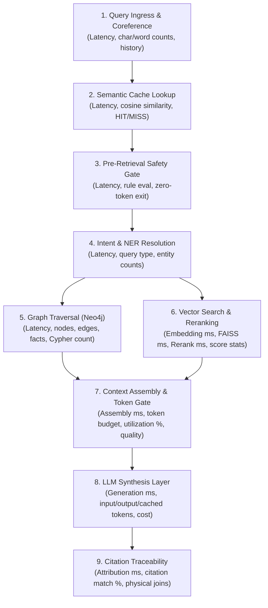
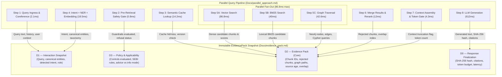
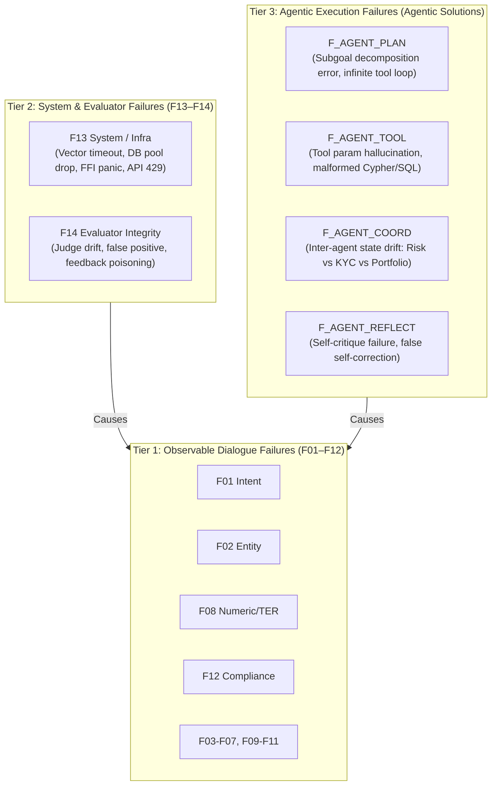

Searched for files: *
Searched for files: *
Listed directory context-engineering
Viewed COMPLETE_METRICS_INDEX.md:1-453
Searched for files
Searched for files: *.py
Searched for "class.*Metrics"
Searched for "latency"
Viewed tracing.py:1-309
Viewed METRICS_VERIFICATION_REPORT.md:1-250
Viewed METRICS_VERIFICATION_REPORT.md:251-500
Viewed METRICS_VERIFICATION_REPORT.md:501-741
Searched for files: *
Viewed retrieval.py:140-200
Viewed retrieval.py:200-300
Viewed retrieval.py:301-450
Viewed retrieval.py:451-550
Viewed query.py:1-120
Viewed query.py:121-200
Viewed query.py:201-360
Searched for files: *orchestrator*.py
Viewed orchestrator.py:1-150
Viewed orchestrator.py:151-300
Viewed orchestrator.py:301-360
Viewed query.py:1-160
Viewed query.py:161-240
Viewed query.py:241-353
Viewed multi_turn_query_test.py:1-100
Viewed multi_turn_query_test.py:400-550
Viewed query_pipeline_metrics_flowchart.html:1-100

In this codebase, a comprehensive **end-to-end telemetry and metrics instrumentation system** captures granular metrics from the millisecond a user query enters the system to the final response delivery.

---

### 1. Where Metrics Are Captured (Core Codebase)

The metrics infrastructure is organized across several layers:

1. **Unified Tracing Engine** — [`backend/app/core/tracing.py`](file:///c:/Users/Laptopadmin/Desktop/context-engineering/backend/app/core/tracing.py):
   - [`QueryTracingContext`](file:///c:/Users/Laptopadmin/Desktop/context-engineering/backend/app/core/tracing.py#L82-L282): The single source of truth for all metrics across a query lifecycle.
   - [`ComponentMetrics`](file:///c:/Users/Laptopadmin/Desktop/context-engineering/backend/app/core/tracing.py#L26-L53): High-resolution per-stage timers (`time.perf_counter()`), error states, and custom payloads.
   - [`CacheMetrics`](file:///c:/Users/Laptopadmin/Desktop/context-engineering/backend/app/core/tracing.py#L56-L66) & [`EntityResolutionMetrics`](file:///c:/Users/Laptopadmin/Desktop/context-engineering/backend/app/core/tracing.py#L69-L79).

2. **Schema & Trace Contract** — [`backend/app/schemas/query.py`](file:///c:/Users/Laptopadmin/Desktop/context-engineering/backend/app/schemas/query.py):
   - [`QueryTrace`](file:///c:/Users/Laptopadmin/Desktop/context-engineering/backend/app/schemas/query.py#L240-L265): Structured telemetry model including per-component ms, tokens (input, output, saved), quality scores, and gate statuses.
   - [`AssembledContext`](file:///c:/Users/Laptopadmin/Desktop/context-engineering/backend/app/schemas/query.py#L148-L186): Validates token budgets, dropped chunks, and utilization percentage.

3. **Orchestrator & Execution Pipeline** — [`backend/app/retrieval/orchestrator.py`](file:///c:/Users/Laptopadmin/Desktop/context-engineering/backend/app/retrieval/orchestrator.py) & [`backend/app/engine/retrieval.py`](file:///c:/Users/Laptopadmin/Desktop/context-engineering/backend/app/engine/retrieval.py):
   - [`hybrid_graphrag()`](file:///c:/Users/Laptopadmin/Desktop/context-engineering/backend/app/engine/retrieval.py#L229-L575): Measures every retrieval step and generates `telemetry_breakdown`.
   - [`log_query_audit()`](file:///c:/Users/Laptopadmin/Desktop/context-engineering/backend/app/engine/retrieval.py#L192-L227): Logs full structured query audit JSONL files per execution into the `logs/` directory.

---

### 2. The 9 Sequential Pipeline Stages & Metrics Captured

The query pipeline instruments 9 stages from query input to synthesis:



| Stage | Metrics Captured | Example Baseline |
| :--- | :--- | :--- |
| **1. Query Ingress & Coreference** | Ingress latency (`ms`), query length (chars/words), history turns compressed, pronouns resolved, active domain namespace. | `2.1 ms` (124 chars, 18 words) |
| **2. Semantic Query Cache** | Lookup latency (`ms`), cosine similarity score, match threshold, corpus version, TTL, Cache HIT/MISS flag, saved tokens. | `14.2 ms` (sim: 0.420, MISS) |
| **3. Pre-Retrieval Safety Gate** | Evaluation latency (`ms`), rules evaluated, regulatory violations detected (e.g. SEBI guaranteed returns), tokens consumed (`0` on block). | `0.8 ms` (0 violations, 0 tokens) |
| **4. Intent Classification & NER** | Classifier latency (`ms`), classified query type, entity count (Layer A rule-based + Layer B ML), taxonomy paths, routing flags (`requires_graph`, `requires_vector`). | `18.5 ms` (2 entities, compliance_check) |
| **5. Graph Traversal (Neo4j)** | Traversal latency (`ms`), nodes matched, edges traversed (`:APPLIES_TO`, `:AFFECTS`, etc.), facts extracted, Cypher query count. | `42.6 ms` (8 nodes, 12 edges, 6 facts) |
| **6. Vector Search & Reranking** | Sub-latencies (`embedding_ms`, `faiss_ms`, `rerank_ms`), raw candidates scanned vs. retained, retention ratio, score distribution (Max, Min, P50, Mean). | `86.8 ms` (40 scanned → 5 kept, top score: 0.892) |
| **7. Context Assembly & Token Gate** | Assembly latency (`ms`), token budget allocation vs. consumption, budget utilization (`%`), graph/vector token split, Context Quality Score (0–1). | `4.3 ms` (1,420 / 4,000 tokens = 35.5%, quality: 0.88) |
| **8. LLM Synthesis** | Generation latency (`ms`), model ID, input tokens, output tokens, cached tokens, estimated cost, confidence level (`high`/`medium`/`low`), schema validation status. | `612.0 ms` (1,420 in, 185 out, Groq 120b) |
| **9. Citation & Traceability** | Attribution latency (`ms`), citation count extracted vs. verified, resolvability rate (`%`), bidirectional chunk/doc joins. | `1.5 ms` (3/3 verified, 100% resolvability) |

---

### 3. Latency & Token Summary

Across the benchmark runs recorded in [`METRICS_VERIFICATION_REPORT.md`](file:///c:/Users/Laptopadmin/Desktop/context-engineering/METRICS_VERIFICATION_REPORT.md):
- **End-to-End Total Latency:** `~782.8 ms`
  - **LLM Inference:** `612.0 ms` (78.2% of total time)
  - **All Pre/Post-Retrieval Engineering:** `170.8 ms` (21.8% of total time)
- **Token Accounting & Efficiency:**
  - Token budget: 4,000 tokens
  - Context tokens used: 1,420 tokens (35.5% utilization)
  - ContextGraph achieves **~40–70% token savings** compared to Traditional Vector RAG via structured graph facts and score-gap vector pruning.

---

### 4. Interactive Dashboards & Evaluation Reports in the Project

The workspace includes detailed reports and interactive visualizers:

1. **Interactive HTML Dashboards:**
   - [`comprehensive_query_pipeline_flowchart.html`](file:///c:/Users/Laptopadmin/Desktop/context-engineering/comprehensive_query_pipeline_flowchart.html): 3-tab dashboard with real-time inspector panel, JSON payloads, waterfall timeline, and CSV export.
   - [`query_pipeline_metrics_flowchart.html`](file:///c:/Users/Laptopadmin/Desktop/context-engineering/query_pipeline_metrics_flowchart.html): Step simulator allowing you to step through all 9 stages with live metric chips.
2. **Audit & Verification Documentation:**
   - [`COMPLETE_METRICS_INDEX.md`](file:///c:/Users/Laptopadmin/Desktop/context-engineering/COMPLETE_METRICS_INDEX.md): Index guide for all metrics, test outputs, and quality gates.
   - [`METRICS_VERIFICATION_REPORT.md`](file:///c:/Users/Laptopadmin/Desktop/context-engineering/METRICS_VERIFICATION_REPORT.md): Full audit report with ASCII waterfall diagrams, quality gate matrix (10/10 PASS), component health, and JSON payloads.
   - [`BENCHMARK_SUMMARY.md`](file:///c:/Users/Laptopadmin/Desktop/context-engineering/BENCHMARK_SUMMARY.md) & [`TEST_OUTPUT_SUMMARY.md`](file:///c:/Users/Laptopadmin/Desktop/context-engineering/TEST_OUTPUT_SUMMARY.md).
3. **Multi-Turn Benchmark Suite:**
   - [`evaluation/multi_turn_query_test.py`](file:///c:/Users/Laptopadmin/Desktop/context-engineering/evaluation/multi_turn_query_test.py): Runs 5 multi-turn conversation chains comparing ContextGraph vs Traditional Vector RAG across tokens, latency, and ground-truth fragment verification.
   

Viewed evidence_pack.md:1-51
Viewed parallel_approach.md:1-12
Searched for "EvidencePack"
Viewed AMC_Feedback_loop_Architecture_v1.2.html:1230-1390

Based on [Docs/evidence_pack.md](file:///c:/Users/Laptopadmin/Desktop/context-engineering/Docs/evidence_pack.md) and the parallel pipeline stages defined in [Docs/parallel_approach.md](file:///c:/Users/Laptopadmin/Desktop/context-engineering/Docs/parallel_approach.md), here is the comprehensive architectural blueprint for converting runtime operational metrics into the **Immutable EvidencePack (D0–D3) format**.

---

### 1. Conceptual Shift: Operational Telemetry vs. Frozen Evidence Pack

```
┌─────────────────────────────────────────────────────────┐
│              Live Operational Telemetry                 │
│  - Ephemeral execution timings (ms)                     │
│  - Dynamic system state, memory counters, pool stats   │
└──────────────────────────┬──────────────────────────────┘
                           │
       At Delivery Time: Transforms & Freezes
                           │
                           ▼
┌─────────────────────────────────────────────────────────┐
│          Frozen EvidencePack Snapshot (D0–D3)           │
│  - Immutable, SHA-256 cryptographically anchored        │
│  - Complete provenance (what the system knew & cited)   │
│  - Evaluators judge ONLY this snapshot, never live state│
└─────────────────────────────────────────────────────────┘
```

When corpus files update in production (e.g. AMFI circular v18 updates to v19), evaluating historical responses against the *live* database causes false positives. An **EvidencePack** captures and freezes the exact state at query time so compliance auditors or automated evaluators can deterministically replay and diagnose any interaction years later.

---

### 2. Step-by-Step Mapping: Parallel Pipeline $\rightarrow$ EvidencePack (D0–D3)

Here is how each step in [Docs/parallel_approach.md](file:///c:/Users/Laptopadmin/Desktop/context-engineering/Docs/parallel_approach.md) populates the **D0–D3 EvidencePack**:



---

### 3. Detailed Stage-to-Field Mapping Matrix

| Pipeline Step (Parallel Approach) | Operational Metrics Captured | Mapped EvidencePack Field | EvidencePack Tier | Diagnostic Purpose |
| :--- | :--- | :--- | :--- | :--- |
| **1. Query Ingress (2.1ms)** | Normalized query, turn index, chat history, namespace | `interaction_id`, `timestamp`, `user_role`, `jurisdiction`, `channel` | **D1** | Interaction provenance & scope anchoring |
| **2. Safety Gate (0.8ms)** | Guardrail rule evaluations, short-circuit refusal | `applicable_controls`, `mandatory_controls`, `advice_flag`, `interaction_mode` | **D3** | Verifies regulatory control compliance (e.g., C08: no guaranteed returns) |
| **3. Cache Lookup (14.2ms)** | Cosine similarity, match status, version check | `source_version`, `source_version_mismatch`, `cache_hit` | **D2** | Prevents serving stale cached data across corpus versions |
| **4. Intent + NER + Embedding (18.5ms)** | Query classification, entity extraction (Layer A & B), taxonomy path | `detected_intent`, `entities` (canonical IDs), `attributes`, `taxonomy_nodes` | **D1 / D2** | Anchors what entities/attributes were targeted vs. hallucinations |
| **5A. Vector Search (86.8ms)** | Dense candidates, cosine scores, FAISS timings | `chunk_ids`, `vector_scores`, `document_ids` | **D2** | Identifies candidate rank distribution |
| **5B. BM25 Search (40ms)** | Lexical keyword candidates, BM25 scores | `bm25_chunk_ids`, `lexical_scores` | **D2** | Verifies exact-match retrieval (fund codes, circular numbers) |
| **5C. Graph Traversal (42.6ms)** | Neo4j nodes matched, edges traversed, Cypher query | `graph_paths`, `graph_nodes`, `relationship_types`, `cypher_queries` | **D2** | Relational integrity and structured ground-truth facts |
| **6. Merge Results (12ms)** | RRF fusion scores, cross-encoder rerank drops, overlap | `evidence_rejected[]`, `vector_graph_overlap` (`HIGH`/`MED`/`LOW`) | **D2** | **Critical:** Distinguishes **F09 (context dropped at rerank)** from **F04 (retrieval miss)** |
| **7. Context Assembly (4.3ms)** | Token budget vs consumed, quality score, pruning | `context_truncation` (bool), `selected_context[]`, `quality_score` | **D2** | Detects context boundary clipping |
| **8. LLM Generation (612ms)** | Final answer text, Groq/OpenAI token usage, citations | `response_id`, `response_hash` (SHA-256), `model_id`, `citations_shown`, `citation_coverage` | **D0 / D2** | Cryptographic non-repudiation & citation verification (F06 vs F07) |

---

### 4. Target Python Pydantic Data Contract

To implement this in our codebase, we define the schemas in [`backend/app/schemas/evidence.py`](file:///c:/Users/Laptopadmin/Desktop/context-engineering/backend/app/schemas/evidence.py):

```python
from pydantic import BaseModel, Field, computed_field
from typing import List, Dict, Any, Optional
import hashlib
from datetime import datetime

# ─── D0: RESPONSE FINALIZATION ────────────────────────────────────────────────
class D0_ResponseFinalization(BaseModel):
    response_id: str
    response_text: str
    model_id: str
    prompt_template_version: str
    citations_shown: List[str]
    input_tokens: int
    output_tokens: int
    total_tokens: int
    latency_ms: float
    truncation_flag: bool = False

    @computed_field
    @property
    def response_hash(self) -> str:
        """Deterministic SHA-256 hash of final output for cryptographic non-repudiation."""
        return hashlib.sha256(self.response_text.encode("utf-8")).hexdigest()


# ─── D1: INTERACTION SNAPSHOT ─────────────────────────────────────────────────
class D1_InteractionSnapshot(BaseModel):
    interaction_id: str
    session_id: str
    timestamp: str = Field(default_factory=lambda: datetime.utcnow().isoformat())
    user_query: str
    normalized_query: str
    detected_intent: str  # e.g., CURRENT_NUMERIC_FACT, COMPARATIVE_CLAIM, COMPLIANCE_CHECK
    entities: List[str]   # Canonical IDs: e.g. ["INF846K01DP5", "ADANI_PORTS"]
    attributes: List[str] # e.g. ["TER", "EBITDA", "NAV", "5yr_return"]
    jurisdiction: str = "IN"
    channel: str = "web_chat"
    user_role: str = "investor"  # investor | adviser | compliance_officer


# ─── D2: EVIDENCE PACK (CORE PROVENANCE) ──────────────────────────────────────
class RetrievedChunkEvidence(BaseModel):
    chunk_id: str
    document_id: str
    document_title: str
    page_number: Optional[int] = None
    similarity_score: float
    rank: int
    retrieval_source: str  # "vector" | "bm25" | "graph"

class D2_EvidencePackCore(BaseModel):
    selected_chunks: List[RetrievedChunkEvidence]
    evidence_rejected: List[RetrievedChunkEvidence]  # Dropped during rerank/prune
    graph_paths: List[str]                           # e.g. ["Scheme->HOLDS->Issuer"]
    cypher_queries_run: List[str]
    source_version: str                              # e.g. "v2_baseline_20260814"
    source_age_days: int
    source_version_mismatch: bool = False
    citation_coverage: str                           # e.g. "3/3 (100%)"
    vector_graph_overlap: str                        # "HIGH" | "MEDIUM" | "LOW"
    context_truncation: bool = False
    quality_score: float = 1.0


# ─── D3: POLICY & APPLICABILITY CONTEXT ───────────────────────────────────────
class D3_PolicyContext(BaseModel):
    jurisdiction: str = "IN"
    policy_pack: str = "INDIA_SEBI_v2026_03"
    applicable_controls: List[str]  # e.g. ["C01", "C02", "C03", "C07", "C08"]
    mandatory_controls: List[str]   # e.g. ["C02_source_currency", "C03_numeric_accuracy", "C08_no_guarantee"]
    advice_flag: bool = False
    interaction_mode: str = "INFORMATION"  # "INFORMATION" | "COMPARISON" | "ADVISORY"


# ─── UNIFIED IMMUTABLE EVIDENCE PACK ──────────────────────────────────────────
class FrozenEvidencePack(BaseModel):
    d0: D0_ResponseFinalization
    d1: D1_InteractionSnapshot
    d2: D2_EvidencePackCore
    d3: D3_PolicyContext
    frozen_at: str = Field(default_factory=lambda: datetime.utcnow().isoformat())
```

---

### 5. Failure Mode Diagnosis Enabled by D0–D3

By persisting this structured EvidencePack, downstream automated evaluators can diagnose exact root causes without calling an expensive LLM:

```
┌──────────────────────────────────────┬────────────────────────────────────────────────────────┐
│ EvidencePack Diagnostic Fields       │ Failure Mode Pinpointed                                │
├──────────────────────────────────────┼────────────────────────────────────────────────────────┤
│ source_version + source_age_days     │ Distinguishes F05 (Stale Source) from F07 (LLM Hallucination) │
│ evidence_rejected[]                  │ Distinguishes F09 (Context Pruned) from F04 (Retrieval Miss)   │
│ citation_coverage + chunk_ids        │ Distinguishes F06 (Citation Hallucination) from F04 (Bad Rank) │
│ vector_graph_overlap = "LOW"         │ Passive Anomaly: Signals Graph/Vector schema divergence│
│ response_hash                        │ Cryptographic proof of what was served (Zero-Tamper)   │
│ mandatory_controls in D3             │ Instant pass/fail for SEBI statutory disclosures       │
└──────────────────────────────────────┴────────────────────────────────────────────────────────┘
```

---

### 6. Recommended Implementation Steps

1. **Create Evidence Schema** in [`backend/app/schemas/evidence.py`](file:///c:/Users/Laptopadmin/Desktop/context-engineering/backend/app/schemas/evidence.py) with the D0–D3 dataclasses shown above.
2. **Implement EvidencePack Builder** in [`backend/app/core/tracing.py`](file:///c:/Users/Laptopadmin/Desktop/context-engineering/backend/app/core/tracing.py) to accumulate D1 (ingress/intent), D3 (guardrails), and D2 (parallel vector/BM25/graph retrieval + rejected chunks).
3. **Freeze & Persist in Orchestrator** in [`backend/app/retrieval/orchestrator.py`](file:///c:/Users/Laptopadmin/Desktop/context-engineering/backend/app/retrieval/orchestrator.py) upon completing Step 8 (LLM generation), compute `response_hash`, and write the frozen snapshot to `logs/evidence_packs/{date}/{interaction_id}.json`.
4. **Expose in API Response** via [`backend/app/api/routes/query.py`](file:///c:/Users/Laptopadmin/Desktop/context-engineering/backend/app/api/routes/query.py) so the frontend and compliance dashboard can consume the frozen D0–D3 record directly.

Would you like me to create an implementation plan and proceed with integrating this `FrozenEvidencePack` schema and builder into our backend retrieval pipeline?

Viewed AMC_Feedback_Loop_Technical_Design.md:1-206
Viewed AMC_Active_Passive_Feedback_LLD_v1.3.html:1-180
Viewed AMC_Active_Passive_Feedback_LLD_v1.3.html:450-580
Searched for "F01"
Viewed feedback_container_implementation_spec.md:1-115
Searched for "TER"
Viewed AMC_Feedback_loop_Architecture_v1.2.html:1150-1250
Viewed AMC_Feedback_loop_Architecture_v1.2.html:1390-1550

Based on a comprehensive review of the three core feedback loop specifications:
1. **[Docs/AMC_Feedback_loop_Architecture_v1.2.html](file:///c:/Users/Laptopadmin/Desktop/context-engineering/Docs/AMC_Feedback_loop_Architecture_v1.2.html)** (End-to-End System Architecture, Data Lineage & Evaluation Tiers)
2. **[Docs/AMC_Active_Passive_Feedback_LLD_v1.3.html](file:///c:/Users/Laptopadmin/Desktop/context-engineering/Docs/AMC_Active_Passive_Feedback_LLD_v1.3.html)** (Active/Passive Worked Execution Model, 33 Gates & Failure Attribution)
3. **[Docs/AMC_Feedback_Loop_Technical_Design.md](file:///c:/Users/Laptopadmin/Desktop/context-engineering/Docs/AMC_Feedback_Loop_Technical_Design.md)** (Three-System Contract, Ingestion Webhook & 6-Step Build)

---

### 1. Architectural Synthesis: How Metrics Feed the Feedback Loop

In an enterprise Asset Management Company (AMC), operational metrics are not just performance counters—they are the **deterministic ground truth** used by both **Active (human-driven)** and **Passive (automated system-driven)** feedback loops:

```
┌────────────────────────────────────────────────────────────────────────────────────────┐
│                               AMC RUNTIME PIPELINE                                     │
│  Parallel Retrieval (Vector + BM25 + Graph) ➔ Context Engineering ➔ LLM Synthesis      │
└──────────────────────────────────────────┬─────────────────────────────────────────────┘
                                           │ At Response Delivery
                                           ▼
┌────────────────────────────────────────────────────────────────────────────────────────┐
│                        FROZEN EVIDENCE PACK (D0–D3 SNAPSHOT)                           │
│  Cryptographically signed (SHA-256), immutable record of what the system knew & cited  │
└─────────────────────┬────────────────────────────────────────────┬─────────────────────┘
                      │                                            │
        Active Path (Human Reviewer)                 Passive Path (Automated Controls)
        • Reviewer selects checkboxes (F01–F12)      • Runs immediately with 0 human input
        • Free-text commentary / highlighted span    • Deterministic numeric/date/freshness checks
        • Submits via Feedback API                   • Guardrail & advice-boundary triggers
                      │                                            │
                      └────────────────────┬───────────────────────┘
                                           │ Converges into
                                           ▼
┌────────────────────────────────────────────────────────────────────────────────────────┐
│                              HUMAN FEEDBACK LOOP MODULE                                │
│  Builds Unified Evaluation Record ➔ 4-Tier Ladder (0-token deterministic checks first) │
│  ➔ Diagnoses Root Cause (F01–F12) ➔ Reversible, Governed Self-Healing Repair           │
└────────────────────────────────────────────────────────────────────────────────────────┘
```

---

### 2. AMC Regulatory & Compliance Requirements (What Must Be Captured)

Under **SEBI (Mutual Funds) Regulations, SEBI Investment Advisers Regulations (2013), and AMFI Code of Conduct**, a financial AI cannot just provide answers; it must maintain strict compliance boundaries. 

The following **mandatory regulatory dimensions** must be captured across the telemetry and evidence layers:

```
┌────────────────────────────────────────────────────────────────────────────────────────┐
│                           MANDATORY AMC REGULATORY CONTROLS                            │
├────────────────────────────────────────────────────────────────────────────────────────┤
│ C01 · SEBI Categorization Match     │ Exact subcategory alignment (Large Cap, Flexi Cap, etc.) │
│ C02 · NAV & Source Currency Date    │ As-of date for NAV/AUM; historical vs latest distinction │
│ C03 · Total Expense Ratio (TER)     │ Must specify Plan (Direct vs Regular) + Option (Growth)  │
│ C04 · Performance & Benchmark Co-Pres.│ Compulsory presentation of Scheme vs Benchmark returns │
│ C05 · Risk-o-meter Level & Date     │ Mandatory Risk level (Low to Very High) & monthly update│
│ C06 · Statutory Risk Disclaimer     │ Mandatory "Mutual Fund investments are subject to..."    │
│ C07 · Guaranteed Return Prohibition │ Hard block on any assured/guaranteed return phrasing     │
│ C08 · Advice vs Info Boundary       │ Rejection of personalized recommendation without RIA/KYC│
│ C09 · Conflict of Interest / ARN    │ Distributor commission transparency (Direct vs Regular)  │
│ C10 · Portfolio Exposure Limits     │ Top-10 holdings, sector cap (max 25%), rating profile    │
└────────────────────────────────────────────────────────────────────────────────────────┘
```

---

### 3. Complete Extended EvidencePack Data Model (D0–D3)

To power both the **Parallel Approach** and the **Active/Passive Feedback Loop**, our EvidencePack schema is extended with AMC-specific financial and regulatory structures:

#### **D0 — Response Finalization**
```python
class D0_ResponseFinalization(BaseModel):
    response_id: str                      # e.g., "resp_9c4f1a"
    interaction_id: str                   # e.g., "int_8b2e7f"
    timestamp: str                        # ISO-8601 UTC
    response_text: str                    # Full markdown generated answer
    response_hash: str                    # SHA-256 hash for cryptographic non-repudiation
    model_id: str                         # e.g., "openai/gpt-oss-120b"
    prompt_template_version: str          # e.g., "v2.4.1"
    citations_shown: list[str]            # e.g., ["[1] Factsheet_June_2026.pdf#p.4"]
    disclosures_shown: list[str]          # e.g., ["SEBI Statutory Market Risk Notice", "Direct Plan Notice"]
    guardrail_state: dict                 # {"pre_retrieval_pass": True, "advice_boundary_pass": True}
    input_tokens: int
    output_tokens: int
    total_tokens: int
    latency_ms: float                     # End-to-end latency (e.g. 782.8ms)
    truncation_flag: bool = False
    output_schema_validated: bool = True
```

#### **D1 — Interaction Snapshot & Regulatory Context**
```python
class D1_InteractionSnapshot(BaseModel):
    interaction_id: str
    session_id: str
    conversation_id: str
    turn_index: int                       # Multi-turn sequence number
    user_query: str                       # Raw query string
    normalized_query: str                 # Coreference-resolved query
    detected_intent: str                  # e.g., "CURRENT_NUMERIC_FACT", "COMPARATIVE_CLAIM", "COMPLIANCE_CHECK"
    intent_confidence: float              # 0.0 to 1.0
    canonical_entities: list[str]         # ISIN / Scheme codes: e.g., ["INF846K01DP5", "ADANI_PORTS"]
    target_attributes: list[str]          # ["TER", "NAV", "CAGR_3Y", "AUM", "RISK_LEVEL"]
    plan_option: str = "DIRECT_GROWTH"    # DIRECT_GROWTH | REGULAR_GROWTH | DIRECT_IDCW | REGULAR_IDCW
    temporal_anchor: str                  # e.g., "as_of_2026-08-17" or "FY25_Q1"
    investor_category: str = "RETAIL"     # RETAIL | HNI | INSTITUTIONAL | DISTRIBUTOR_ARN
    interaction_mode: str = "INFORMATION" # INFORMATION | COMPARISON | ADVISORY | TRANSACTION
    jurisdiction: str = "IN"              # SEBI / India
    channel: str = "web_chat"
```

#### **D2 — Evidence Pack & Provenance Ledger**
```python
class TemporalClaim(BaseModel):
    attribute: str                        # "TER", "NAV", "1Y_RETURN"
    value: float                          # e.g., 0.78, 45.20
    unit: str                             # "%", "INR"
    as_of_date: str                       # "2026-08-15"
    plan_option: str                      # "DIRECT_GROWTH"
    source_doc: str                       # "Factsheet_Aug_2026.pdf"
    source_version: str                   # "v2_baseline_20260814"
    source_authority_tier: str            # "TIER_1_REGULATOR" | "TIER_2_OFFICIAL_FILING" | "TIER_3_INTERNAL"

class D2_EvidencePackCore(BaseModel):
    selected_chunks: list[dict]           # Chunks passed into context window
    evidence_rejected: list[dict]         # Chunks dropped at reranking (Distinguishes F09 from F04)
    graph_paths: list[str]                # Cypher traversal paths (e.g. Scheme->HOLDS->Issuer)
    cypher_queries_run: list[str]
    source_version: str                   # e.g., "v2_baseline_20260814"
    source_age_days: int                  # Days since source publication
    source_version_mismatch: bool = False # Flag if superseded docs used
    citation_coverage: str                # e.g. "3/3 (100%)"
    vector_graph_overlap: str             # "HIGH" | "MEDIUM" | "LOW"
    temporal_claims: list[TemporalClaim]  # Structured claims for Tier-1 0-token deterministic checks
    benchmark_co_presented: bool = True   # SEBI compliance check
    risk_o_meter_level: str = "VERY_HIGH" # Risk rating
    context_truncation: bool = False
    quality_score: float = 0.88
```

#### **D3 — Policy & Applicability Context**
```python
class D3_PolicyContext(BaseModel):
    jurisdiction: str = "IN"
    policy_pack: str = "INDIA_SEBI_MF_2026_03"
    applicable_controls: list[str]        # ["C01", "C02", "C03", "C04", "C05", "C06", "C07", "C08"]
    mandatory_controls: list[str]         # ["C02_NAV_CURRENCY", "C03_TER_ACCURACY", "C07_NO_GUARANTEED_RETURN"]
    advice_flag: bool = False             # True triggers SEBI RIA suitability check
    hard_blocks_evaluated: list[str]      # ["GUARANTEED_RETURN_BLOCK", "UNQUALIFIED_ADVICE_BLOCK"]
    retention_period_years: int = 7       # SEBI statutory audit requirement
    governance_approval_required: bool = False
```

---

### 4. How the Parallel Pipeline Populates the EvidencePack

Mapping each step from [Docs/parallel_approach.md](file:///c:/Users/Laptopadmin/Desktop/context-engineering/Docs/parallel_approach.md) to D0–D3:

```
┌──────────────────────────────────────┬─────────────────────────────────────────────────────────────┐
│ Parallel Pipeline Step               │ Mapped EvidencePack Field                                   │
├──────────────────────────────────────┼─────────────────────────────────────────────────────────────┤
│ Step 1: Query Ingress (2.1ms)        │ D1.user_query, D1.turn_index, D1.normalized_query           │
│ Step 2: Safety Gate (0.8ms)          │ D3.hard_blocks_evaluated, D3.advice_flag, D0.guardrail_state │
│ Step 3: Semantic Cache (14.2ms)      │ D2.source_version, D2.source_age_days, cache_hit telemetry  │
│ Step 4: Intent + NER + Emb (18.5ms)  │ D1.detected_intent, D1.canonical_entities, D1.plan_option   │
│ Step 5A: Vector Search (86.8ms)      │ D2.selected_chunks (dense embeddings & cosine scores)       │
│ Step 5B: BM25 Search (40ms)          │ D2.selected_chunks (lexical keyword exact hits)             │
│ Step 5C: Graph Traversal (42.6ms)    │ D2.graph_paths, D2.cypher_queries_run, D2.temporal_claims   │
│ Step 6: Merge & Rerank (12ms)        │ D2.evidence_rejected[] (vital for F09 diagnosis), overlap   │
│ Step 7: Context Assembly (4.3ms)     │ D2.context_truncation, D0.input_tokens, D2.quality_score    │
│ Step 8: LLM Generation (612ms)       │ D0.response_text, D0.response_hash (SHA-256), citations     │
└──────────────────────────────────────┴─────────────────────────────────────────────────────────────┘
```

---

### 5. Failure Taxonomy (F01–F12) Diagnosis Matrix

When feedback is received (Active or Passive), the Feedback Module evaluates the frozen EvidencePack to localize the root cause without guessing:

| Code | Failure Family | EvidencePack Diagnostic Anchor | 0-Token Deterministic Resolution |
| :--- | :--- | :--- | :--- |
| **F01** | Intent / Understanding | `D1.detected_intent` vs User Feedback | Re-evaluates intent classifier mapping |
| **F02** | Entity Resolution | `D1.canonical_entities`, `D1.plan_option` | Detects Direct vs Regular or Scheme alias mismatch |
| **F03** | Context State | `D1.turn_index`, coreference resolution trace | Validates multi-turn pronoun & entity persistence |
| **F04** | Retrieval Miss | `D2.selected_chunks` vs authoritative docs | Validates vector/BM25 candidate rank |
| **F05** | Source / Freshness | `D2.source_version`, `D2.source_age_days` | Identifies superseded Factsheet or circular |
| **F06** | Citation Integrity | `D0.citations_shown`, `D2.citation_coverage`| Distinguishes wrong-span from factual error |
| **F07** | Hallucination / Unsupported | `D2.selected_chunks` NLI cross-check | Confirms generated claim is not in evidence |
| **F08** | Numeric / TER / NAV Error | `D2.temporal_claims` vs response numbers | Instant deterministic arithmetic compare (10.8% $\ne$ 12.8%) |
| **F09** | Completeness / Context Drop | `D2.evidence_rejected[]`, `context_truncation`| Pinpoints if chunk was retrieved but pruned by budget |
| **F10** | Reasoning / Logic | `D2.graph_paths`, triplet directionality | Identifies logical contradiction in traversal |
| **F11** | Communication / Tone | `D0.response_text` readability metrics | Flags jargon or non-compliant presentation |
| **F12** | Governance / SEBI Violation | `D3.mandatory_controls`, `D0.disclosures_shown`| Instant detection of missing disclaimer or advice breach |

---

### 6. Recommended Next Step

We can now implement this unified schema and builder in the backend:
1. **Define Schema**: Create [`backend/app/schemas/evidence.py`](file:///c:/Users/Laptopadmin/Desktop/context-engineering/backend/app/schemas/evidence.py) with `FrozenEvidencePack`, `D0_ResponseFinalization`, `D1_InteractionSnapshot`, `D2_EvidencePackCore`, and `D3_PolicyContext`.
2. **Implement Evidence Builder**: Add `EvidencePackBuilder` to [`backend/app/core/tracing.py`](file:///c:/Users/Laptopadmin/Desktop/context-engineering/backend/app/core/tracing.py) to aggregate parallel metrics into D0–D3 during retrieval.
3. **Persist Snapshots**: In [`backend/app/retrieval/orchestrator.py`](file:///c:/Users/Laptopadmin/Desktop/context-engineering/backend/app/retrieval/orchestrator.py), freeze and write the EvidencePack to `logs/evidence_packs/{date}/{interaction_id}.json` at the instant of delivery.
4. **Hook into Feedback APIs**: Update [`backend/app/api/routes/feedback.py`](file:///c:/Users/Laptopadmin/Desktop/context-engineering/backend/app/api/routes/feedback.py) to link active and passive feedback records directly to the frozen `response_id` EvidencePack.

Shall I proceed with creating the implementation plan for these changes?


Searched for files: *failure*
Viewed failure_taxonomy.py:1-120
Searched for "Failure Taxonomy"
Viewed AMC_Feedback_loop_Architecture_v1.2.html:2500-2750
Viewed AMC_Feedback_loop_Architecture_v1.2.html:2751-2900
Searched for files: *.py
Viewed orchestrator.py:1-100

A comprehensive analysis of both the **AMC regulatory landscape** and **Agentic AI solution architectures** shows that **12 categories (F01–F12) are necessary and sufficient for the human reviewer interface**, but the backend diagnostic engine requires an expanded **3-Tier Failure Hierarchy (F01–F14 + Agentic Extensions)**.

---

### 1. The Core 12 Categories (F01–F12): Reviewer & Semantic Plane

For a human reviewer (Compliance Officer, Fund Manager, Auditor) or an LLM-as-a-judge evaluating responses, **F01–F12** covers all observable dialogue and reasoning defects:

```
┌────────────────────────────────────────────────────────────────────────────────────────┐
│                        HUMAN / REVIEWER FACING TAXONOMY (F01–F12)                      │
├───────┬──────────────────────────────────┬─────────────────────────────────────────────┤
│ Code  │ Failure Family                   │ Core Definition                             │
├───────┼──────────────────────────────────┼─────────────────────────────────────────────┤
│ F01   │ Intent / Understanding           │ Misunderstood query, missed secondary intent│
│ F02   │ Entity Resolution                │ Confused Direct vs Regular, wrong scheme    │
│ F03   │ Context / Conversation State     │ Multi-turn state drift, forgotten constraint│
│ F04   │ Retrieval Miss                   │ Missing authoritative circular or factsheet │
│ F05   │ Source Freshness / Staleness     │ Relied on superseded/expired document       │
│ F06   │ Citation / Attribution           │ Cited wrong page/span, unsupported link     │
│ F07   │ Grounding / Hallucination        │ Fabricated fact or claim not in evidence    │
│ F08   │ Numerical / Factual Accuracy     │ Wrong TER %, NAV, AUM, CAGR, date           │
│ F09   │ Completeness / Relevance         │ Omitted mandatory risk, unanswered sub-part │
│ F10   │ Reasoning / Logical Consistency  │ Self-contradiction, illogical deduction     │
│ F11   │ Communication / Tone             │ Excess jargon, alarmist or aggressive tone  │
│ F12   │ Governance / Compliance / Safety │ Advice-boundary breach, missing disclaimer  │
└───────┴──────────────────────────────────┴─────────────────────────────────────────────┘
```

Keeping the UI container strictly bounded to **F01–F12** prevents reviewer cognitive overload.

---

### 2. What Is Missing from an AMC Enterprise & Agentic Solutions POV?

When operating an autonomous, multi-agent RAG system in a regulated financial enterprise, failures happen that **cannot be attributed to F01–F12 alone**:



---

### 3. The 3 Missing Dimensions to Add to Backend Diagnostics

#### Dimension A: Infrastructure & Ops Failures (**F13 & F14**)
As defined in [Docs/AMC_Feedback_loop_Architecture_v1.2.html](file:///c:/Users/Laptopadmin/Desktop/context-engineering/Docs/AMC_Feedback_loop_Architecture_v1.2.html) (§7.14 & §7.15):

* **`F13 — System / Infrastructure`**:
  * *Subtypes:* Vector DB timeout, Neo4j connection pool exhausted, Groq/LLM rate limit (429), cache corruption, Rust FFI memory fault, replica sync lag.
  * *Why needed:* Distinguishes a technical network glitch from a model hallucination. An engineer should not tune RAG prompts when the root cause was a Qdrant connection timeout.

* **`F14 — Evaluation / Feedback Integrity`**:
  * *Subtypes:* Automated evaluator false positives, judge threshold miscalibration, feedback poisoning, duplicate spam submissions, evaluator version regressions.
  * *Why needed:* If a new evaluator model is deployed and suddenly flags 50 false hallucinations, we must diagnose the evaluator, not modify the knowledge graph.

---

#### Dimension B: Agentic AI Execution Failures (Agentic Solutions POV)
In multi-agent architectures (like our 5 autonomous compliance domain agents: *Portfolio, Governance, KYC, Risk, Reporting*), failures often occur during autonomous reasoning before any answer is synthesized:

* **`F_AGENT_PLAN (Planning & Decomposition Failure)`**:
  * The orchestrator decomposes a query into wrong subgoals, skips a required step, or enters an infinite recursive loop.
* **`F_AGENT_TOOL (Tool Calling & Parameter Hallucination)`**:
  * The agent invokes the wrong tool (e.g., calling FAISS instead of Neo4j Cypher) or hallucinates invalid arguments (e.g., malformed Cypher syntax or invalid ISIN filter).
* **`F_AGENT_COORD (Multi-Agent State & Delegation Drift)`**:
  * Hand-off degradation between agents (e.g., the KYC agent flags an anomaly, but the Portfolio agent drops the context flag during aggregation).
* **`F_AGENT_REFLECT (Self-Correction / Critique Failure)`**:
  * The Critic agent either approves a flawed response (false negative) or corrupts a correct response during self-repair (over-correction).

---

#### Dimension C: AMC Regulatory-Specific Sub-Taxonomies (SEBI / AMFI Rules)
For automated 0-token deterministic evaluation, F08 (Numeric) and F12 (Compliance) require explicit AMC sub-codes:

* **`F08.TER_PLAN_MISMATCH`**: Quoting Direct Plan expense ratio when Regular Plan was requested.
* **`F08.NAV_CUTOFF_BREACH`**: Quoting yesterday's historical NAV as current NAV after the 3:00 PM cut-off.
* **`F12.UNQUALIFIED_INVESTMENT_ADVICE`**: Crossing the SEBI RIA boundary ("You should invest in Scheme X").
* **`F12.STATUTORY_DISCLAIMER_MISSING`**: Omitting the mandatory AMFI market risk disclaimer.
* **`F12.GUARANTEED_RETURN_PROHIBITION`**: Explicit or implied promise of assured returns (Strict SEBI ban).
* **`F12.BENCHMARK_CO_PRES_MISSING`**: Quoting fund performance without co-presenting the scheme benchmark (e.g. Nifty 50 TRI).

---

### 4. Complete Unified Failure Taxonomy Architecture

Here is how the complete failure taxonomy is structured:

```
┌────────────────────────────────────────────────────────────────────────────────────────────────┐
│ 1. USER & REVIEWER FACING PANEL (12 UI Checkboxes)                                             │
│    F01 · Intent / Understanding        F07 · Grounding / Hallucination                         │
│    F02 · Entity Resolution             F08 · Factual / Numerical Accuracy                      │
│    F03 · Context / Conversation State  F09 · Completeness / Relevance                          │
│    F04 · Retrieval Miss                F10 · Reasoning / Logical Consistency                   │
│    F05 · Source Freshness              F11 · Communication / Tone                              │
│    F06 · Citation / Attribution        F12 · Governance / Compliance / Safety                  │
└────────────────────────────────────────────────┬───────────────────────────────────────────────┘
                                                 │ Enriched by Backend & EvidencePack
                                                 ▼
┌────────────────────────────────────────────────────────────────────────────────────────────────┐
│ 2. BACKEND DIAGNOSTIC & ATTRIBUTION ENGINE                                                      │
│    ├─ F13 · System / Infrastructure    (Timeouts, API errors, Cache corruption)                │
│    ├─ F14 · Evaluator Integrity        (Judge drift, false positives, feedback spam)           │
│    ├─ F_AGENT_PLAN                     (Decomposition failure, recursive looping)              │
│    ├─ F_AGENT_TOOL                     (Tool parameter hallucination, execution failure)       │
│    ├─ F_AGENT_COORD                    (Inter-agent state drift across domain agents)          │
│    └─ AMC Regulatory Sub-Codes         (SEBI Advice breach, NAV cutoff, TER plan, Disclaimers) │
└────────────────────────────────────────────────────────────────────────────────────────────────┘
```

### Summary & Confirmation
1. **Frontend / UI**: Keep **F01–F12** (12 clean checkboxes).
2. **Backend Engine**: Support **F01–F14 + Agentic & AMC Regulatory Sub-codes** so the Feedback Loop and automated root-cause evaluators have full observability.

Would you like me to incorporate this full taxonomy into our implementation plan?