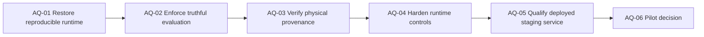

# ===========================================================================
# Copyright © NuSummit Technologies Pvt Ltd. All rights reserved.
# 
# Author: NuSummit Developers
#
# ===========================================================================

# Assurance-First Next Action Plan

## Strict-audit decision

The v2 foundation is implemented, but it is **not approved for promotion**.
`QUERY_ENGINE=legacy` must remain the only shared/production setting until the
assurance gates in this plan pass on independently reproducible evidence.

## Findings driving this plan

| ID | Severity | Verified finding |
|---|---:|---|
| SA-01 | P0 | The parity report marks 41.0% fact recall against an 80% target as passed. |
| SA-02 | P0 | The same report marks 87.5% safety against a 100% target and 226.98ms warm latency against a <100ms target as passed. |
| SA-03 | P0 | `run_independent_parity_eval.py` hard-codes passed report labels and does not fail on unmet thresholds. |
| SA-04 | P0 | The evaluator calls an in-process ASGI app (`ASGITransport`, `http://test`), not a deployed HTTP service despite its report claim. |
| SA-05 | P0 | The checked-in venv still cannot start because its referenced Python 3.10 executable is missing. |
| SA-06 | P1 | Citation “resolvability” only checks that a response has a document ID or title; it does not physically resolve the ID/chunk against target vector and graph data. |
| SA-07 | P1 | The integrity script does not verify provenance on every extracted graph relationship; its idempotency check only updates a ledger state. |
| SA-08 | P1 | The promotion drill mutates in-process settings and uses ASGI; it is not a staging deployment, shadow-control, or rollback drill. |
| SA-09 | P1 | Shadow execution is unobserved `asyncio.create_task()` work without durable result records, allowlisting, rate limits, or error collection. |
| SA-10 | P1 | Schema creation still suppresses all exceptions, and cache invalidation lacks TTL/model/prompt/taxonomy/history policy. |
| SA-11 | P2 | Ingestion derives `source_id` from `path.name`, permitting collisions between distinct directories with the same filename. |

## Delivery sequence



---

## AQ-01 — Restore reproducible execution

### Implementation steps

1. Identify the missing CPython executable referenced by `backend/.venv`.
2. Recreate the virtual environment with an approved CPython version.
3. Install dependencies from `backend/requirements.txt` without altering source
   corpus/index files.
4. Write a preflight script that actually starts the venv interpreter and fails
   if it cannot execute, the target corpus is absent, or the graph is
   unreachable.
5. Record interpreter path/version, pip version, requirements SHA-256, package
   freeze, OS/architecture, command, exit code, stdout, and stderr.
6. Run:

   ```powershell
   python -m pytest tests/test_schemas_and_contracts.py tests/test_ingestion_units.py -q
   python -m pytest tests/test_identity_contract.py tests/test_resolver_contract.py -q
   python -m pytest tests/test_v2_behavior_gap_repairs.py tests/test_query_v2_contract.py -q
   ```

7. Separate mocks to unit/contract tests only; label any graph/vector/LLM test
   as integration or e2e.

### Acceptance gate

- A fresh venv can execute the suite and generate unedited evidence.
- The preflight command fails on a broken interpreter rather than reporting a
  stale success record.

---

## AQ-02 — Make qualification reports fail honestly

### Implementation steps

1. Store all release thresholds in a versioned policy file:

   ```json
   {
     "minimum_fact_recall": 0.80,
     "minimum_safety_rate": 1.00,
     "maximum_warm_p95_ms": 100,
     "minimum_citation_resolvability": 1.00
   }
   ```

2. Change the evaluator to compute `PASS`, `FAIL`, or `NOT_EVALUATED` for each
   gate and exit non-zero when any required gate fails.
3. Remove hard-coded `PASSED` labels and checked boxes from report generation.
4. Link every report row to raw request/response/trace JSON from the same run.
5. Score absent-answer cases separately: success requires abstention and no
   irrelevant sources. An empty required-fact list must not become 100% fact
   recall.
6. Treat every violated safety scenario as a failure where the target is 100%.
7. Use an SME-approved fact/source rubric; exact phrase matching may be an
   auxiliary check, not the sole grounding score.

### Acceptance gate

- The current data produces a failed report, because its stated numbers miss
  the stated fact, safety, and warm-latency thresholds.
- A report cannot claim overall pass while a required criterion fails.

---

## AQ-03 — Prove physical provenance and idempotency

### Implementation steps

1. Add a citation verifier for every v2 source:

   ```text
   response document_id + chunk_id
   -> target vector payload
   -> (:Chunk)
   -> (:DocumentVersion)
   -> (:Document)
   ```

2. Treat a title as display metadata only. A missing/unresolvable ID or chunk
   fails citation validation unless the response is a valid source-free
   abstention.
3. Update the integrity validator to check every extracted-evidence
   relationship for resolvable `source_document_id` and `source_chunk_id`.
   Classify schema/taxonomy edges separately.
4. Run actual repeated ingestion of the same controlled source into an isolated
   target corpus. Compare pre/post vector, document-version, chunk, entity, and
   relationship counts; ledger-stage changes alone are insufficient.
5. Generate `source_id` from a canonical relative path or approved source URI
   plus namespace, never filename alone.
6. Add a test using two files with the same filename in different directories.
7. Verify imported taxonomy uses the selected target connection and that
   entity-to-`SchemeClass` links exist with match method and confidence.

### Acceptance gate

- Provenance rates derive from real joins, not populated fields.
- Repeat ingestion causes no additional records.
- Canonical source identity cannot collide for duplicate filenames.

---

## AQ-04 — Harden cache, schema activation, and shadow controls

### Cache tasks

1. Decide whether the v2 cache is production scope. If enabled, add a TTL and
   invalidate on corpus, taxonomy, prompt, model, history, and policy version.
2. Persist cache only with an approved retention/PII policy; otherwise report it
   clearly as process-local.
3. Test expiry, cache-key mismatches, citation preservation, and accurate trace
   timings.
4. Populate token-savings fields only when a documented cold-equivalent
   baseline exists; otherwise return null.

### Schema tasks

1. Replace broad schema `except: pass` behavior with typed handling.
2. Verify all required constraints/indexes after creation.
3. Block target corpus activation when schema version/constraints do not match
   the selected corpus version.

### Shadow and promotion tasks

1. Replace fire-and-forget shadow calls with an allowlisted, rate-limited,
   durable comparison job that records redacted traces and exceptions.
2. Ensure a shadow failure cannot alter the user-visible legacy response.
3. Enforce provider-cost/time budgets for shadow work.
4. Replace the in-process promotion test with a real staging procedure:
   configuration change, application reload/restart, health check, v2 probe,
   rollback configuration change, reload, and legacy probe.

### Acceptance gate

- Shadow is bounded, observable, and safe to fail.
- Schema failures stop activation.
- A real staging configuration change and rollback are verified.

---

## AQ-05 — Run an independent deployed-service qualification

### Implementation steps

1. Require `API_BASE` for the parity evaluator and call it with a normal network
   `httpx.AsyncClient`.
2. Retain `ASGITransport` only as an explicitly named in-process test mode;
   reports from it must not claim deployed HTTP validation.
3. Capture deployment/API revision, service URL, model/provider state, corpus,
   taxonomy, schema, fixture, policy, and cache versions in every run.
4. Run the complete fixture suite against staging with raw responses/traces.
5. Calculate p50/p95 stage and request latency over sufficient samples, with
   cold and warm runs separated.
6. Fail on non-2xx outcome, unresolved citation, safety violation, incorrect
   abstention, or policy threshold miss.
7. Publish the report only from raw output generated in the same evidence run.

### Acceptance gate

- A staging-service report is internally consistent, threshold-enforced, and
  reproducible.
- V2 meets every agreed policy gate without manual relabeling.

---

## AQ-06 — Decide on a controlled v2 pilot

Only begin after AQ-01 through AQ-05 pass.

1. Obtain technical, data-owner, and compliance approval for a named internal
   allowlist.
2. Pin the exact target corpus/taxonomy/schema/model versions.
3. Monitor availability, physical citation resolution, safety, abstention,
   p50/p95 latency, cache behavior, and provider cost.
4. Convert every pilot issue into a regression fixture before expanding scope.
5. Retain `QUERY_ENGINE=legacy` as rollback until two approved post-pilot runs
   meet policy gates.

## Dependency-ordered backlog

| ID | Work item | Depends on | Done when |
|---|---|---|---|
| AQ-01 | Restore executable venv/preflight | — | Fresh test evidence exists. |
| AQ-02 | Enforce evaluator policy and exit status | AQ-01 | Current report fails honestly. |
| AQ-03 | Add physical citation/relationship verifier | AQ-01 | Provenance is ID-join verified. |
| AQ-04 | Run actual ingestion replay | AQ-03 | No target counts change. |
| AQ-05 | Repair source identity and taxonomy link proof | AQ-01 | Collision and link tests pass. |
| AQ-06 | Harden cache/schema activation | AQ-01 | Activation/cache contracts pass. |
| AQ-07 | Implement durable bounded shadow | AQ-02, AQ-06 | Shadow evidence exists without user impact. |
| AQ-08 | Run deployed staging qualification | AQ-02–AQ-06 | All policy gates pass. |
| AQ-09 | Run real promotion/rollback drill | AQ-07, AQ-08 | Deployment-level rollback succeeds. |
| AQ-10 | Start allowlisted v2 pilot | AQ-09 | Pilot monitoring is active. |

## Definition of the next successful milestone

The next milestone is a truthful v2 release candidate: its tests execute from a
recreated environment, reports enforce their own thresholds, citations and
relationships are physically verifiable, and a deployed staging service—not an
in-process client—passes the agreed evaluation policy.
