# ===========================================================================
# Copyright © NuSummit Technologies Pvt Ltd. All rights reserved.
# 
# Author: NuSummit Developers
#
# ===========================================================================

# Evidence-Based Baseline — Implementation Plan

## Objective

Produce a repeatable, auditable description of the system **as it is actually
served and stored today**, before changing routing, ingestion, graph topology,
or indexes. The baseline must make it possible to answer, with raw evidence:

- Which retrieval path answered a request?
- Which corpus/index/graph was consulted?
- Can every response source be joined to a graph `Document` by `document_id`?
- Are chat history, cache, telemetry, taxonomy, and safety behavior observable?
- Are reported quality, latency, and token metrics reproducible?

This phase must not mutate the corpus, graph, index, or ingestion state: it
must not rebuild an index, reseed a graph, clear a cache, upload a file, or
create an ingestion job. Query and chat calls can create their normal audit-log
or response-cache entries; capture that expected side effect and never hide it.

## Scope and exclusions

### In scope

- Static code/configuration inventory.
- Live HTTP probe collection from the current FastAPI serving path.
- Read-only Neo4j census and integrity checks.
- Offline unit/contract tests and clearly marked live integration tests.
- Raw evidence preservation, analysis, and a go/no-go convergence decision.

### Out of scope

- Switching `/api/query` to `RetrievalOrchestrator`.
- Changing document IDs, graph schema, FAISS stores, prompts, cache logic, or
  UI behavior.
- Re-ingesting documents, merging databases, adding CKG/agentic features, or
  recalibrating metrics.

Those changes are subsequent implementation phases and require this baseline.

## Roles and required access

| Role | Responsibility | Access required |
|---|---|---|
| Technical owner | Select environment and approve test window. | API base URL; environment identity. |
| Baseline operator | Runs collector and test commands; stores unmodified outputs. | Read access to API, Neo4j, Docker/logs if applicable. |
| Data owner | Confirms corpus/index is representative and approved for testing. | Read-only corpus/inventory knowledge. |
| Reviewer | Validates claims and signs off the baseline report. | Collected evidence directory. |

Never place API keys, Neo4j passwords, source document content, or secrets in
the manifest, issue tracker, or baseline report.

## Execution order

```mermaid
flowchart LR
  A["0. Freeze scope and identify environment"] --> B["1. Prepare runtime and evidence folder"]
  B --> C["2. Capture static architecture inventory"]
  C --> D["3. Run offline tests"]
  D --> E["4. Collect live API baseline"]
  E --> F["5. Run graph/vector integrity checks"]
  F --> G["6. Analyze metrics and reconcile differences"]
  G --> H["7. Publish report and decision gates"]
```



Do not begin a later step if the prior step has an unrecorded failure. A failure
does not stop the baseline; it becomes a finding with an owner and evidence.

---

## Step 0 — Freeze the baseline scope

### Activities

1. Choose exactly one named environment, for example `local-demo-20260814` or
   `staging-us-east-1`. Do not combine responses from different environments.
2. Record the API base URL, intended UI URL, Neo4j endpoint/database name,
   container/image identifiers if available, and timestamp in UTC.
3. Ask the data owner to confirm whether the environment is safe for LLM query
   traffic and whether query logs are retained.
4. Declare the run mode:
   - **cold observation** — capture existing cache state without modification;
   - **warm observation** — a separate run made only after a documented first
     run; or
   - **degraded/offline observation** — services intentionally unavailable.
5. Create a run ID: `baseline-<environment>-<YYYYMMDDTHHMMSSZ>`.

### Deliverable

`run_context.md` in the output directory, containing only configuration-safe
identifiers and the approved scope.

### Exit criteria

- One environment and one API URL are unambiguously selected.
- The run is confirmed to prohibit corpus/index/graph/ingestion mutation.
- No secret values appear in the run context.

---

## Step 1 — Prepare the runtime and evidence directory

### Activities

1. Confirm PowerShell is available:

   ```powershell
   $PSVersionTable.PSVersion
   ```

2. Check that a Python interpreter exists:

   ```powershell
   py -0p
   python --version
   ```

   The current workspace had no registered Python interpreter on 2026-08-14.
   Provision the project-approved Python version before continuing with tests.
   Python 3.12 is the sensible first candidate because the repository contains
   Python 3.12 bytecode, but confirm package compatibility before standardizing.

3. Create an isolated virtual environment rather than using a global package
   install:

   ```powershell
   cd backend
   <approved-python> -m venv .venv
   .\.venv\Scripts\Activate.ps1
   python -m pip install --upgrade pip
   python -m pip install -r requirements.txt
   ```

4. Record interpreter version and package resolution. Prefer `pip freeze` plus
   the exact `requirements.txt` digest; do not edit dependency versions during
   the baseline.
5. Confirm the PowerShell collector and fixture JSON parse:

   ```powershell
   Get-Content -Raw .\scripts\collect_baseline.ps1 |
     ForEach-Object { [scriptblock]::Create($_) }
   Get-Content -Raw ..\Docs\baseline\query_fixtures.json |
     ConvertFrom-Json | Out-Null
   ```

### Deliverable

A dated `environment_preflight.json` with interpreter, dependency, and command
availability results. The existing collector creates the evidence directory at
`logs/baseline/<UTC timestamp>/`; place preflight output in that same directory.

### Exit criteria

- Tests have a reproducible interpreter environment, or the absence of one is
  explicitly recorded as a blocker.
- The collector and its fixture file parse without execution.

---

## Step 2 — Capture the static architecture inventory

### Activities

1. Record the active serving call chain:

   ```text
   Frontend/Streamlit -> /api/query -> app.engine.retrieval
   ```

   Verify it from `backend/app/api/routes/query.py`, not from design documents.

2. Record the modern but currently non-serving chain:

   ```text
   /api/ingest -> IngestionPipeline -> app.vector.VectorStore + GraphClient
   Container.orchestrator -> RetrievalOrchestrator
   ```

3. Record UI fallback behavior, including `API_BASE` and the local taxonomy
   fallback path in `streamlit_app/app.py`.
4. Record graph topology from `docker-compose.yml`, app configuration, taxonomy
   builder configuration, and deployment environment values. Mark hard-coded
   values such as `bolt://localhost:7688` separately from deployed values.
5. Record every vector/index location and metadata contract:
   - legacy engine FAISS index;
   - modern `app.vector.VectorStore` FAISS payload store;
   - taxonomy showcase index;
   - any mounted Docker volumes.
6. Record identifier fields at each boundary: `document_id`, `doc_name`,
   `product_name`, `source`, `chunk_id`, and page/section metadata.
7. Build a capability matrix with columns: capability, implementation file,
   active serving path, data dependency, test coverage, and confidence.

### Deliverable

`static_inventory.md` and `capability_matrix.csv` in the baseline output.

### Exit criteria

- Every live-looking component is labeled active, fallback-only, test-only, or
  unused/unknown.
- Every difference between design docs and code is a cited finding, not an
  assumed defect.

---

## Step 3 — Run offline unit and contract tests

### Activities

1. From `backend/`, run the known offline suite first:

   ```powershell
   python -m pytest tests/test_schemas_and_contracts.py tests/test_ingestion_units.py -q
   ```

2. Save stdout, stderr, pytest version, exit code, duration, and test count.
3. If imports/downloads unexpectedly contact external services, stop and record
   the dependency. Do not mask the problem with a mock response.
4. Identify gaps in the offline suite, particularly:
   - route-to-engine selection;
   - document/graph/vector identifier compatibility;
   - response telemetry fields;
   - chat history forwarding;
   - taxonomy endpoint configuration.
5. Add test cases only after documenting the gap; do not modify application
   behavior as part of the baseline phase.

### Deliverable

`tests/offline/` raw output and `test_gap_register.md`.

### Exit criteria

- Test results are reproducible with one command.
- All skipped/failed tests have a concrete cause and environment classification.

---

## Step 4 — Collect the live API baseline

### Activities

1. Confirm endpoint reachability with the smallest probes:

   ```powershell
   Invoke-RestMethod 'http://<host>:8000/api/status'
   Invoke-RestMethod 'http://<host>:8000/api/docs'
   ```

2. Run the collector without manually changing caches or data:

   ```powershell
   .\backend\scripts\collect_baseline.ps1 -ApiBase 'http://<host>:8000'
   ```

3. Verify that it collected raw responses for:
   - `/api/status` — dependency state and indexed counts;
   - `/api/docs` — vector-visible document IDs;
   - `/api/taxonomy` and `/api/graph` — modern container visibility;
   - `/api/query` — traditional/contextgraph/both query behavior;
   - `/api/chat` — two-turn history propagation.
4. Review `manifest.json` first. For each failed request, retain the HTTP status,
   error text, and elapsed time. Do not replace it with an empty response file.
5. Review query responses for answer, citations/sources, graph highlight,
   telemetry, latency, and reported confidence. Keep raw JSON unchanged.
6. Repeat as a separate warm run only if needed. Label it `warm` and retain the
   preceding cold/unknown run. Never compare mixed cache states.

### Deliverable

One immutable evidence directory per run:

```text
logs/baseline/<timestamp>/
  manifest.json
  SUMMARY.txt
  status.json
  documents.json
  taxonomy.json
  graph.json
  query_*.json
  chat_*.json
```

### Exit criteria

- Every fixture appears in `manifest.json`.
- Failed services are represented as failures, never false passes.
- The baseline can be rerun from the same fixture set.

---

## Step 5 — Verify graph/vector/provenance integrity

### Activities

1. Run the read-only queries in
   `Docs/baseline/neo4j_integrity_queries.cypher` against the API's Neo4j
   instance. Save exported CSV/JSON with the run evidence.
2. Build an API vector document set from `documents.json` using exact
   `document_id` values.
3. Build a graph document set from the Cypher `Document` query using exact
   `document_id` values.
4. Calculate and report four categories:

   | Category | Definition |
   |---|---|
   | Intersection | ID exists in both API vector output and graph. |
   | Vector-only | ID exists in `/api/docs` but not graph. |
   | Graph-only | ID exists in graph but not `/api/docs`. |
   | Unjoinable legacy | Data uses a name/product field rather than canonical ID. |

5. Inspect a small sample of each category, retaining filename/title/page only
   as supporting evidence—not as the join key.
6. Count extracted relationships with and without `source_document_id`; label
   schema/taxonomy relationships separately so they do not distort provenance
   coverage.
7. Count `SchemeClass`/taxonomy nodes and explicit links to extracted entities.
   If none exist, record absence rather than inferring a second graph instance.

### Deliverable

`integrity_report.md`, `document_join_report.csv`, and unmodified graph exports.

### Exit criteria

- Every mismatch has an ID-level example and a source path.
- The report never joins records using filename alone.
- Graph topology claims match the queried endpoint, not merely a builder script.

---

## Step 6 — Reconcile telemetry, cache, and evaluation metrics

### Activities

1. Inventory every metric returned by `/api/query` and `/api/chat`, every field
   written to engine audit logs, and every metric rendered in the UI.
2. Create a metric dictionary with: field name, producer, unit, denominator,
   cache state, exact/estimated classification, and consumer.
3. Compare raw API metrics to engine audit logs by query text, session ID, and
   turn index where present. Record fields that are lost in API adapters.
4. For cache claims, capture separately:
   - first observed request;
   - repeat equivalent request;
   - cache type reported;
   - actual response tokens;
   - cold-equivalent token definition; and
   - latency.
5. Do not state “token savings” until the numerator and denominator are both
   stored and their cache states are compatible.
6. Run the existing multi-turn evaluation only after the API baseline. Identify
   whether it calls the active API engine, the taxonomy v2 fallback, or another
   implementation. Report the target explicitly beside the score.

### Deliverable

`metric_dictionary.csv`, `metric_reconciliation.md`, and a source-linked
evaluation target matrix.

### Exit criteria

- Each dashboard/report metric has one traceable producer.
- Cache, token, and latency figures cannot be mistaken for measurements from a
  different serving path.

---

## Step 7 — Publish the baseline report and decision gates

### Activities

1. Assemble a concise report with these sections:
   - environment and run identity;
   - serving-path map;
   - data-store/index inventory;
   - test results;
   - API behavior by fixture;
   - document/provenance integrity;
   - telemetry/evaluation reconciliation;
   - defects, severity, owner, and evidence path.
2. Classify every design claim:
   - **live and verified**;
   - **implemented but unused**;
   - **implemented but unverified**;
   - **designed only**; or
   - **contradicted by observed evidence**.
3. Hold a review with the technical and data owners. Correct interpretations by
   addendum; do not overwrite original raw evidence.
4. Decide whether convergence work may begin. The minimum gates are:
   - active query route confirmed;
   - exact document-ID mismatch quantified;
   - active graph topology confirmed;
   - baseline failure modes captured;
   - test environment made reproducible; and
   - metrics classified as trustworthy, provisional, or unsupported.
5. Convert approved findings into the next implementation backlog, ordered:
   1. unified serving path;
   2. canonical document/provenance contract;
   3. unified taxonomy/entity graph schema;
   4. telemetry/API/UI trace contract;
   5. evaluation-harness alignment;
   6. only then new agentic, CKG, or lifecycle features.

### Deliverable

`baseline_report.md`, reviewed evidence links, and a signed decision record.

### Exit criteria

- A future engineer can reproduce the observed state without relying on oral
  history or design-document assertions.
- Architecture changes have a named acceptance test and before/after baseline.

## Required backlog created by this plan

| ID | Activity | Depends on | Definition of done |
|---|---|---|---|
| BL-01 | Provision approved Python environment | Step 0 | Offline pytest command runs and version is recorded. |
| BL-02 | Capture static serving/data-path inventory | Step 0 | Capability matrix has active-path labels. |
| BL-03 | Run offline contracts/unit checks | BL-01 | Raw test result and gap register saved. |
| BL-04 | Collect cold/unknown live API run | BL-02 | Collector manifest contains all probes. |
| BL-05 | Capture graph census and document joins | BL-04 | ID-level intersection/mismatch report exists. |
| BL-06 | Run separate warm-cache observation, if approved | BL-04 | Cache state and comparison denominator recorded. |
| BL-07 | Reconcile UI/API/log/evaluation metrics | BL-04, BL-05 | Metric dictionary assigns a producer to each claim. |
| BL-08 | Publish reviewed baseline report | BL-03–BL-07 | Decision gates are explicitly passed, failed, or deferred. |

## Risks and controls

| Risk | Control |
|---|---|
| Baseline accidentally changes core data | Only GET/POST query/chat calls are permitted; no ingest/cache/rebuild routes or scripts. Query/audit cache side effects are expected and recorded. |
| LLM behavior varies across time | Save prompt/query, model/config-safe identifier, raw response, and UTC timestamp; use fixed fixtures. |
| Cache causes misleading comparisons | Capture cold/unknown and warm runs separately; never aggregate them without labels. |
| Current code and docs disagree | Treat live output and cited source code as evidence; document claims are hypotheses. |
| Tests target an unused pipeline | Record exact endpoint/function under test before interpreting a score. |
| Secrets leak into evidence | Capture endpoint identities and statuses only; redact connection strings/keys before sharing. |
| Production query traffic has impact | Obtain environment approval and use the small fixed fixture set. |
