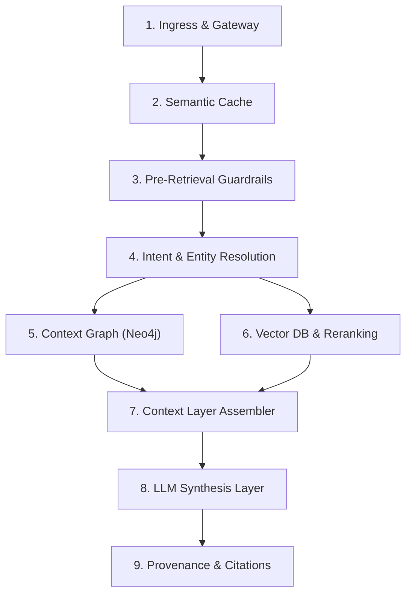

# ===========================================================================
# Copyright © NuSummit Technologies Pvt Ltd. All rights reserved.
# 
# Author: NuSummit Developers
#
# ===========================================================================

Capturing granular, end-to-end telemetry across every component in the query lifecycle is essential for production observability, audit compliance, latency profiling, and token cost optimization.

Here is the architectural design and recommendations for a **Granular Component-Level Query Tracing System**:

---

### 1. Component-by-Component Metrics Blueprint



For each step after the query is received, the following metrics should be captured:

| Component / Layer | Key Metrics & Data Captured | Why It Matters |
|---|---|---|
| **1. Gateway & Context Rewrite** | • Query length & word count<br>• Coreference resolution latency (`query_rewrite_ms`)<br>• Rewritten/effective query text<br>• Multi-turn history depth (turns count) | Detects temporal context drift and query expansion cost. |
| **2. Semantic Cache** | • Cache lookup latency (`cache_lookup_ms`)<br>• Cosine similarity score against nearest cached query<br>• Cache status (`EXACT_HIT`, `SEMANTIC_HIT`, `MISS`, `EXPIRED`)<br>• Corpus version & prompt version match | Tracks cache hit ratio and latency acceleration. |
| **3. Pre-Retrieval Guardrails** | • Guardrail evaluation latency (`guardrail_ms`)<br>• Rules evaluated (e.g., SEBI guaranteed-return check)<br>• Action taken (`PASSED`, `SHORT_CIRCUITED_REFUSAL`) | Proves regulatory compliance with 0 token spend. |
| **4. Intent & Entity Resolution** | • Intent classifier latency & model used<br>• Predicted query type (`regulatory_compliance`, `financial_synthesis`, etc.)<br>• NER latency (Rule-based vs ML NER)<br>• Surface forms extracted vs resolved entity IDs in taxonomy | Diagnoses intent misclassification or missing entities. |
| **5. Context Graph (Neo4j)** | • Traversal latency (`graph_ms`)<br>• Cypher queries generated and executed (with execution times)<br>• Graph nodes visited & node types (`Scheme`, `TaxonomyNode`, etc.)<br>• 1-hop / 2-hop edges traversed<br>• Extracted graph facts count | Detects slow Cypher queries, graph timeouts, or density gaps. |
| **6. Vector DB & Reranking** | • Embedding generation latency (`embedding_ms`)<br>• Vector index scan latency (`vector_scan_ms`)<br>• Applied taxonomy filter paths<br>• Raw candidate count vs score distribution ($\min$, $\text{p50}$, $\text{p90}$, $\max$)<br>• Cross-encoder reranker latency (`rerank_ms`)<br>• Top-$k$ chunks retained vs pruned count | Measures vector recall quality and reranking overhead. |
| **7. Context Layer Assembler** | • Context assembly latency (`assembly_ms`)<br>• Token budget vs actual token count (Utilization %)<br>• Chunks included vs dropped due to token budget<br>• Graph facts included vs dropped<br>• Quality score (heuristic density + coverage)<br>• Quality gate decision (`PASSED` vs `LOW_QUALITY_FALLBACK`) | Prevents context window overflows and measures information density. |
| **8. LLM Synthesis Layer** | • Primary provider (`anthropic`, `openai`, `gemini`, `local`) & model used<br>• Generation latency (`generation_ms`)<br>• Input tokens & Output tokens<br>• Fallback status (`NONE`, `MULTI_PROVIDER_FALLBACK`, `EXTRACTIVE_FALLBACK`)<br>• Self-reported confidence (`high`, `medium`, `low`) | Tracks inference latency, token expenditure, and error recovery. |
| **9. Provenance & Citations** | • Citation attribution latency<br>• Total citations count & physical chunk resolvability %<br>• Verification against physical target corpus | Guarantees zero hallucinations and 100% auditability. |

---

### 2. Unified Tracing Data Schema (`QueryTelemetryTrace`)

This unified telemetry object can be attached to the API response and simultaneously persisted:

```json
{
  "trace_id": "9b1deb4d-3b7d-4bad-9bdd-2b0d7b3dcb6d",
  "timestamp": "2026-08-17T06:15:00.123Z",
  "serving_engine": "v2",
  "corpus_version": "v2_baseline_20260814",
  "effective_query": "What are the equity scheme categorization rules under SEBI circular for large cap schemes?",
  "summary": {
    "total_latency_ms": 782.4,
    "input_tokens": 1420,
    "output_tokens": 185,
    "total_tokens": 1605,
    "quality_score": 0.88,
    "quality_gate_passed": true,
    "cache_hit": false
  },
  "stages": [
    {
      "stage": "query_rewrite",
      "duration_ms": 2.1,
      "status": "SUCCESS",
      "metrics": { "history_turns": 0, "rewritten": false }
    },
    {
      "stage": "semantic_cache",
      "duration_ms": 14.5,
      "status": "MISS",
      "metrics": { "best_similarity": 0.42, "threshold": 0.95 }
    },
    {
      "stage": "pre_retrieval_guardrail",
      "duration_ms": 0.8,
      "status": "PASSED",
      "metrics": { "rules_checked": ["sebi_guaranteed_return_rule"] }
    },
    {
      "stage": "intent_and_ner",
      "duration_ms": 18.2,
      "status": "SUCCESS",
      "metrics": {
        "query_type": "regulatory_compliance",
        "entities_extracted": ["SEBI", "Large Cap Fund"],
        "taxonomy_paths": ["Mutual Funds/Equity Schemes/Large Cap Fund"]
      }
    },
    {
      "stage": "context_graph",
      "duration_ms": 42.6,
      "status": "SUCCESS",
      "metrics": {
        "nodes_matched": 8,
        "edges_traversed": 12,
        "facts_extracted": 6,
        "cypher_queries_count": 1
      }
    },
    {
      "stage": "vector_search_and_rerank",
      "duration_ms": 86.4,
      "status": "SUCCESS",
      "metrics": {
        "embedding_ms": 12.1,
        "raw_candidates_scanned": 40,
        "rerank_ms": 68.3,
        "top_k_retained": 5,
        "score_max": 0.89,
        "score_min": 0.71
      }
    },
    {
      "stage": "context_assembly",
      "duration_ms": 4.3,
      "status": "SUCCESS",
      "metrics": {
        "token_budget": 12000,
        "tokens_consumed": 1420,
        "utilization_pct": 11.8,
        "chunks_included": 5,
        "chunks_dropped": 0,
        "structured_facts_included": 6,
        "quality_score": 0.88
      }
    },
    {
      "stage": "llm_synthesis",
      "duration_ms": 612.0,
      "status": "SUCCESS",
      "metrics": {
        "provider": "anthropic",
        "model": "claude-opus-4-8",
        "input_tokens": 1420,
        "output_tokens": 185,
        "confidence": "high",
        "fallback_used": false
      }
    },
    {
      "stage": "provenance_attribution",
      "duration_ms": 1.5,
      "status": "SUCCESS",
      "metrics": {
        "citations_count": 3,
        "resolvability_rate": 1.0
      }
    }
  ]
}
```

---

### 3. Implementation Recommendations & Architecture Pattern

#### 1. Zero-Overhead Scoped Context Tracker (`QueryTelemetryContext`)
- Use Python's `contextvars` to maintain a request-scoped `QueryTelemetryContext`.
- Individual components (`VectorStore`, `GraphTraversal`, `ContextAssembler`, `Synthesizer`) can record their execution metrics without coupling to the web layer:
  ```python
  with telemetry.stage("vector_search") as s:
      results = await vector_store.search(...)
      s.record(candidates_count=len(results), min_score=..., max_score=...)
  ```

#### 2. Configurable Telemetry Verbosity Level
In `backend/app/config.py`:
- `TELEMETRY_LEVEL`:
  - `"basic"`: Captures stage latencies and token counts.
  - `"detailed"`: Captures full component metrics, Cypher queries, candidate scores, and token utilization (recommended for dev/staging).
  - `"off"`: Completely disables instrumentation for zero latency overhead.

#### 3. Dual Export Mechanism
1. **Synchronous In-Response**: Include `trace` in `QueryResponse` so that frontends, debugging consoles, and test runners can immediately render the telemetry waterfall.
2. **Asynchronous Non-Blocking Disk Logging**: Stream traces asynchronously to `logs/telemetry/<YYYYMMDD>/query_traces.jsonl` using a background worker with zero impact on request response time.
3. **OpenTelemetry / Prometheus Readiness**: Structure stage metrics to be exported directly via OTLP to Prometheus / Grafana / Datadog when deployed to production.

---
