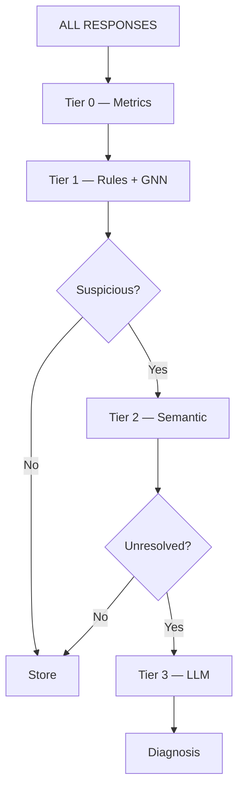

# AMC Chatbot — Feedback, Evaluation & Self-Correction Architecture

HITL feedback and agentic (no-feedback) evaluation are **not two separate systems**. They are two entry routes into one pipeline: **Feedback → Evaluation → Diagnosis → Controlled Improvement.** Every response — whether a human ever reacts to it or not — ends up in the same evidence record, the same tiered evaluation, the same diagnosis step, and the same governed correction path. That's what makes the architecture explainable in a demo and extensible later into an adaptive router / jurisdiction layer.

The diagram below is annotated in place — every node names *what it does*, so it can be read on its own in the showcase without flipping back and forth to prose. Full detail on each layer follows underneath.

---

## Architecture Diagram

```mermaid
flowchart TD

    A["User Query"] --> B["AMC Chatbot Pipeline<br/>generates the answer"]
    B --> B1["Retrieval<br/>Vector search + Knowledge Graph traversal"]
    B1 --> B2["Context Engineering<br/>assembles evidence into the prompt"]
    B2 --> B3["Guardrails / Policy Checks<br/>pre-response compliance gate"]
    B3 --> C["Response Generated"]

    C --> D["Capture Interaction Evidence<br/>immutable record, written before any feedback exists"]
    D --> D1["Stores: query+response, retrieved evidence,<br/>graph paths, citations, taxonomy nodes,<br/>guardrail decisions, model/prompt version,<br/>latency/token/system metrics"]

    C --> E{"Human Feedback<br/>or follow-up?"}

    %% HITL PATH
    E -->|YES| F["Structured HITL Feedback<br/>explicit selection OR a dissatisfaction<br/>follow-up converted into the same shape"]
    F --> FD["Dissatisfaction Follow-up Handling<br/>frustration/intent classifier + same-referent<br/>check turn unstructured pushback into<br/>a structured claim before anything expensive runs"]
    FD --> F1["Category: Hallucination / Accuracy /<br/>Missing Context / Incomplete / Outdated /<br/>Citation / Tone / Compliance / Other"]

    F1 --> G["Feedback Validation Layer<br/>routes the claim to the cheapest tier that can resolve it"]

    G --> G1["Tier 1 — Rule Categories<br/>Schema/Type, Cardinality, Referential,<br/>Temporal, Numeric, Cross-Source,<br/>Duplicate, Hierarchy, Jurisdiction"]
    G1 --> G1b["Tier 1 — GNN Structural Plausibility<br/>frozen model, fixed threshold — deterministic<br/>at inference time, no LLM tokens"]
    G1b --> G2{"Resolved by<br/>rules + GNN alone?"}

    G2 -->|YES| H["Feedback Adjudication"]
    G2 -->|NO| G3["Tier 2 — Semantic Evaluation<br/>NLI/entailment: claim vs evidence"]
    G3 --> G4{"Enough confidence?"}
    G4 -->|YES| H
    G4 -->|NO| G5["Tier 3 — LLM / Agent Evaluator<br/>last resort, most expensive"]
    G5 --> H

    H --> H1["Verdict: Valid / Partially Valid /<br/>Invalid / Subjective / Insufficient Evidence"]

    %% NO-HUMAN PATH
    E -->|NO| I["Automatic Evaluation Trigger"]
    I --> J["Tier 0/1 — Cheap Deterministic Evaluation<br/>+ GNN sweep runs on 100% of responses"]

    J --> J1["Grounding, citation, source freshness,<br/>numeric consistency, retrieval confidence,<br/>guardrail events, schema/formatting, cost/latency"]

    J1 --> K{"Suspicious /<br/>sampled / high-value?"}

    K -->|NO| L["Store Evaluation + Metrics"]
    K -->|YES| M["Tier 2 — Semantic Evaluation<br/>claim-evidence consistency, completeness,<br/>contradiction, relevance, factuality"]

    M --> N{"Resolved with<br/>confidence?"}
    N -->|YES| O["Evaluation Finding"]
    N -->|NO| P["Tier 3 — LLM / Agent Evaluator"]
    P --> O

    %% COMMON PIPELINE
    H1 --> Q["Unified Evaluation Record<br/>same schema regardless of entry route"]
    O --> Q
    L --> Q

    Q --> R["Failure Diagnosis<br/>where in the stack did this actually go wrong?"]
    R --> R1["Knowledge/Data? Retrieval? Graph?<br/>Context Engineering? Taxonomy?<br/>Reasoning/Model? Guardrail?<br/>Compliance? Presentation? User-feedback issue?"]

    R1 --> S["Severity + Confidence + Impact scoring"]
    S --> T{"Action<br/>required?"}

    T -->|NO| U["Monitor / Analytics"]
    T -->|YES| DET

    subgraph DET["1 — DETECTION (localize the candidate correction)"]
        DET0["Candidate Correction Event<br/>from HITL-confirmed feedback, a scheduled<br/>GNN structural sweep, or an ingestion-time<br/>source conflict"] --> DET1["Localize exact disputed<br/>node / edge / triple"]
    end

    DET1 --> EVAL

    subgraph EVAL["2 — EVALUATION (judge it, cheapest signal first)"]
        EVAL1["Merge: Rule Categories + GNN<br/>Plausibility + NLI Entailment"] --> EVAL2{"Confident<br/>verdict?"}
        EVAL2 -->|NO| EVAL3["Escalate to HITL /<br/>LLM Evaluator"]
        EVAL3 --> EVAL4["Verdict: Confirmed /<br/>Rejected / Ambiguous"]
        EVAL2 -->|YES| EVAL4
    end

    EVAL4 --> RES

    subgraph RES["3 — RESOLUTION (act only on a confirmed verdict)"]
        RES1{"Confirmed?"} -->|NO| RES2["Close — no patch,<br/>no graph change, logged"]
        RES1 -->|YES| RES3["Correction Patch Layer<br/>keyed override, confidence + provenance + TTL"]
        RES3 --> RES4["Immediate: LLM uses patch<br/>as a context override for future responses<br/>— this is the 'LLM learns from feedback' step,<br/>reversible, not a weight update"]
        RES3 --> RES5["Improvement Queue<br/>NOT direct self-learning"]
    end

    EVAL4 --> RES1
    RES5 --> X["Offline Test / Regression"]
    X --> Y{"Pass?"}

    Y -->|NO| Z["Reject / Refine"]
    Y -->|YES| AA["Human Governance Approval<br/>weekly batch — only path that can<br/>write to the canonical graph"]
    AA --> AB["Controlled Deployment<br/>Canonical KG Update + Reindex"]
    AB --> ABG["Scheduled GNN Embedding Refresh<br/>same governed cadence, keeps the<br/>structural scorer in sync"]

    ABG --> AC["Measure Post-change Outcome"]
    AC --> D
```



---

## Layer-by-layer explanation

### 1. Response pipeline (`A → B → B1 → B2 → B3 → C`)
The chatbot answers normally — retrieval pulls from both the vector index and the knowledge graph, context engineering assembles that evidence into the prompt, guardrails run before the response ever reaches the user. Nothing about the feedback loop changes this path; it just determines what evidence exists for everything downstream to check against later.

### 2. Evidence capture (`C → D → D1`)
The moment a response is generated, an **immutable interaction record** is written — query, response, retrieved evidence, graph paths, citations, taxonomy nodes, guardrail state, model/prompt version, and system metrics. This happens *before* any feedback exists, so feedback arriving later always points at a fixed, auditable snapshot rather than a moving target.

### 3. Feedback entry — human and dissatisfaction-triggered (`E → F → FD → F1`)
Two things can bring a human into the loop: an explicit feedback action, or a follow-up query that reads as dissatisfaction ("that's wrong," "that's outdated," repeated pushback). The `FD` step is what converts the second case into the same structured shape as the first — a lightweight frustration/intent classifier plus a same-referent check (embedding similarity + coreference against the original answer) decide whether this is genuinely a correction attempt before anything expensive runs. Both cases land in the same category set (`F1`), so everything downstream treats them identically.

### 4. Evaluation — tiered, rule-categorized, GNN-augmented (`G → G1 → G1b → G2/G3/G4/G5`, and `J → K → M → N → P`)
This is the cost-control core of the whole design, on both the human-feedback side and the no-feedback side:

- **Tier 1 — Rule categories.** Instead of one opaque "deterministic checks" box, checks are tagged by category: Schema/Type, Cardinality, Referential Integrity, Temporal Consistency, Numeric/Unit, Cross-Source Consistency, Duplicate Detection, Taxonomy Hierarchy, and Regulatory/Jurisdiction. Each emits the same shape — `{category, rule_id, pass/fail or score, threshold, evidence_ref}` — so results merge cleanly no matter which rule fired.
- **Tier 1 — GNN structural plausibility.** A relational GNN (R-GCN/CompGCN-style) trained on the graph gives a plausibility score for a candidate triple and flags neighborhood anomalies rules wouldn't catch. It's only ever queried through a **frozen model + fixed threshold** at request time — deterministic and cheap at inference, no LLM tokens spent. Retraining it is a separate, scheduled batch job (see layer 9), not something that reacts per interaction.
- **Tier 2 — Semantic evaluation.** NLI/entailment checks the claim against evidence (contradicts / supports / neutral) — more expensive than rules, still far cheaper than an LLM call.
- **Tier 3 — LLM/Agent evaluator.** Only reached when rules, GNN, and NLI together can't resolve it. This tiering is why the architecture stays economically viable at 100% response coverage on the no-feedback side.

### 5. Adjudication & unified evaluation record (`H → H1`, `Q`)
Whatever tier resolved it, the outcome collapses into the same verdict vocabulary (`Valid / Partially Valid / Invalid / Subjective / Insufficient Evidence` for feedback, or an equivalent `Evaluation Finding` for the no-feedback path) and both feed the same **Unified Evaluation Record** — one schema regardless of entry route. This is what turns the system into an audit trail rather than a feedback database.

### 6. Failure diagnosis (`R → R1 → S → T`)
A bad answer doesn't automatically mean a bad model. Diagnosis walks the record back through the stack — was it a knowledge/data problem, retrieval, the graph itself, context engineering, taxonomy, reasoning, a guardrail, compliance, presentation, or the feedback itself being wrong? — and only issues that clear a severity/confidence/impact bar proceed to correction. Everything else goes to monitoring.

### 7. KG correction — Detection → Evaluation → Resolution
This is the part that needed its own explicit three-stage structure, because "correct the knowledge graph" was doing too much work in one box:

- **Detection** — purely about finding and localizing a candidate. Three entry points feed it: a HITL-confirmed dissatisfaction claim, a scheduled GNN structural sweep across the whole graph (so drift gets caught even with zero user complaints), or a conflict surfaced at ingestion time (new source vs. controlled base taxonomy). Detection doesn't judge anything — it just hands off a precisely localized node/edge/triple.
- **Evaluation** — purely about judging the candidate. Rules, GNN plausibility, and NLI run and merge first; only an inconclusive result escalates to HITL or the LLM evaluator. Output is a verdict, never a write.
- **Resolution** — purely about acting on a *confirmed* verdict, and this is where correction is split by trust level (next section).

### 8. Correction Patch Layer vs. canonical graph — the KG-vs-LLM split
This is the answer to "the KG shouldn't self-correct from one user, but the LLM should learn from feedback" — both are true because they write to different stores:

| | Correction Patch Layer | Canonical Knowledge Graph |
|---|---|---|
| What it is | Keyed override store: `disputed_node/edge → corrected_claim`, with confidence, provenance, and TTL | The shared ground-truth graph every user's retrieval depends on |
| Who writes to it | Either resolution pathway, immediately, at a confidence tier reflecting how it was adjudicated | Only the weekly Human Governance batch, after approval |
| Effect | Fast, reversible, auto-expires if never ratified | Global, permanent, versioned |

The LLM consults the patch layer at generation time — a context-level override, not a weight update — so the next user asking about the same disputed fact gets the corrected answer immediately, while the change stays fully logged and reversible until governance signs off on making it permanent.

### 9. Governance & controlled deployment (`X → Y → AA → AB → ABG → AC`)
Every confirmed correction still goes through offline regression testing before it reaches governance. Approval is the **only** path that writes to the canonical graph. Right after a canonical update, the GNN embeddings are refreshed on that same governed cadence — deliberately placed after the graph write, not before, so the structural scorer used in Tier 1 never drifts out of sync with an edit that hasn't actually landed yet. Post-change outcomes are then measured and fed straight back into evidence capture, closing the loop.

### 10. The guiding principle
**Feedback ≠ Learning. Evaluation ≠ Learning. Diagnosis ≠ Learning.** The chatbot never directly learns from one user's say-so — not the graph (governed, weekly, batch-approved) and not really the LLM either, since its "learning" is a logged, confidence-scored, TTL-bound context patch rather than a parameter update. That single decision is what protects the system against incorrect feedback, malicious feedback, feedback poisoning, and accidental corruption of the AMC taxonomy — while still letting the visible behavior improve immediately.

---

## Appendix — supporting diagrams for the showcase

### Why this is economically viable at scale



### Two evaluation families

**Response Evaluation** asks whether a single answer is grounded, accurate, complete, current, consistent, relevant, compliant, safe, and clearly communicated.

**System Evaluation** asks a root-cause question across three subsystems — Retrieval (recall, precision, graph path correctness, freshness), Generation (groundedness, citation use, context use, tokens), and Guardrails (triggered correctly, false positive/negative rate) — because a bad answer doesn't necessarily mean a bad model:

```text
Incorrect response
   → Was correct information retrieved?      NO  → Retrieval / knowledge problem
   → Was correct evidence given to model?     NO  → Context engineering problem
   → Did model contradict the evidence?       YES → Reasoning / generation problem
```

### The unified evaluation record (conceptual shape)

```text
EvaluationRecord
├── interaction_id
├── feedback (raw_feedback, categories, free_text)
├── evidence (retrieved_sources, graph_paths, taxonomy_nodes, citations)
├── deterministic_results (by rule category)
├── gnn_plausibility_score
├── semantic_results
├── llm_evaluation
├── adjudication (verdict, confidence, supporting_evidence)
├── root_cause
├── severity
├── improvement_candidate
└── lifecycle_status
```

### Phase boundary for the initial showcase

```text
                 PHASE 1 — FEEDBACK INTELLIGENCE
┌───────────────────────────────────────────────────────┐
│ Feedback → Evidence → Evaluate → Adjudicate → Diagnose │
└───────────────────────────────────────────────────────┘
                          │
                          ▼
                 PHASE 2 — CONTROL PLANE
┌───────────────────────────────────────────────────────┐
│ Adaptive Router · AMC Taxonomy · Jurisdiction Rule     │
│ Packs · Failure Attribution Graph · Automated          │
│ Improvement Recommendations                            │
└───────────────────────────────────────────────────────┘
```

Phase 1 is what's presented; Phase 2 stays behind an interface, already anticipated by the architecture above.
