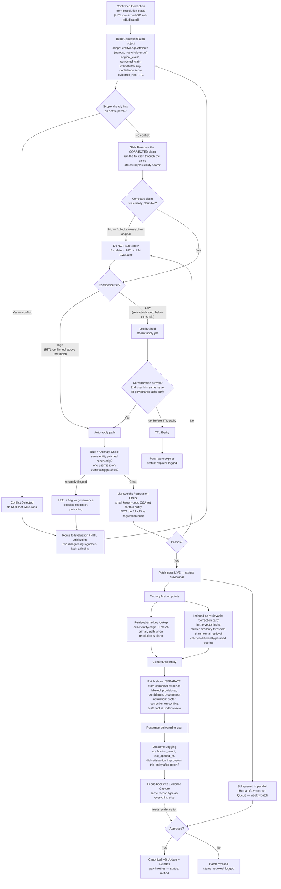

# Correction Patch Layer — Methodology & Routes

This is a standalone zoom-in on one box from the main architecture: the **Correction Patch Layer**. It covers the patch object itself, both ways it intercepts the response pipeline, and every route a patch can take from creation to either going live, getting escalated, or dying out.

---

## Flowchart — all routes through the Patch Layer

---

## The routes, named

| Route | Trigger | Outcome |
|---|---|---|
| **Conflict route** | New patch targets scope with an existing active patch | Never silently overwritten — always kicked to arbitration, treated as a finding, not noise |
| **Self-defeating fix route** | GNN re-scores the *corrected* claim and finds it implausible | Blocked before it ever applies — protects specifically against Pathway 2 (no human involved) producing a bad fix |
| **High-confidence route** | HITL-confirmed, above threshold | Straight to rate check → regression check → live |
| **Low-confidence hold route** | Self-adjudicated, below threshold | Logged but withheld until either a second corroborating signal arrives or it expires unratified — bounded exposure by construction |
| **Anomaly route** | Repeated patches on one entity, or one source dominating patch creation | Held and flagged rather than applied — this is the feedback-poisoning defense |
| **Regression-fail route** | Lightweight known-good check fails for this entity | Rejected the same way a structurally-bad fix is rejected |
| **Live-and-governed route** | Passes every gate above | Applied immediately (fast lane) **and** queued for the weekly canonical review (slow lane) at the same time — these are not sequential, they run in parallel |
| **Expiry route** | Never corroborated or ratified before TTL | Auto-dies — this is what stops a provisional patch from becoming permanent by inertia alone |

## The two threads that never merge

Notice the diagram splits into two parallel destinations once a patch goes live (`I0`):

- **Fast lane** (`J0` onward) — governs what the *LLM shows users*, right now, reversibly.
- **Slow lane** (`N0` onward) — governs what the *knowledge graph itself* contains, permanently, only via governance.

A patch can be live in the fast lane for weeks while still sitting unratified in the slow lane — that gap is intentional, not a bug. It's what lets behavior improve immediately without letting any single patch become ground truth on its own.
