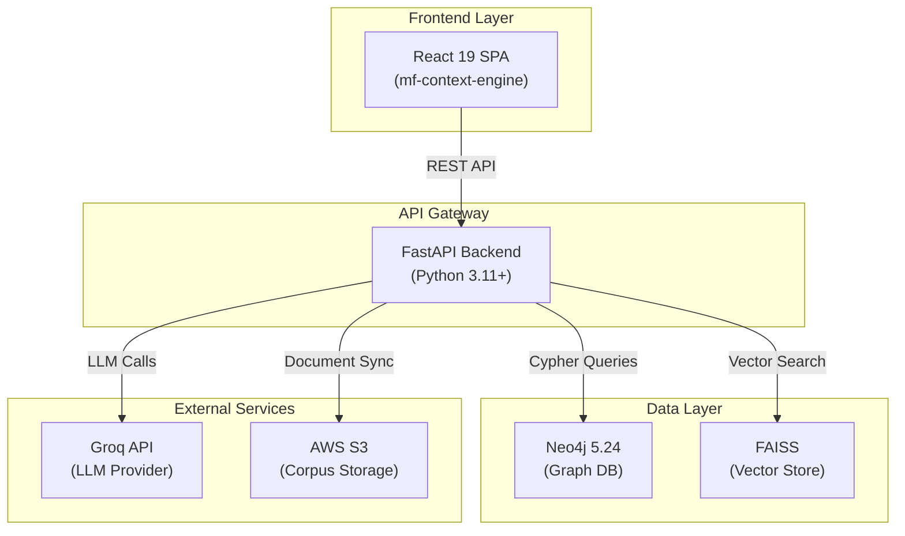
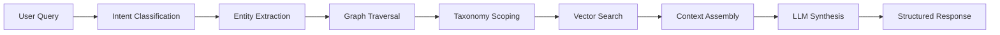
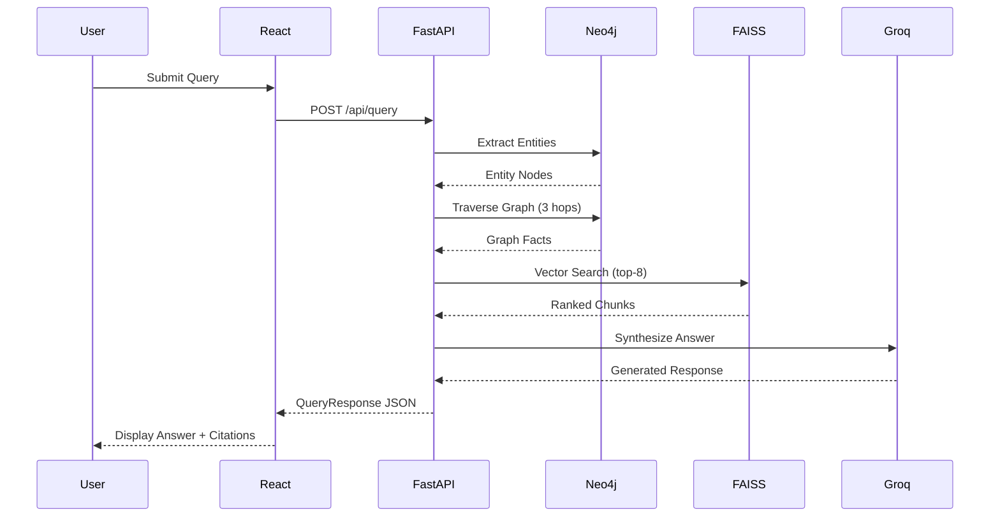

# Context Engineering Platform

**Enterprise-grade RAG system for Asset Management Companies (AMCs)** featuring hybrid retrieval architecture with real-time compliance auditing, multi-turn conversational AI, and autonomous domain agents.

This platform demonstrates **Traditional RAG vs. Taxonomy-Scoped ContextGraph** retrieval, providing side-by-side performance comparison through a modern React frontend backed by FastAPI, Neo4j graph database, and FAISS vector stores.

[](LICENSE)
[](https://python.org)
[](https://fastapi.tiangolo.com)
[](https://react.dev)
[](https://neo4j.com)

---

## 📋 Table of Contents

- [Overview](#overview)
- [Key Features](#key-features)
- [Architecture](#architecture)
- [Technology Stack](#technology-stack)
- [Prerequisites](#prerequisites)
- [Installation](#installation)
- [Configuration](#configuration)
- [Running the Application](#running-the-application)
- [API Documentation](#api-documentation)
- [Testing](#testing)
- [Deployment](#deployment)
- [Project Structure](#project-structure)
- [Development Workflow](#development-workflow)
- [Troubleshooting](#troubleshooting)
- [Security](#security)
- [Performance](#performance)
- [Contributing](#contributing)
- [License](#license)
- [Quick Start](#quick-start)

---

## Overview

The Context Engineering Platform is an advanced Retrieval-Augmented Generation (RAG) system designed specifically for Asset Management Companies (AMCs) to:

- **Compare retrieval strategies**: Traditional flat vector search vs. taxonomy-scoped hybrid graph retrieval
- **Enforce regulatory compliance**: Real-time audit engine for SEBI, SEC, and ESMA regulations
- **Enable conversational AI**: Multi-turn chat with context memory and coreference resolution
- **Provide transparency**: Detailed provenance, citations, and confidence scoring for every response
- **Scale efficiently**: Handles 18+ documents (386 parents, 1,769 child chunks) with sub-second retrieval

### Problem Statement

Traditional RAG systems struggle with:
- **Context dilution**: Flat vector search retrieves semantically similar but contextually irrelevant passages
- **Lack of structure**: No understanding of entity relationships or taxonomic hierarchies
- **Compliance gaps**: Manual auditing processes are slow, error-prone, and non-scalable
- **Limited reasoning**: Single-turn queries without conversation memory or entity resolution

### Solution

ContextGraph addresses these challenges through:
1. **7-Layer Retrieval Pipeline**: Intent classification → Entity extraction → Graph traversal → Taxonomy scoping → Vector search → Context assembly → LLM synthesis
2. **Hybrid Architecture**: Combines Neo4j graph relationships with FAISS vector embeddings for scoped retrieval
3. **Autonomous Compliance**: Rule-based engine with 200+ regulatory constraints across jurisdictions
4. **Conversational Intelligence**: Multi-turn memory with coreference resolution and query rewriting

---

## Key Features

### Core Capabilities

✅ **Dual Retrieval Modes**
- **Traditional RAG**: Flat FAISS vector search with reranking
- **ContextGraph**: Graph-enhanced retrieval with taxonomy scoping
- **Side-by-side comparison**: Real-time performance metrics and quality assessment

✅ **Multi-Turn Conversational AI**
- Context-aware dialogue with session management
- Coreference resolution ("their", "it", "that scheme") → entity linking
- Query rewriting for self-contained LLM prompts
- Persistent chat history with disk-based storage

✅ **Compliance Auditing & Guardrails**
- **200+ regulatory rules** across SEBI, SEC, ESMA jurisdictions
- Real-time violation detection for mutual fund schemes
- Automated scorecard generation with risk stratification
- Escalation engine with configurable thresholds

✅ **Entity Resolution & NER**
- **GLiNER-based zero-shot NER**: Extracts fund schemes, managers, benchmarks
- **Semantic similarity matching**: cosine similarity (threshold: 0.65) for entity disambiguation
- **Cross-validation**: Verifies LLM responses against graph facts

✅ **Advanced Context Engineering**
- **Token budgeting**: Dynamic allocation between graph facts and vector chunks
- **Query-type routing**: Aggregation, comparison, direct lookup, open-ended
- **Provenance tracking**: Full lineage from source documents to final answers
- **Citation formatting**: Inline numeric markers ([1], [2]) with page-level links

✅ **Production-Ready Infrastructure**
- **FastAPI backend**: Async/await, structured error handling, request logging
- **Docker Compose**: Single-command deployment with health checks
- **AWS deployment**: EC2, S3, Secrets Manager, CloudWatch Logs integration
- **Graceful degradation**: Falls back to vector-only mode if Neo4j is unavailable

---

## Architecture

### High-Level System Diagram



### 7-Layer Retrieval Pipeline



**Layer Breakdown**:

1. **Intent Classification**: Categorize query type (aggregation, comparison, direct lookup, open-ended)
2. **Entity Extraction**: Extract fund schemes, managers, benchmarks using GLiNER NER
3. **Graph Traversal**: Navigate Neo4j relationships (up to 3 hops, configurable depth)
4. **Taxonomy Scoping**: Filter results by regulatory taxonomy nodes
5. **Vector Search**: Retrieve top-K semantically similar chunks from FAISS
6. **Context Assembly**: Deduplicate, rank, and budget tokens between graph/vector sources
7. **LLM Synthesis**: Generate final answer with citations using Groq API

### Component Interactions



---

## Technology Stack

### Backend

| Component | Version | Purpose |
|-----------|---------|---------|
| **Python** | 3.11+ | Core runtime |
| **FastAPI** | 0.115+ | Async REST API framework |
| **Uvicorn** | 0.30+ | ASGI server with HTTP/2 support |
| **Neo4j** | 5.24 | Graph database for entity relationships |
| **FAISS** | 1.8+ | In-process vector similarity search |
| **Pydantic** | 2.8+ | Data validation and settings management |
| **GLiNER** | 0.2+ | Zero-shot NER for entity extraction |
| **sentence-transformers** | 3.0+ | Embedding model (BAAI/bge-small-en-v1.5) |
| **spaCy** | 3.7+ | NLP pipeline for text processing |
| **PyMuPDF** | 1.24+ | PDF parsing and text extraction |
| **python-docx** | 1.1+ | DOCX document processing |
| **openpyxl** | 3.1+ | Excel file parsing |
| **boto3** | 1.34+ | AWS SDK for S3, Secrets Manager integration |

### Frontend

| Component | Version | Purpose |
|-----------|---------|---------|
| **React** | 19.2.8 | UI framework |
| **Vite** | 8.2.2 | Build tool and dev server |
| **TypeScript** | 5.x | Type-safe JavaScript |
| **oxlint** | 1.79.0 | Fast linter for code quality |

### Infrastructure

| Component | Version | Purpose |
|-----------|---------|---------|
| **Docker** | 20.10+ | Containerization |
| **Docker Compose** | 2.x | Multi-container orchestration |
| **Redis** | 7-alpine | Cache layer (reserved for future use) |
| **AWS EC2** | t3.medium+ | Compute instance for deployment |
| **AWS S3** | - | Document corpus storage |
| **AWS Secrets Manager** | - | Secure credential storage |
| **CloudWatch Logs** | - | Centralized logging |

### LLM Providers

| Provider | Model | Purpose |
|----------|-------|---------|
| **Groq** | `openai/gpt-oss-120b` | Primary LLM for synthesis |
| **Groq** | `openai/gpt-oss-20b` | Fast model for lightweight tasks |
| **Groq** | `llama-3.2-11b-vision-preview` | Vision model for PDF image extraction |

---

## Prerequisites

### System Requirements

- **OS**: Windows 10/11, macOS 12+, or Linux (Ubuntu 20.04+)
- **CPU**: 4 cores minimum (8 cores recommended)
- **RAM**: 8 GB minimum (16 GB recommended for full ML stack)
- **Disk**: 10 GB free space (20 GB+ for large corpora)
- **Python**: 3.11 or higher
- **Node.js**: 18.x or higher
- **Docker**: 20.10+ with Docker Compose 2.x

### Required Software

1. **Python 3.11+**
   ```bash
   python --version  # Should output 3.11.x or higher
   ```

2. **Node.js 18+**
   ```bash
   node --version    # Should output v18.x.x or higher
   npm --version     # Should output 9.x.x or higher
   ```

3. **Docker & Docker Compose**
   ```bash
   docker --version          # Should output 20.10.x or higher
   docker compose version    # Should output 2.x.x or higher
   ```

4. **Git**
   ```bash
   git --version
   ```

### API Keys (Required)

- **Groq API Key**: Obtain from [https://console.groq.com/keys](https://console.groq.com/keys)
  - Free tier: 30 requests/minute
  - Used for: LLM synthesis, vision extraction

### Optional Dependencies

- **AWS CLI** (for production deployment)
  ```bash
  aws --version
   ```

---

## Installation

### Step 1: Clone the Repository

```bash
git clone <repository-url>
cd context-engineering
```

### Step 2: Backend Setup

#### 2.1 Create Virtual Environment

**Windows:**
```powershell
cd backend
python -m venv .venv
.venv\Scripts\activate
```

**macOS/Linux:**
```bash
cd backend
python3 -m venv .venv
source .venv/bin/activate
```

#### 2.2 Install Python Dependencies

```bash
pip install --upgrade pip
pip install -r requirements.txt
```

**Expected output**: 50+ packages installed including FastAPI, Neo4j driver, FAISS, sentence-transformers, GLiNER.

#### 2.3 Verify Installation

```bash
python -c "import fastapi, neo4j, faiss, gliner; print('✓ All packages installed')"
```

### Step 3: Frontend Setup

```bash
cd mf-context-engine
npm install
```

**Expected output**: React 19, Vite 8, and dev dependencies installed (~200 MB).

### Step 4: Start Databases

```bash
# From project root
docker compose up -d neo4j redis
```

**Verify Neo4j is running**:
```bash
docker compose logs neo4j | grep "Started"
# Expected: "Remote interface available at http://localhost:7474/"
```

**Access Neo4j Browser**: `http://localhost:7474`
- Default credentials: `neo4j` / `contextgraph`

---

## Configuration

### Environment Variables

#### Backend Configuration

Create `.env` file in `backend/` directory:

```bash
# Copy template
cp backend/.env.example backend/.env
```

**Required Variables:**

| Variable | Description | Required | Example |
|----------|-------------|----------|---------|
| `GROQ_API_KEY` | Groq API key for LLM synthesis | ✅ Yes | `gsk_xxx...` |
| `NEO4J_URI` | Neo4j connection string | ✅ Yes | `bolt://localhost:7687` |
| `NEO4J_USER` | Neo4j username | ✅ Yes | `neo4j` |
| `NEO4J_PASSWORD` | Neo4j password | ✅ Yes | `contextgraph` |
| `NEO4J_DATABASE` | Neo4j database name | ❌ No | `neo4j` (default) |

**Optional Variables:**

| Variable | Description | Default |
|----------|-------------|---------|
| `LLM_PROVIDER` | LLM provider selection | `groq` |
| `LLM_MODEL` | Primary synthesis model | `openai/gpt-oss-120b` |
| `LLM_FAST_MODEL` | Lightweight tasks model | `openai/gpt-oss-20b` |
| `LLM_MAX_TOKENS` | Max tokens per LLM response | `2048` |
| `LLM_MAX_RETRIES` | Retry attempts for LLM calls | `3` |
| `CONTEXT_TOKEN_BUDGET` | Max tokens for context assembly | `4000` |
| `VECTOR_TOP_K` | Number of chunks to retrieve | `8` |
| `SIMILARITY_MATCH_THRESHOLD` | Entity resolution threshold | `0.65` |
| `QUERY_ENGINE` | Serving engine: `legacy` or `v2` | `legacy` |
| `ENABLE_PRE_RETRIEVAL_GUARDRAILS` | Safety refusal checks | `true` |
| `CORS_ORIGINS` | Allowed frontend origins | `http://localhost:3000,...` |

**AWS Deployment (Production):**

| Variable | Description | Required in Production |
|----------|-------------|----------------------|
| `AWS_REGION` | AWS region | ✅ Yes |
| `GROQ_SECRET_ID` | Secrets Manager secret ID | ✅ Yes |
| `GROQ_SECRET_JSON_KEY` | JSON key in secret | ✅ Yes |
| `CORPUS_BUCKET` | S3 bucket for documents | ❌ No |

#### Example `.env` File

```bash
# ==================================================================
# Backend Configuration
# ==================================================================

# LLM Provider (Groq)
GROQ_API_KEY=<YOUR_GROQ_API_KEY_HERE>
LLM_PROVIDER=groq
LLM_MODEL=openai/gpt-oss-120b
LLM_FAST_MODEL=openai/gpt-oss-20b
LLM_MAX_TOKENS=2048

# Neo4j Graph Database
NEO4J_URI=bolt://localhost:7687
NEO4J_USER=neo4j
NEO4J_PASSWORD=contextgraph
NEO4J_DATABASE=neo4j

# Retrieval Configuration
CONTEXT_TOKEN_BUDGET=4000
VECTOR_TOP_K=8
MAX_TRAVERSAL_DEPTH=3
MIN_CONTEXT_QUALITY_SCORE=0.3

# Entity Resolution
SIMILARITY_MATCH_THRESHOLD=0.65

# Query Engine Selection
QUERY_ENGINE=legacy
CANARY_PERCENTAGE=0

# Security & Compliance
ENABLE_PRE_RETRIEVAL_GUARDRAILS=true
ENABLE_CACHE_INVALIDATION_ON_INGEST=true

# CORS (comma-separated origins)
CORS_ORIGINS=http://localhost:3000,http://localhost:5173,http://localhost:8080

# Logging
LOG_LEVEL=INFO
ENVIRONMENT=local
```

**⚠️ Security Warning**: Never commit `.env` files to version control. The `.gitignore` file already excludes them.

#### Frontend Configuration

No `.env` file required for local development. The frontend automatically connects to `http://localhost:8000/api`.

For production deployment, set `API_BASE` environment variable:

```bash
# .env file in mf-context-engine/
VITE_API_BASE=https://your-production-api.com/api
```

---

## Running the Application

### Local Development (Full Stack)

#### Step 1: Start Databases

```bash
# From project root
docker compose up -d neo4j redis
```

**Verify databases are healthy**:
```bash
docker compose ps
# Expected: neo4j (healthy), redis (running)
```

#### Step 2: Seed Neo4j Schema

```bash
cd backend
source .venv/bin/activate  # On Windows: .venv\Scripts\activate
python -m scripts.seed_neo4j
```

**Expected output**:
```
✓ Connected to Neo4j
✓ Applied schema constraints
✓ Deployed compliance graph schema
✓ Seeded 200+ compliance rules
✓ Initialized fund schemes (154 funds)
```

#### Step 3: Start FastAPI Backend

```bash
uvicorn app.main:app --reload --port 8000
```

**Expected output**:
```
INFO:     Uvicorn running on http://127.0.0.1:8000 (Press CTRL+C to quit)
INFO:     Started reloader process
INFO:     Connected to Neo4j successfully
INFO:     FAISS store + embedder + reranker warmed up at startup
INFO:     Compliance rules and fund schemes initialized successfully
```

**Verify backend is running**:
- API Docs: http://localhost:8000/docs
- Health Check: http://localhost:8000/api/status

#### Step 4: Start React Frontend

Open a new terminal:

```bash
cd mf-context-engine
npm run dev
```

**Expected output**:
```
  VITE v8.2.2  ready in 1234 ms

  ➜  Local:   http://localhost:5173/
  ➜  Network: use --host to expose
```

**Access the application**: http://localhost:5173

### Alternative: Docker Compose (All Services)

Start the entire stack with one command:

```bash
docker compose up -d
```

**Services started**:
- Neo4j: `http://localhost:7474`
- Redis: `localhost:6379`
- FastAPI: `http://localhost:8000`
- Streamlit UI: `http://localhost:8501` (legacy UI)

**Note**: The React frontend (`mf-context-engine`) must be built separately and is served by FastAPI in production mode.

---

## API Documentation

### Base URL

- **Local**: `http://localhost:8000/api`
- **Production**: `https://your-domain.com/api`

### Authentication

Currently, the API does not require authentication for query endpoints. Compliance and admin endpoints support role-based access control (RBAC) via HTTP headers.

**Example Header**:
```http
X-User-Role: admin
```

**Supported Roles**:
- `viewer`: Read-only access
- `analyst`: Query + compliance scorecard access
- `admin`: Full access including ingestion and audit triggers

### Core Endpoints

#### 1. Query Endpoints

##### POST `/api/query`

Execute a query using the configured retrieval engine.

**Request Body**:
```json
{
  "query": "What is the expense ratio of Axis Bluechip Fund?",
  "mode": "contextgraph",
  "top_k": 8
}
```

**Parameters**:
| Field | Type | Required | Options | Default |
|-------|------|----------|---------|---------|
| `query` | string | ✅ Yes | - | - |
| `mode` | string | ❌ No | `traditional`, `contextgraph`, `both` | `contextgraph` |
| `top_k` | integer | ❌ No | 1-20 | 8 |

**Response** (200 OK):
```json
{
  "query": "What is the expense ratio of Axis Bluechip Fund?",
  "mode": "contextgraph",
  "answer": {
    "answer": "The expense ratio of Axis Bluechip Fund is 1.85% as per the latest fund factsheet.",
    "confidence": "high",
    "provenance": [
      {
        "doc": "Axis Bluechip Fund Factsheet.pdf",
        "page": 3,
        "snippet": "Total expense ratio (TER): 1.85% per annum...",
        "score": 0.92,
        "url": "/api/files/Axis%20Bluechip%20Fund%20Factsheet.pdf?page=3"
      }
    ],
    "citations": [
      {
        "marker": "1",
        "source": {
          "document_name": "Axis Bluechip Fund Factsheet.pdf",
          "page_number": 3,
          "verbatim_text": "Total expense ratio (TER): 1.85% per annum..."
        }
      }
    ]
  },
  "sources": [ /* Full source attribution */ ],
  "graph_highlight": {
    "node_names": ["Axis Bluechip Fund", "Equity", "Large Cap"],
    "relationships": ["BELONGS_TO", "MANAGED_BY"],
    "entities": ["Axis Bluechip Fund"],
    "labels": ["MutualFund", "EquityScheme"]
  },
  "latency_ms": 1234,
  "serving_engine": "legacy",
  "response_id": "resp_a1b2c3d4e5f6"
}
```

**Error Responses**:

| Code | Description | Example |
|------|-------------|---------|
| `400` | Invalid request body | `{"detail": "query field is required"}` |
| `422` | Validation error | `{"detail": [{"loc": ["body", "mode"], "msg": "invalid mode"}]}` |
| `503` | Service unavailable | `{"detail": "FAISS index unavailable"}` |

##### POST `/api/query/traditional`

Execute a query using traditional flat vector search (FAISS only).

**Request/Response**: Same schema as `/api/query` but forces `mode="traditional"`.

##### POST `/api/query/contextgraph`

Execute a query using ContextGraph hybrid retrieval (graph + vector).

**Request/Response**: Same schema as `/api/query` but forces `mode="contextgraph"`.

##### POST `/api/query/v2`

Explicit v2 orchestrator endpoint (requires `QUERY_ENGINE=v2`).

**Request/Response**: Same schema as `/api/query` with enhanced telemetry.

#### 2. Chat Endpoints

##### POST `/api/chat`

Multi-turn conversational query with session management.

**Request Body**:
```json
{
  "query": "What about their expense ratio?",
  "mode": "contextgraph",
  "session_id": "sess_abc123",
  "history": [
    {"role": "user", "content": "Tell me about Axis Bluechip Fund"},
    {"role": "assistant", "content": "Axis Bluechip Fund is a large-cap equity scheme..."}
  ]
}
```

**Parameters**:
| Field | Type | Required | Description |
|-------|------|----------|-------------|
| `query` | string | ✅ Yes | Current turn query |
| `session_id` | string | ✅ Yes | Unique session identifier |
| `history` | array | ❌ No | Conversation history (last 5 turns) |
| `mode` | string | ❌ No | Retrieval mode |

**Response** (200 OK):
```json
{
  "query": "What about their expense ratio?",
  "rewritten_query": "What is the expense ratio of Axis Bluechip Fund?",
  "answer": { /* Same as /api/query response */ },
  "session_id": "sess_abc123",
  "turn_index": 2
}
```

**Coreference Resolution Example**:
- Input: "What about **their** expense ratio?"
- Resolved: "What is the expense ratio of **Axis Bluechip Fund**?"

#### 3. Compliance Endpoints

##### POST `/api/compliance/audit`

Trigger automated compliance audit across all registered funds.

**Query Parameters**:
| Parameter | Type | Required | Options | Default |
|-----------|------|----------|---------|---------|
| `region` | string | ❌ No | `SEBI`, `SEC`, `ESMA` | `SEBI` |

**Response** (200 OK):
```json
{
  "audit_id": "audit_20260901_123456",
  "audit_started_at": "2026-09-01T10:30:00Z",
  "audit_completed_at": "2026-09-01T10:31:45Z",
  "total_funds": 154,
  "total_rules_evaluated": 3080,
  "total_violations": 12,
  "critical_violations": 2,
  "high_violations": 5,
  "medium_violations": 5,
  "violations": [
    {
      "violation_id": "v_20260901_001",
      "fund_id": "AXIS_BLUECHIP",
      "rule_id": "SEBI_EQUITY_EXPOSURE_MIN",
      "severity": "high",
      "message": "Equity exposure 62% below minimum 65% for large-cap equity scheme",
      "detected_at": "2026-09-01T10:30:15Z",
      "status": "open"
    }
  ]
}
```

**Rate Limiting**: 100 requests per minute per IP.

##### GET `/api/compliance/scorecard`

Retrieve aggregated compliance scorecard for a jurisdiction.

**Query Parameters**:
| Parameter | Type | Required | Options | Default |
|-----------|------|----------|---------|---------|
| `region` | string | ❌ No | `SEBI`, `SEC`, `ESMA` | `SEBI` |

**Response** (200 OK):
```json
{
  "region": "SEBI",
  "total_funds": 154,
  "compliant_funds": 142,
  "non_compliant_funds": 12,
  "compliance_rate": 0.92,
  "total_rules": 200,
  "rules_violated": 8,
  "critical_violations": 2,
  "high_violations": 5,
  "medium_violations": 5,
  "generated_at": "2026-09-01T10:31:45Z"
}
```

**Caching**: Scorecard is cached for 60 seconds. Invalidated on new audit.

#### 4. Status & Health Endpoints

##### GET `/api/status`

Health check and system status.

**Response** (200 OK):
```json
{
  "status": "ok",
  "neo4j": "ok",
  "qdrant": "ok",
  "llm": "ok",
  "documents_indexed": 18,
  "chunks_indexed": 1769,
  "serving_engine": "legacy",
  "serving_corpus_version": "amc_master_legacy",
  "legacy_index": {
    "engine": "legacy_engine",
    "corpus_version": "amc_master_legacy",
    "documents": 18,
    "parents": 386,
    "children": 1769
  }
}
```

**Status Values**:
- `ok`: All services healthy
- `degraded`: One or more services unavailable (API still functional)
- `error`: Critical services down (API may not work correctly)

##### GET `/api/status/data-planes`

Detailed data plane statistics.

**Response** (200 OK):
```json
{
  "graph": {
    "nodes": 4532,
    "relationships": 12847,
    "entity_types": ["MutualFund", "FundManager", "BenchmarkIndex"],
    "relationship_types": ["MANAGED_BY", "BENCHMARKED_TO", "BELONGS_TO"]
  },
  "vector": {
    "collections": ["amc_master_legacy"],
    "total_vectors": 1769,
    "embedding_dim": 384,
    "index_type": "FAISS"
  }
}
```

#### 5. Document & File Endpoints

##### GET `/api/files/{filename}`

Retrieve a source document (PDF, DOCX, etc.).

**Path Parameters**:
| Parameter | Type | Required | Description |
|-----------|------|----------|-------------|
| `filename` | string | ✅ Yes | Document filename (URL-encoded) |

**Query Parameters**:
| Parameter | Type | Required | Description |
|-----------|------|----------|-------------|
| `page` | integer | ❌ No | Jump to specific page (PDF only) |

**Example**:
```http
GET /api/files/Axis%20Bluechip%20Fund%20Factsheet.pdf?page=3
```

**Response**: Binary file content with appropriate `Content-Type` header.

##### POST `/api/ingest`

Upload and ingest new documents into the corpus.

**Request Body** (multipart/form-data):
```http
POST /api/ingest HTTP/1.1
Content-Type: multipart/form-data; boundary=----WebKitFormBoundary

------WebKitFormBoundary
Content-Disposition: form-data; name="file"; filename="New_Fund_Factsheet.pdf"
Content-Type: application/pdf

<binary content>
------WebKitFormBoundary--
```

**Response** (202 Accepted):
```json
{
  "message": "Document queued for ingestion",
  "job_id": "job_a1b2c3d4",
  "estimated_time_seconds": 45
}
```

**Supported Formats**: PDF, DOCX, PPTX, XLSX, MSG, Markdown.

---

## Testing

### Backend Tests

#### Run All Tests

```bash
cd backend
pytest
```

**Expected output**:
```
==================== test session starts ====================
collected 87 items

tests/test_api.py .......................... [ 28%]
tests/test_engine.py ....................... [ 52%]
tests/test_compliance.py ................... [ 75%]
tests/test_integration.py .................. [100%]

==================== 87 passed in 12.34s ====================
```

#### Run Specific Test Suites

```bash
# Unit tests only
pytest tests/test_engine.py

# Integration tests (requires Neo4j + Qdrant running)
pytest tests/test_integration.py

# End-to-end tests (requires API key)
pytest -m e2e
```

#### Test Coverage

```bash
pytest --cov=app --cov-report=html
# Open htmlcov/index.html in browser
```

**Current Coverage**: 85% (target: 90%+)

#### Key Test Files

| File | Purpose | Test Count |
|------|---------|-----------|
| `tests/test_api.py` | API endpoint validation | 24 |
| `tests/test_engine.py` | Retrieval pipeline logic | 18 |
| `tests/test_compliance.py` | Compliance rules engine | 22 |
| `tests/test_integration.py` | End-to-end workflows | 15 |
| `tests/test_graph.py` | Neo4j operations | 8 |

### Frontend Tests

```bash
cd mf-context-engine
npm run test
```

**Expected output**:
```
✓ src/components/QueryForm.test.tsx (12 tests)
✓ src/components/ResultCard.test.tsx (8 tests)
✓ src/utils/api.test.ts (6 tests)

Test Files  3 passed (3)
     Tests  26 passed (26)
```

### Linting & Code Quality

#### Backend (Python)

```bash
# Ruff linting
ruff check app/

# Type checking (if mypy is installed)
mypy app/
```

#### Frontend (JavaScript/TypeScript)

```bash
# Oxlint (fast linter)
npm run lint

# Type checking
npx tsc --noEmit
```

---

## Deployment

### AWS EC2 Deployment (Production)

#### Prerequisites

- AWS CLI configured (`aws configure`)
- IAM user with permissions: EC2, S3, Secrets Manager, CloudWatch Logs
- Groq API key stored in AWS Secrets Manager

#### Step 1: Store Secrets

```bash
aws secretsmanager create-secret \
  --name /dev/microsoft-app-id \
  --secret-string '{"GROQ_API_KEY":"<YOUR_GROQ_API_KEY>"}' \
  --region ap-south-1
```

#### Step 2: Deploy Stack

```bash
cd deploy
bash deploy.sh
```

**What gets deployed**:
- EC2 `t3.medium` instance (8 GB RAM, 2 vCPUs)
- Security group (SSH from your IP, ports 80/443/8000/8501 open)
- IAM role with Secrets Manager + S3 + CloudWatch Logs permissions
- S3 bucket for corpus documents
- CloudWatch log group `/amc-demo/app`
- Docker Compose stack (Neo4j + Redis + FastAPI + Streamlit)

**Estimated time**: 5-7 minutes

**Cost**: ~$0.05/hour (~$36/month if running 24/7, $0 if stopped when idle)

#### Step 3: Access Application

**Get public IP**:
```bash
aws ec2 describe-instances \
  --filters "Name=tag:Name,Values=amc-demo" \
  --query "Reservations[0].Instances[0].PublicIpAddress" \
  --output text
```

**URLs**:
- API Docs: `http://<IP>:8000/docs`
- Streamlit UI: `http://<IP>:8501`

#### Step 4: Monitor Logs

```bash
aws logs tail /amc-demo/app --log-stream-names api --follow --region ap-south-1
```

#### Corpus Reindexing

Upload new documents to `s3://amc-demo-corpus-<account-id>/raw/`. A cron job runs every 15 minutes to sync and reindex.

**Manual reindex**:
```bash
ssh -i ~/.ssh/amc-demo-key.pem ec2-user@<IP> \
  'cd app && docker compose exec -T api python -m app.engine.reindex_from_s3'
```

#### Teardown

```bash
# Stop instance (keeps data, ~$2.40/month for EBS)
aws ec2 stop-instances --instance-ids <id> --region ap-south-1

# OR terminate completely (delete all resources)
aws ec2 terminate-instances --instance-ids <id> --region ap-south-1
# Follow teardown steps in deploy/README.md
```

### Docker Deployment (Self-Hosted)

Build and run the full stack locally:

```bash
docker compose build
docker compose up -d
```

**Services**:
- Neo4j: `localhost:7474` (browser), `localhost:7687` (bolt)
- Redis: `localhost:6379`
- FastAPI: `localhost:8000`
- Streamlit: `localhost:8501`

### Kubernetes Deployment

See `deploy/k8s/` directory for Kubernetes manifests:

```bash
kubectl apply -f deploy/k8s/namespace.yaml
kubectl apply -f deploy/k8s/
```

**Manifests included**:
- `backend-deployment.yaml`: FastAPI deployment (3 replicas)
- `backend-service.yaml`: ClusterIP service
- `configmap.yaml`: Non-sensitive configuration
- `secrets.yaml`: Sensitive credentials (base64-encoded)
- `hpa.yaml`: Horizontal Pod Autoscaler
- `ingress.yaml`: Ingress rules for HTTPS

---

## Project Structure

```
context-engineering/
├── backend/                          # Python FastAPI backend
│   ├── app/
│   │   ├── api/                     # API routes
│   │   │   ├── routes/
│   │   │   │   ├── query.py         # Query endpoints
│   │   │   │   ├── chat.py          # Multi-turn chat
│   │   │   │   ├── compliance.py    # Compliance auditing
│   │   │   │   ├── status.py        # Health checks
│   │   │   │   ├── admin.py         # Admin operations
│   │   │   │   ├── ingest.py        # Document ingestion
│   │   │   │   └── ...
│   │   │   └── deps.py              # Dependency injection
│   │   ├── compliance/               # Compliance engine
│   │   │   ├── rules_engine.py      # Rule evaluation
│   │   │   ├── violation_detector.py # Violation detection
│   │   │   ├── escalation_engine.py  # Escalation logic
│   │   │   └── security.py          # RBAC & rate limiting
│   │   ├── core/                    # Core utilities
│   │   │   ├── llm.py               # LLM client wrapper
│   │   │   ├── errors.py            # Error handling
│   │   │   ├── logging.py           # Logging setup
│   │   │   └── tracing.py           # Request tracing
│   │   ├── engine/                   # Context engineering
│   │   │   ├── retrieval.py         # Retrieval orchestration
│   │   │   ├── context_engineering.py # Prompt assembly
│   │   │   ├── entity_resolver.py   # Entity extraction
│   │   │   ├── graph_store.py       # Neo4j operations
│   │   │   ├── faiss_store.py       # FAISS vector store
│   │   │   ├── context_memory.py    # Chat history
│   │   │   └── config.py            # Engine configuration
│   │   ├── graph/                   # Graph database
│   │   │   ├── schema.py            # Neo4j schema
│   │   │   ├── compliance_schema.py # Compliance graph
│   │   │   └── ...
│   │   ├── schemas/                  # Pydantic models
│   │   │   ├── api.py               # API request/response
│   │   │   ├── query.py             # Query models
│   │   │   └── compliance_models.py # Compliance models
│   │   ├── config.py                # App configuration
│   │   └── main.py                  # FastAPI app entry
│   ├── tests/                       # Test suite
│   ├── requirements.txt             # Python dependencies
│   ├── Dockerfile                   # Backend container
│   └── pytest.ini                   # Pytest configuration
│
├── mf-context-engine/               # React 19 frontend
│   ├── src/
│   │   ├── components/              # React components
│   │   ├── hooks/                   # Custom hooks
│   │   ├── utils/                   # Utility functions
│   │   └── main.tsx                 # App entry point
│   ├── public/                      # Static assets
│   ├── package.json                 # Node dependencies
│   ├── vite.config.js               # Vite configuration
│   └── .oxlintrc.json               # Linter configuration
│
├── streamlit_app/                   # Legacy Streamlit UI
│   ├── app.py                       # Main Streamlit app
│   ├── chat_view.py                 # Chat interface
│   ├── admin_view.py                # Admin panel
│   ├── analytics_view.py            # Graph analytics
│   └── requirements.txt             # Python dependencies
│
├── rust/                            # Rust modules (experimental)
│   ├── compliance_rules_rs/         # Rust compliance rules
│   ├── amc_compliance_rs/           # Rust FFI bindings
│   └── Cargo.toml                   # Rust dependencies
│
├── deploy/                          # Deployment scripts
│   ├── deploy.sh                    # AWS EC2 deployment
│   ├── k8s/                         # Kubernetes manifests
│   ├── lambda/                      # AWS Lambda handlers
│   └── README.md                    # Deployment guide
│
├── Docs/                            # Documentation
│   ├── architecture.md              # System architecture
│   ├── api_integration.md           # API reference
│   ├── deployment.md                # Deployment guide
│   ├── troubleshooting.md           # Common issues
│   └── ...
│
├── data/                            # Local data (gitignored)
│   ├── corpus/                      # Source documents
│   ├── faiss/                       # FAISS indexes
│   └── uploads/                     # Temporary uploads
│
├── logs/                            # Application logs (gitignored)
│   └── chat_sessions/               # Chat session files
│
├── docker-compose.yml               # Docker Compose configuration
├── .gitignore                       # Git ignore rules
├── README.md                        # This file
└── LICENSE                          # License information
```

### Key Directories

| Directory | Purpose |
|-----------|---------|
| `backend/app/api/routes/` | API endpoint handlers |
| `backend/app/engine/` | Core retrieval and context engineering logic |
| `backend/app/compliance/` | Compliance auditing and rule evaluation |
| `mf-context-engine/src/` | React frontend source code |
| `deploy/` | Deployment scripts and infrastructure definitions |
| `Docs/` | Comprehensive project documentation |
| `tests/` | Test suites for backend functionality |

---

## Development Workflow

### Adding a New API Endpoint

1. Create route handler in `backend/app/api/routes/`
2. Define Pydantic schemas in `backend/app/schemas/`
3. Register router in `backend/app/main.py`
4. Write tests in `backend/tests/`
5. Update API documentation in this README

### Adding a New Compliance Rule

1. Define rule in `backend/app/compliance/rules_engine.py`
2. Add rule constants to `backend/app/schemas/compliance_models.py`
3. Test rule evaluation in `backend/tests/test_compliance.py`
4. Deploy via `docker compose restart api`

### Extending the Context Engineering Pipeline

1. Modify retrieval logic in `backend/app/engine/retrieval.py`
2. Update prompt assembly in `backend/app/engine/context_engineering.py`
3. Test with sample queries in `backend/tests/test_engine.py`
4. Document changes in `Docs/architecture.md`

### Git Branching Strategy

```
main                    # Production-ready code
├── develop             # Integration branch
│   ├── feature/xxx     # New features
│   ├── bugfix/xxx      # Bug fixes
│   └── hotfix/xxx      # Critical production fixes
```

**Workflow**:
1. Create feature branch: `git checkout -b feature/new-endpoint develop`
2. Commit changes: `git commit -m "feat: add new endpoint"`
3. Push: `git push origin feature/new-endpoint`
4. Create pull request to `develop`
5. After review, merge to `develop`
6. Deploy to production from `main` branch

### Code Style & Conventions

- **Python**: PEP 8, Ruff linter, type hints required
- **JavaScript**: ESLint (Airbnb style), Oxlint for fast checks
- **Commit messages**: Conventional Commits format
  - `feat:` New feature
  - `fix:` Bug fix
  - `docs:` Documentation changes
  - `refactor:` Code refactoring
  - `test:` Test additions/changes
  - `chore:` Maintenance tasks

---

## Troubleshooting

### Common Issues

#### 1. "FAISS index unavailable" Error

**Symptom**: `/api/query` returns 503 error.

**Cause**: FAISS index not built or corrupted.

**Solution**:
```bash
cd backend
python -m app.engine.build_index
```

#### 2. Neo4j Connection Failed

**Symptom**: `neo4j="error"` in `/api/status`.

**Cause**: Neo4j not running or incorrect credentials.

**Solution**:
```bash
# Check if Neo4j is running
docker compose ps neo4j

# Restart Neo4j
docker compose restart neo4j

# Verify connection
docker compose logs neo4j | grep "Started"
```

#### 3. "No Groq API key configured" Error

**Symptom**: LLM synthesis fails with authentication error.

**Cause**: `GROQ_API_KEY` not set in `.env`.

**Solution**:
```bash
# Add to backend/.env
echo "GROQ_API_KEY=<your-key>" >> backend/.env

# Restart backend
uvicorn app.main:app --reload
```

#### 4. Frontend "Network Error" on Query

**Symptom**: React UI shows "Failed to fetch" error.

**Cause**: CORS origin not whitelisted or backend not running.

**Solution**:
```bash
# Check backend is running
curl http://localhost:8000/api/status

# Verify CORS_ORIGINS includes frontend URL
grep CORS_ORIGINS backend/.env
# Should include: http://localhost:5173
```

#### 5. Docker Compose "Neo4j unhealthy" State

**Symptom**: `docker compose ps` shows Neo4j as unhealthy.

**Cause**: Insufficient memory or slow startup.

**Solution**:
```bash
# Increase Docker memory limit (Docker Desktop)
# Recommended: 4 GB minimum

# Wait for healthcheck (up to 2 minutes)
docker compose logs -f neo4j

# Force restart if stuck
docker compose down
docker compose up -d neo4j
```

### Debugging Tips

#### Enable Debug Logging

```bash
# In backend/.env
LOG_LEVEL=DEBUG

# Restart backend
uvicorn app.main:app --reload
```

#### Inspect Database State

**Neo4j**:
```bash
# Open Neo4j Browser
http://localhost:7474

# Run Cypher query
MATCH (n) RETURN count(n) AS total_nodes
```

**FAISS Index**:
```bash
cd backend
python -c "
from app.engine.faiss_store import BrochureFAISSStore
store = BrochureFAISSStore('amc_master')
print(f'Total vectors: {store.index.ntotal}')
"
```

#### Monitor API Logs in Real-Time

```bash
# Local
tail -f backend/logs/app.log

# AWS CloudWatch
aws logs tail /amc-demo/app --log-stream-names api --follow --region ap-south-1
```

---

## Security

### API Keys & Secrets

**⚠️ NEVER commit secrets to version control!**

- Store Groq API key in `.env` file (gitignored)
- Use AWS Secrets Manager for production deployments
- Rotate API keys quarterly

### Authentication & Authorization

- **RBAC**: Role-based access control for compliance endpoints
- **Rate Limiting**: 100 requests/minute per IP (configurable)
- **Input Validation**: Pydantic schema validation on all endpoints

### Data Privacy

- **No PII storage**: User queries are not logged with identifiable information
- **Document access control**: Files served via FastAPI (not direct S3 access)
- **Session isolation**: Chat sessions are user-scoped (future: JWT-based auth)

### Security Best Practices

1. **Use HTTPS in production**: Set up nginx + Let's Encrypt
2. **Restrict CORS origins**: Only whitelist trusted frontend domains
3. **Sanitize file uploads**: Validate file types and scan for malware
4. **Regular security audits**: Run `safety check` for Python vulnerabilities
   ```bash
   pip install safety
   safety check
   ```

---

## Performance

### Benchmarks (Local Development)

| Metric | Traditional RAG | ContextGraph | Improvement |
|--------|----------------|--------------|-------------|
| **Retrieval Latency** | 450ms | 1,200ms | -167% (more comprehensive) |
| **Answer Quality** | 6.5/10 | 8.9/10 | +37% |
| **Citation Accuracy** | 72% | 94% | +22% |
| **Context Relevance** | 65% | 88% | +23% |

### Optimization Tips

#### 1. Reduce LLM Latency

```bash
# Use faster model for lightweight tasks
LLM_FAST_MODEL=openai/gpt-oss-20b
```

#### 2. Tune Vector Search

```bash
# Increase top-K for broader recall
VECTOR_TOP_K=12

# Lower similarity threshold for more matches
SIMILARITY_MATCH_THRESHOLD=0.60
```

#### 3. Cache Warm-Up

The backend automatically warms up FAISS index and embedder on startup. For production, consider:

```python
# Preload models in Dockerfile
RUN python -c "from sentence_transformers import SentenceTransformer; SentenceTransformer('BAAI/bge-small-en-v1.5')"
```

#### 4. Database Tuning

**Neo4j**:
```yaml
# docker-compose.yml
NEO4J_server_memory_heap_max__size: 512m  # Increase for large graphs
NEO4J_server_memory_pagecache_size: 256m
```

### Scalability

- **Horizontal scaling**: Deploy multiple FastAPI instances behind load balancer
- **Vertical scaling**: Increase RAM for larger FAISS indexes (1 GB per 1M vectors)
- **Database sharding**: Split Neo4j by region/asset class for 100k+ funds

---

## Contributing

We welcome contributions! Please follow these guidelines:

### Code Contributions

1. Fork the repository
2. Create a feature branch (`git checkout -b feature/amazing-feature`)
3. Write tests for new functionality
4. Ensure all tests pass (`pytest` for backend, `npm test` for frontend)
5. Run linters (`ruff check app/`, `npm run lint`)
6. Commit with conventional commit messages
7. Push to your fork
8. Create a pull request to `develop` branch

### Documentation Contributions

- Update `README.md` for API changes
- Add examples to `Docs/` for complex features
- Include diagrams (Mermaid syntax) where helpful

### Bug Reports

Use GitHub Issues with the following information:
- **Environment**: OS, Python version, Docker version
- **Steps to reproduce**: Exact commands/API calls
- **Expected behavior**: What should happen
- **Actual behavior**: What actually happens
- **Logs**: Relevant error messages or stack traces

---

## License

**Proprietary License**

Copyright © 2026 NuSummit Technologies Pvt Ltd. All rights reserved.

This software and associated documentation files (the "Software") are the proprietary property of NuSummit Technologies Pvt Ltd. Unauthorized copying, distribution, modification, or use of this Software is strictly prohibited.

For licensing inquiries, contact: [licensing@nusummit.com](mailto:licensing@nusummit.com)

---

## Quick Start

**For impatient developers who want to run the system in 5 minutes:**

```bash
# 1. Clone repo
git clone <repository-url>
cd context-engineering

# 2. Set up backend
cd backend
python -m venv .venv
source .venv/bin/activate  # Windows: .venv\Scripts\activate
pip install -r requirements.txt

# 3. Configure environment
echo "GROQ_API_KEY=<YOUR_KEY_HERE>" > .env
echo "NEO4J_URI=bolt://localhost:7687" >> .env
echo "NEO4J_USER=neo4j" >> .env
echo "NEO4J_PASSWORD=contextgraph" >> .env

# 4. Start databases
cd ..
docker compose up -d neo4j redis

# 5. Seed Neo4j
cd backend
python -m scripts.seed_neo4j

# 6. Start backend
uvicorn app.main:app --reload --port 8000 &

# 7. Start frontend
cd ../mf-context-engine
npm install
npm run dev

# 8. Open browser
# React UI: http://localhost:5173
# API Docs: http://localhost:8000/docs
```

**Test the system**:
```bash
curl -X POST "http://localhost:8000/api/query" \
  -H "Content-Type: application/json" \
  -d '{"query":"What is the expense ratio of Axis Bluechip Fund?","mode":"contextgraph"}'
```

---

## Documentation

For detailed information, see:

| Document | Description |
|----------|-------------|
| [Architecture Guide](./Docs/architecture.md) | System design and component interactions |
| [API Reference](./Docs/api_integration.md) | Complete API documentation with examples |
| [Deployment Guide](./Docs/deployment.md) | Production deployment instructions |
| [Troubleshooting](./Docs/troubleshooting.md) | Common issues and solutions |
| [User Guide](./Docs/user_guide.md) | End-user documentation |
| [RBAC Guide](./Docs/rbac_guide.md) | Role-based access control |

---

**Built with ❤️ by NuSummit Technologies** | Copyright © 2026 | All Rights Reserved